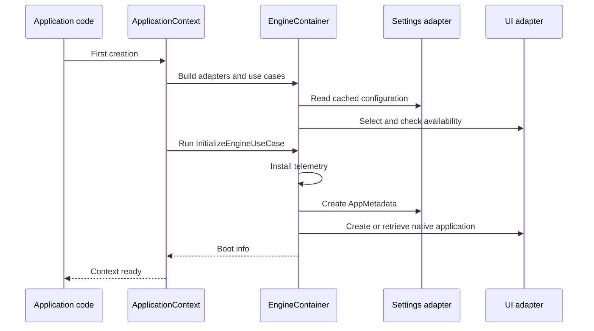

An application needs configuration, resources, and a framework instance before starting its event loop. `ApplicationContext` brings these responsibilities together. The [quickstart](/en/quickstart) uses it as a **mixin** for the main window; you can also create an independent context through composition when integration with the toolkit requires it.

## Recommended usage: mixin in the application

In an application created by Qyro, inherit from the native window or application, `Component`, and `ApplicationContext`:

```python
from PySide6.QtWidgets import QMainWindow
from qyro import ApplicationContext
from qyro.ui.component import Component


class MainWindow(QMainWindow, Component, ApplicationContext):
    def component_will_mount(self):
        self.setMinimumSize(640, 480)
```

From that class, you can use `self.metadata`, `self.app_settings`, `self.platform`, `self.is_frozen`, and `self.get_resource(...)`. You do not need to create another context instance.

## Composition and advanced options

You can also create an independent context. This pattern is useful for tests, headless mode, or integrations where the toolkit manages its own application class:

```python
from pathlib import Path
from qyro import ApplicationContext

context = ApplicationContext(
    framework="Headless",
    custom_root=Path.cwd().resolve(),
    enable_sentry=False,
    argv=[],
)
print(context.metadata.app_name)
print(context.platform.value, context.execution_mode.value)
```

| Parameter | Default | Meaning |
| --- | --- | --- |
| `framework` | `None` | Adapter name; when omitted, uses settings and then autodetection |
| `custom_root` | `None` | `Path` that replaces the root; use an absolute path |
| `enable_sentry` | `True` | Allows Sentry to be selected if settings contains a DSN |
| `argv` | `None` | Arguments for creating the native application; Qt uses `sys.argv` when not provided |
| `*args`, `**kwargs` | — | Cooperative forwarding to the next constructor in the inheritance chain |

## Startup



The **boot info** is the startup result: native instance, metadata, platform, mode, and frozen status. Constructing `EngineContainer` by itself loads settings and selects a framework, but it does not run that use case or start an event loop.

## Global state and first initialization

Qyro shares a single Engine within the process. The first `ApplicationContext` instance establishes the framework and root the application will use; subsequent instances reuse that configuration.

In a normal application, create a single root window or context. Child components do not need to create another `ApplicationContext`: they can use `Component` or the `get_resource`, `load_build_settings`, and `is_frozen` helpers. Those helpers reuse the shared Engine.

<Note>Qyro is not designed to run multiple isolated toolkits in the same process. If you need to test different frameworks, run each test in a separate process.</Note>

## Properties

| Property | Result |
| --- | --- |
| `container` | `EngineContainer`, with adapters and use cases |
| `app` | Native instance or `None`, depending on the moment and toolkit |
| `metadata` | `AppMetadata` |
| `app_settings` | Final settings dictionary, by reference |
| `platform` | Detected `PlatformType` |
| `execution_mode` | Detected `ExecutionMode` |
| `is_frozen` | Startup value that is normally boolean |
| `window_title` | Context title, with getter/setter |
| `app_icon` | Icon path or `None`, with getter/setter |

Modifying `app_settings` changes shared memory: it does not persist a JSON file or automatically rebuild `metadata` fields. Treat startup configuration and mutable application state as separate concepts.

## Title and icon

```python
context.set_window_title(context.get_default_window_title(), window=window)
context.set_window_icon("icons/app.png", window=window)
```

This snippet assumes an already-created native window. With composition, specify `window`; the `context.window_title` property by itself operates on the context and does not discover your window.

The default title comes from `metadata.app_name`, then the raw value, and finally `Qyro Application`. In mixin mode, it attempts to preserve an explicit widget title after the constructor. `get_window_title()` may return the last cached title even if you later change it through the native API; use a consistent mechanism.

The explicit icon uses `icon` or `app_icon` as the resource name. Without a value, it tries platform-specific candidates and fallbacks (`icons/Icon.ico`, PNG files with sizes, `app.icns`, etc.). Not all names are equivalent, and not all formats work in every toolkit. `set_window_icon` accepts an existing path or a relative resource; it returns false when it cannot resolve it, but true for a valid path even if the toolkit does not display it.

## Multiple inheritance

Multiple inheritance works with all supported UI frameworks: for example, `QMainWindow, Component, ApplicationContext` in Qt, `tk.Tk, Component, ApplicationContext` in Tkinter, and `App, Component, ApplicationContext` in Kivy. The context wrapper prepares the Engine before the native object's constructor; when it finishes, it attempts to apply the title and icon. See the [framework guides](/en/frameworks) to respect each toolkit's specific lifecycle.

The wrappers can also initialize without explicit options before your constructor processes them. To select the framework/root deterministically, first create a separate context with those options and then the window. Avoid passing `framework=` as a keyword to a `Component`: it would interpret it as a prop.

## Run and exit

`context.run()` delegates to the adapter. Qt returns the `exec`/`exec_` code; Tkinter, Kivy, and headless return `0`. In Kivy, a native `App` subclass must run its own `run`; the adapter without an existing `App` can create a generic application without your UI.

To exit through the adapter, use `context.container.framework_adapter.exit(code=0)`. There is no `context.exit()` or automatic lifecycle for closing Python resources. Qt exits the loop, Tkinter destroys its root, and Kivy stops the app known by the adapter. Release connections and subscriptions according to the toolkit.

Startup paths and differences are covered in [Source/frozen](/en/source-frozen); global errors are covered in [Telemetry](/en/telemetry).