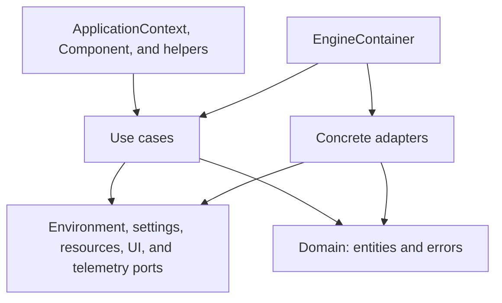

The project applies a practical variant of Clean Architecture. Dependencies point from infrastructure toward contracts and domain, while `EngineContainer` acts as the composition root.

This is an advanced guide. Start with [Introduction](/en/index) and [Source/frozen](/en/source-frozen). A **port** expresses a contract; an **adapter** implements it; the **composition root** connects the pieces.



The arrows show dependencies/construction, not temporal events. `Component` also accesses the global container; not all of its behavior goes through a use case.

## Layers

### Domain

It does not import toolkits or infrastructure. It contains:

- `PlatformType` and its `is_desktop`/`is_mobile` properties;
- `ExecutionMode`;
- `ResourceQuery` and `ResourceResult`;
- `AppMetadata`;
- Qyro error hierarchy.

### Application

The ABC ports describe the required capabilities:

| Port | Responsibility |
| --- | --- |
| `IEnvironmentPort` | Mode, platform, root, and bundle. |
| `ISettingsPort` | Configuration and metadata. |
| `IResourcePort` | Resolve and list resources. |
| `IUIFrameworkPort` | Native application, event loop, icons, and titles. |
| `ITelemetryPort` | Install and handle global exceptions. |

The use cases are small:

- `ResolveResourceUseCase`: normalizes a query and applies the `required` rule.
- `LoadSettingsUseCase`: caches metadata and provides `get_setting()`.
- `InitializeEngineUseCase`: validates the framework, installs telemetry, loads metadata, creates the app, and returns boot info.

### Adapters

They implement the ports with concrete details. GUI dependencies are imported inside methods or after checking availability, so the base package works without all toolkits.

### Client

It exposes a convenient API. `ApplicationContext` translates use-case results into properties; `Component` encapsulates UI conventions.

## Composition root

`EngineContainer` constructs, in order:

1. `SystemEnvironmentAdapter`.
2. `JsonSettingsAdapter`.
3. `FileSystemResourceAdapter`.
4. Reads settings to choose telemetry.
5. Chooses the explicit/configured/autodetected framework.
6. Constructs the three use cases.

```python
from qyro import EngineContainer

container = EngineContainer(
    framework_name=None,
    custom_root=None,
    custom_resources_dir=None,
    custom_settings_dir=None,
    enable_sentry=True,
)
```

The container does not execute `InitializeEngineUseCase` by itself; `ApplicationContext._ensure_global_engine()` does.

## Boot info

`InitializeEngineUseCase.execute(argv)` returns a dictionary:

```python
{
    "app_instance": app_instance,
    "metadata": AppMetadata(...),
    "platform": PlatformType.MACOS,
    "execution_mode": ExecutionMode.SOURCE,
    "is_frozen": False,
}
```

`ApplicationContext` stores it globally and exposes it through properties.

## Environment detection

`SystemEnvironmentAdapter` considers any truthy value in `sys.frozen` to be frozen.

- With `sys._MEIPASS`: `FROZEN_PYINSTALLER` and bundle in `_MEIPASS`.
- Frozen without `_MEIPASS`: `FROZEN_GENERIC`; on macOS it attempts `Contents/Resources`.
- Without frozen: `SOURCE`; searches upward for `pyproject.toml` or `src/`.

`PlatformDetector` maps `sys.platform` and also provides detection for Ubuntu, Fedora, Arch/Manjaro, GNOME, and KDE. iOS is defined in the enum, but the current detector does not contain an iOS branch.

## Extension and testing

The ports allow using test doubles without importing frameworks:

```python
from qyro import AppMetadata
from qyro.application.ports.settings import ISettingsPort

class MemorySettings(ISettingsPort):
    def __init__(self, values):
        self.values = values

    def get_raw_settings(self):
        return dict(self.values)

    def load_metadata(self):
        return AppMetadata(
            app_name=self.values.get("app_name", "Test"),
            raw_settings=dict(self.values),
        )
```

The current container constructs concrete adapters internally; for full injection in tests, the suite replaces methods/globals or directly instantiates use cases with fakes.

## Important decisions

- **Global context:** normal usage shares the engine and fixes options during the first initialization; subclass/mixin paths use class attributes and should not be considered managers of isolated engines.
- **Best-effort UI errors:** title, icon, and style differences between toolkits should not bring down the process.
- **Strict errors for authenticated secrets:** a present but invalid payload is not ignored.
- **Filesystem paths:** even a protected bundle is extracted, preserving compatibility with APIs that require paths.
- **Shallow merge:** simple and predictable, but nested objects must be redefined in full.

## Other containers and extension

The CLI container is different: it connects templates, processes, freezer, bundler, and signer. It does not orchestrate a build from inside the executable. Pydux maintains another independent subsystem for store, selectors, and middleware. See [Tooling](/en/tooling) and [Pydux](/en/pydux).

`EngineContainer` constructs concrete adapters and does not receive all of its ports as injection parameters. For an alternative, instantiate use cases directly with your ports or prepare another composition. There is no public plugin registry implemented.