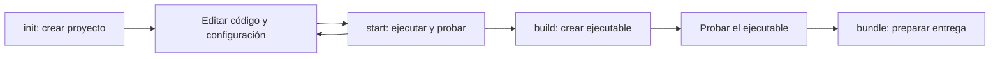

Qyro CLI is the developer's working tool. You use it from a terminal through the `qyro` command. The usual journey of a Qyro application starts here: the CLI creates a project with the selected binding and accompanies you through development, build, and distribution.

Before you begin, distinguish between two elements: **the project** contains your code and its data; **the CLI** performs operations on that project. When `qyro start` opens the application, the code uses Qyro Engine for its startup. The Engine does not create projects or run builds.

## One command, one task

The general form is `qyro <comando> [opciones]`. The command indicates the task; the options allow you to configure that task. For example, in `qyro init --name mi-app --binding PySide6`, `init` creates the project, `--name` selects the folder, and `--binding` selects the GUI toolkit.

| Command | What you use it for | Result |
| --- | --- | --- |
| `qyro init` | Create a project from a template | Initial code, configuration, and dependencies |
| `qyro start` | Run the application during development | Python process that opens your application |
| `qyro build` | Freeze code and dependencies with PyInstaller | Executable and files required to run it |
| `qyro sign` | Sign an already built application | Signed artifacts, with system requirements |
| `qyro bundle` | Prepare the distribution from the build | Folder, archive, or installer |
| `qyro clean` | Remove generated artifacts | Cleanup of the configured build directory |
| `qyro version` | Check versions | CLI and Engine versions |

**Build** prepares an executable application that includes its runtime environment. **Bundle** organizes that result for distribution: it can be a folder, compressed archive, or installer. They are different stages; first you build and test, then you prepare the distribution.



If you need distribution signing, sign the built artifacts before copying them to the final bundle. The specific requirements and commands are explained in [Build, bundle, and distribution](/es/tooling).

## Where to run each command

Run `init` from the folder where you want to create the project. Then enter the created folder with `cd mi-app`. Run `start`, `build`, `sign`, `bundle`, and `clean` there: the CLI needs to find `pyproject.toml` and the project configuration.

Keep that application's Python environment active. `start` and build use the CLI's interpreter; if you installed dependencies in another environment, the CLI will not find them automatically.

## Checking help

Once installed:

```bash
qyro --help
qyro init --help
qyro build --help
```

The first command lists commands. The following commands show options for the specified command. You can also use `python -m qyro_cli --help`; it invokes the CLI with the selected `python` interpreter.

## What `init` creates

A **template**, also called a boilerplate, is a starter project for the selected toolkit. The CLI resolves it, copies its files, replaces your application's data, and installs dependencies. This allows you to start with a project ready for development, without manually building its structure.

The first application uses PySide6. You can also choose PyQt6, PyQt5, PySide2, Tkinter, or Kivy. Each toolkit has its own Python and dependency requirements; the [installation](/es/installation) explains how to choose them.

Continue with [Installation](/es/installation). Then follow [Your first application](/es/quickstart). The [complete configuration file reference](/es/configuration-files) explains every field in `base.json`, platform profiles, `build.json`, `release.json`, `sign.json`, and `secrets.json`; the [Build, bundle, and distribution](/es/tooling) guide covers the distribution workflow.