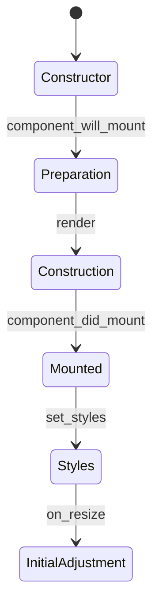

`Component` adds a common construction lifecycle to **Qt**, **Tkinter**, and **Kivy** widgets. The toolkit continues to provide windows, widgets, layouts, events, and styles; Qyro organizes when to prepare and build each component through synchronous hooks.

It is not a reactive rendering system: changing `props` does not run `render()` again, and there is no automatic tree reconciliation. You can import it as `qyro.Component`, `qyro.ui.Component`, or `qyro.ui.component.Component`.

## Framework compatibility

| Capability | Qt | Tkinter | Kivy |
| --- | --- | --- | --- |
| `component_will_mount()` | Yes | Yes | Yes |
| `render()` | Yes | Yes | Yes |
| `component_did_mount()` | Yes | Yes | Yes |
| `props` | Yes | Yes, with positional native arguments | Yes, with positional native arguments |
| `get_resource`, `app_settings`, `is_frozen` | Yes | Yes | Yes |
| `set_styles()` with QSS | Yes | No | No |
| Automatic updates through `resizeEvent` | Yes | No | No |
| `find()` and `destroy_component()` | Qt-oriented | Use native APIs | Use native APIs |

The hooks and helpers are cross-platform. QSS, `resizeEvent`, `findChild`, `setParent`, and `deleteLater` belong to Qt and are not translated to Tkinter or Kivy.

## Common lifecycle

After the native constructor finishes, `Component` runs once:

1. preparation of the stylable background, only when the widget provides the Qt API;
2. `component_will_mount()`;
3. `render()`;
4. `component_did_mount()`;
5. `set_styles()`;
6. initial `on_resize()`.



`component_did_mount()` means that `render()` has finished; it does not guarantee that the toolkit has painted the window. The internal `_component_lifecycle_mounted` flag prevents the same instance from being mounted more than once. The value returned by `render()` is not used by `Component`; Kivy can retrieve it explicitly from `App.build()`.

## Components in Qt

In PySide6, PySide2, PyQt5, and PyQt6, place the native class first and then `Component`:

```python
from PySide6.QtWidgets import QLabel, QWidget
from qyro import Component


class UserCard(QWidget, Component):
    STYLES = "QWidget { border-radius: 8px; background: #252033; }"

    def component_will_mount(self):
        self.user_name = self.props.get("name", "Guest")

    def render(self):
        self.title = QLabel(self.user_name, parent=self)

    def component_did_mount(self):
        self.title.show()

    def on_resize(self):
        self.title.resize(self.calc(self.width(), 90), 32)
```

You can also use it as a decorator:

```python
from PySide6.QtWidgets import QWidget
from qyro import Component


@Component
class UserCard(QWidget):
    pass
```

The decorator creates a class with the same name, module, `qualname`, and docstring. If the class already inherits from `Component`, it is returned unchanged.

### Props in Qt

You can pass a dictionary or keywords:

```python
card = UserCard(parent=window, props={"name": "Ada", "user_id": 7})
card = UserCard(parent=window, name="Ada", user_id=7)
```

`parent` is the only keyword reserved for the Qt constructor. The remaining keywords are removed from the native constructor and stored in `self.props`; if a key also appears inside `props`, the direct keyword takes precedence.

<Warning>On some PyQt5 SIP objects, accessing props before initializing the native class can produce `RuntimeError`. If this occurs, pass native arguments positionally, initialize the widget first, and then assign `self.props`.</Warning>

### Resize in Qt

Qyro wraps `resizeEvent`, runs `on_resize()`, and then attempts to forward the event to the original handler:

```python
def on_resize(self):
    width = self.calc(self.width(), 50)
    self.panel.resize(width, self.height())
```

`calc(a, b)` returns `int((a * b) / 100.0)`. A resize event may arrive before all child construction has finished; use `hasattr` when access could be premature.

### QSS styles in Qt

`set_styles()` works when the object implements `setStyleSheet`. It accepts inline QSS, an existing file, or the path to a Qyro resource. Without an argument, it uses `STYLES`, `CSS`, or `STYLESHEET`, in that order.

```python
from qyro import get_resource

panel.set_styles("QLabel { color: #a78bfa; }")
panel.set_styles(get_resource("styles/debug.qss"))
```

In the root window with `ApplicationContext`, you can use:

```python
self.set_styles(self.get_resource("styles/debug.qss"))
```

A string containing `{` or `;` is interpreted as inline QSS. `_allow_styled_background()` detects the Qt binding and enables `WA_StyledBackground` when available.

## Components in Tkinter

In Tkinter, inherit from a native widget and `Component`. Pass the parent positionally because the Tkinter constructor uses `master`, not the Qt `parent` keyword:

```python
import tkinter as tk
from qyro import Component


class StatusPanel(tk.Frame, Component):
    def component_will_mount(self):
        self.message = self.props.get("message", "Done")

    def render(self):
        self.label = tk.Label(self, text=self.message)
        self.label.pack(padx=12, pady=12)


panel = StatusPanel(root, message="Conectado")
panel.pack(fill="x")
```

Qyro hooks and helpers work, but visual operations remain Tkinter's responsibility:

- use `pack`, `grid`, or `place` for layout;
- use `<Configure>` if you need to react continuously to size changes;
- use widget options or `ttk.Style` for styles;
- use `destroy()` to remove the widget.

`set_styles()`, QSS, `resizeEvent`, `find()`, and `destroy_component()` do not replace those native APIs.

## Components in Kivy

In Kivy, you can add the Qyro lifecycle to a reusable widget:

```python
from kivy.uix.boxlayout import BoxLayout
from kivy.uix.label import Label
from qyro import Component


class StatusPanel(BoxLayout, Component):
    def component_will_mount(self):
        self.message = self.props.get("message", "Done")

    def render(self):
        self.add_widget(Label(text=self.message))
```

The hooks and helpers work, but Kivy retains its own rules:

- use properties, `bind`, KV, canvas, and `Clock`;
- use `size`/`size_hint` and Kivy events instead of `resizeEvent`;
- QSS and `set_styles()` do not apply;
- remove widgets with `remove_widget()` or Kivy APIs.

The root application can combine `App, Component, ApplicationContext`. The official template implements `build()` by returning `self.render()`; see [Qyro with Kivy](/en/frameworks/kivy). Keep `render()` free of registrations or external side effects that should not be repeated.

## Props and native arguments

`props` is created as an empty dictionary when first accessed and supports complete assignment:

```python
self.props = {"title": "New"}
```

The wrapper only automatically forwards the `parent` keyword; any other keyword becomes a prop. This is natural for Qt components, but Tkinter and Kivy use other names in their constructors. For those toolkits, pass native arguments positionally or write an adapted `__init__`.

Changing `self.props` after mounting does not call `render()` again. Update the widget through its framework's API.

## Helpers available in all frameworks

| Method or property | Behavior |
| --- | --- |
| `get_resource(*segments, required=True)` | Resolves a resource through the attached container or global helper. |
| `app_settings` | Returns the Engine's final settings. |
| `is_frozen` | Indicates whether a packaged application is running. |
| `props` | Component properties dictionary. |
| `calc(a, b)` | Calculates a percentage and returns an integer. |

A child component does not need to inherit from `ApplicationContext` to use these helpers:

```python
class LogoPanel(QWidget, Component):
    def render(self):
        logo_path = self.get_resource("images/logo.png")
        settings = self.app_settings
        frozen = self.is_frozen
```

In functions or classes that do not inherit from `Component`, import only the helpers you need:

```python
from qyro import get_resource, is_frozen, load_build_settings

logo = get_resource("images/logo.png")
settings = load_build_settings()
frozen = is_frozen()
```

## Component and ApplicationContext

The root application combines the toolkit's main object with both mixins:

```python
# Qt
class MainWindow(QMainWindow, Component, ApplicationContext):
    ...

# Tkinter
class MainWindow(tk.Tk, Component, ApplicationContext):
    ...

# Kivy
class MainApp(App, Component, ApplicationContext):
    ...
```

`ApplicationContext` connects the framework, settings, resources, metadata, telemetry, and execution. `Component` builds the interface. Reserve `ApplicationContext` for the root application; child widgets normally need only `Component`.

## Destruction and limitations

`destroy_component()` runs `setParent(None)` and `deleteLater()` when the object provides them, so it is Qt-oriented. It does not call a `component_will_unmount` hook or close connections, tasks, bindings, or external subscriptions.

Clean up those resources using the toolkit's closing events. With [Pydux](/en/pydux), explicitly run subscription cleanup. `Component` hooks are synchronous, and several visual operations are *best effort* so they do not interrupt the framework loop.