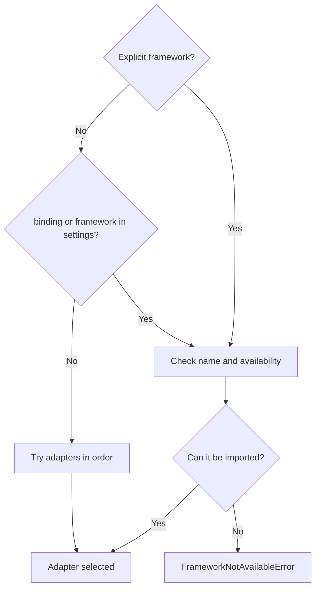

A **UI framework** provides windows, widgets, and events. A Qt **binding** exposes Qt in Python. Qyro's adapter connects startup and a set of common operations to each toolkit; it does not translate widgets between frameworks.

## Choose explicitly

The priority is the context's `framework` (`framework_name` in the container), `binding` from settings, `framework` from settings, and autodetection. In project files, use the canonical PascalCase spelling: `PySide6`, `PyQt6`, `PySide2`, `PyQt5`, `Kivy`, and `Tkinter`; `Headless` is reserved for tests without a UI.

The current implementation strips surrounding spaces and normalizes the value to lowercase before looking up the adapter, so it is not *case-sensitive*: `PySide6` and `pyside6` select the same binding. PascalCase is the recommended convention and the form that examples and generated files should display.



Autodetection: PySide6 → PyQt6 → PySide2 → PyQt5 → Kivy → Tkinter → headless. A requested name that is not available produces an error, not a silent fallback. Importable does not mean that a usable display exists. The first context establishes the process's usual selection.

## Toolkit guides

| Toolkit | Guide | Native application and execution |
| --- | --- | --- |
| PySide6 | [Complete example](/en/frameworks/pyside6) | Creates/reuses `QApplication`; `exec()` |
| PyQt6 | [Complete example](/en/frameworks/pyqt6) | Creates/reuses `QApplication`; `exec()` |
| PyQt5 | [Complete example](/en/frameworks/pyqt5) | Creates/reuses `QApplication`; `exec` if available, otherwise `exec_` |
| PySide2 | [Complete example](/en/frameworks/pyside2) | Same as Qt 5; Engine extra for Python 3.10 |
| Tkinter | [Complete example](/en/frameworks/tkinter) | Retrieves `_default_root`; `mainloop` |
| Kivy | [Complete example](/en/frameworks/kivy) | Looks for `App.get_running_app`; a custom app runs `App.run` |
| Headless | Following example | In-memory test object; `run()` returns `0` |

Do not mix two Qt bindings in the same process. Although the icon adapter identifies a widget's binding through its MRO, that does not make it safe to mix `QApplication` and widgets from different bindings.

## Common contract

`IUIFrameworkPort` exposes `framework_name`, `is_available()`, `create_application(argv=None)`, `run()`, `exit(code=0)`, and the title/icon methods. Visual operations are tolerant attempts to accommodate toolkit differences; verify the result in the actual UI.

Tkinter does not create a root in `create_application`; `run` may retrieve or create one. Kivy also does not immediately create your `App`; if the adapter does not know an app when `run` is executed, it creates a generic one. Qt needs its `QApplication` before any widget, so the examples create the context first.

## Headless

```python
from qyro import ApplicationContext

context = ApplicationContext(framework="headless", enable_sentry=False)
print(context.app.argv)
assert context.run() == 0
```

Headless is always available; it does not provide a real UI or guarantee the availability of other frameworks. Its setters store values in memory, which is useful for tests. For Python version ranges and testing evidence, see [Compatibility](/en/compatibility). To run examples with resources, see [Complete applications](/en/examples).