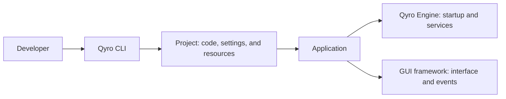

Qyro is an ecosystem for developing, running, and distributing Python applications with graphical interfaces. It provides a common way to organize the project, prepare its startup, and turn it into an application that someone else can use.

The starting point is a common need: writing the interface is only part of the work. You also need to organize configuration and files, run the project with its dependencies, and prepare a distribution for each operating system. Qyro brings these responsibilities together into a development workflow that you can follow from the terminal.

## Why it exists

GUI frameworks handle building the interface and its events. Around that interface, there are tasks that are repeated across applications:

- **Organize the project:** keep code, configuration, and input files in recognizable locations.
- **Prepare startup:** load metadata and options, and have the framework's native application available before creating the interface.
- **Adapt to the system:** select configuration and resources specific to Windows, macOS, or Linux when needed.
- **Find files:** use text, images, fonts, styles, templates, and other assets during development and inside a packaged application.
- **Prepare a distribution:** gather code, interpreter, dependencies, and files; then create a distributable folder, archive, or installer and, when appropriate, sign the application.

Qyro's design separates these tasks into development tools and services that the application uses while it is running. This separation makes it possible to maintain the same project model during development and when preparing a distribution.

## The two components of Qyro

**Qyro CLI** is the terminal tool you use to work on the project. It creates the initial structure from a template, runs the application, and automates build, bundle, signing, and cleanup. It is the entry point for the journey through this documentation.

**Qyro Engine** is the engine your code uses at startup. It provides `ApplicationContext`, configuration, resource resolution, environment information, and integration with the GUI framework. It is installed as a dependency and included in the application you distribute.

A **CLI** is a command-line interface: you use it from the terminal. A **runtime** is the set of services that accompanies the application while it runs. Here, those roles correspond to the CLI and the Engine, respectively.

The CLI works with the project files and its distributions. When the application runs, its code uses the Engine and the GUI framework. On the following pages, you will first learn about the project tools and then the engine services.

## Frameworks and bindings

Qyro works with popular frameworks and bindings from the Python ecosystem: **PySide6, PyQt6, PyQt5, PySide2, Tkinter, and Kivy**.

A **GUI framework** provides windows, layouts, and a loop that handles events. A **binding** allows you to use a native library from Python: PySide and PyQt are Qt bindings. Your choice determines the imports and APIs you will use to write your interface.

The CLI prepares the project for your choice, and the Engine connects its startup with that toolkit. Your application continues to use the framework's native API. The main content of this documentation uses **PySide6**, which will be the Qt binding selected for your first application.

## How to work with Qyro

You begin by creating a Python environment and installing the CLI. Then you use `qyro init` to create the project and choose its binding. You develop the application within that structure, run it with `qyro start`, and, when it is ready, use `qyro build` and `qyro bundle` to generate a distribution.

The project configuration resides in **`settings/`** and the application's input files in **`resources/`**. The Engine provides access to both from your code. You do not have to design that workflow from scratch for every project.

## Learning path

1. **Qyro:** understand these fundamentals.
2. **Qyro CLI:** learn about [the tool](/es/cli), prepare the [installation](/es/installation), create [your first application](/es/quickstart), and learn its [structure](/es/project-structure) and [distribution workflow](/es/tooling).
3. **Qyro Engine:** study [the engine](/es/engine), its context, settings, resources, and components when you need to use them in your code.
4. **Shared state:** learn about the [optional integration with Pydux](/es/pydux), after understanding the engine.
5. **Demos:** explore the [complete applications](/es/examples) to bring together the concepts you have learned.