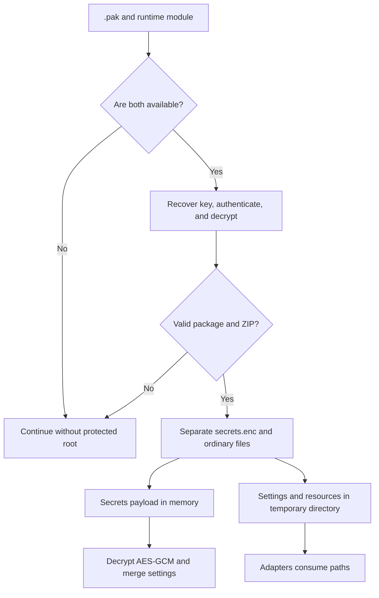

Qyro Runtime consumes artifacts generated by Qyro CLI. It does not create the protected package: it discovers, validates, decrypts, and connects it to the existing adapters.

<Warning>Protection encrypts data at rest and detects tampering. It cannot absolutely hide a secret from someone capable of running, debugging, or inspecting the binary and process memory.</Warning>

## Expected artifacts

```text
.qyro/
├── resources.pak
└── runtime*.so | runtime*.pyd | runtime*.dylib
```

The compiled module must export `RUNTIME_SECRET_HEX`, a hexadecimal string representing at least 16 bytes.

## Loading flow

1. Determine `bundle_dir` in frozen mode or `root_dir` in source mode.
2. Look for `.qyro/resources.pak` and the first supported `runtime*`.
3. Calculate a cache key using the path, size, and `mtime_ns` of both files.
4. Read the runtime secret by loading the extension module as `runtime`.
5. Verify and decrypt the `.pak` in memory.
6. Read `.qyro/secrets.enc` in memory without extracting it.
7. Extract ordinary settings and resources to a temporary directory.
8. Insert those paths into the normal configuration and resource priorities.

## Resource package format

The file begins with:

```text
QYRPKG | salt(16) | wrapped_key(32) | nonce(16) | HMAC-SHA256(32) | ciphertext
```

- The 32-byte resource key is wrapped using XOR with a keystream derived from `SHA-256(runtime_secret + salt)`.
- The content is encrypted with a block-based keystream based on `SHA-256(key + nonce + counter)` and XOR.
- The `HMAC-SHA256(key, nonce + ciphertext)` tag authenticates the nonce and ciphertext.
- The resulting plaintext must be a valid ZIP.

This scheme is a Qyro-specific internal format. Secrets use a different standard scheme.

## Extraction and cache

The folder is:

```text
<temp>/qyro_protected_<16 hex of the package SHA-256>/
```

An `.ok` file marks a complete extraction and allows it to be reused. The process maintains class-level caches protected by `threading.Lock`.

There is no automatic cleanup on exit or new validation of the extracted content when `.ok` exists. The lock is process-local, not shared between multiple processes. Extracted settings and resources remain readable: that folder is not a secure store.

During extraction:

- `.qyro/secrets.enc` is omitted;
- any entry under `.qyro/` is omitted;
- settings and resources are extracted so the APIs can continue returning filesystem paths.

If an artifact is missing, the signature does not match, the format is invalid, or extraction fails, `ProtectedResourceBundle` returns `None` and the runtime continues with other roots. This tolerance applies to the general package.

## Secrets format

Secrets use AES-256-GCM and HKDF-SHA256:

```text
QYRSEC | version | kdf_id | cipher_id | salt_len | nonce_len | salt | nonce | ciphertext+tag
```

Current values:

- version `1`;
- KDF id `1`: HKDF-SHA256;
- cipher id `1`: AES-GCM;
- 32-byte derived key;
- 12-byte nonce;
- HKDF info `qyro-secrets-v1`;
- the complete header is authenticated as AAD.

```python
from qyro.adapters.resources.secrets_crypto import (
    decrypt_secrets_payload,
    encrypt_secrets_payload,
)

runtime_secret = b"a" * 32
encrypted = encrypt_secrets_payload(b'{"token":"abc"}', runtime_secret)
plaintext = decrypt_secrets_payload(encrypted, runtime_secret)
```

These functions are internal infrastructure; normally Qyro CLI encrypts and the runtime decrypts.

The usual approach is to store API keys, tokens, licenses, and other protected data required by the application in `settings/secrets.json`. The build omits the plain file, includes its encrypted payload in the package, and the Engine decrypts it in memory; the application accesses them through `app_settings` without directly calling these cryptographic functions.

## Secrets merge

The decrypted JSON must be an object. Its keys override base settings, platform settings, and plain secrets. The merge is shallow.

Legacy compatibility: if the bundle does not contain `.qyro/secrets.enc`, the runtime looks for `.qyro/secrets.json` as an **encrypted** payload, not plain JSON.

## Failures and guarantees

| Situation | Result |
| --- | --- |
| Missing `.pak` or runtime module | The protected source is ignored. |
| Invalid `.pak` HMAC signature | The package is silently discarded. |
| Embedded secrets without runtime module | In practice, the `.pak` cannot be opened; they are not applied. |
| Incorrect AES-GCM tag or runtime secret | `SecretsCryptoError` (`ValueError`). |
| Plaintext is not UTF-8/JSON/object | `ValueError`. |
| Tampered secrets payload | AES-GCM rejects authentication. |

## Recommendations

- Do not log `RUNTIME_SECRET_HEX`, derived keys, or plaintext.
- Do not version `settings/secrets.json` or `settings/sign.json`.
- Use minimum-scope credentials and frequent rotation.
- For high-value secrets, prefer a remote backend or operating-system store and obtain short-lived tokens at runtime.
- Consider client secrets compromised if an attacker controls its process.
- Regenerate the bundle and module together; the cache key depends on both.

## Build, runtime, and fallback



The loader opens the complete package and extracts the ZIP; it does not decrypt only the requested file. The cache avoids repeated extraction. Outer failures allow fallback; AES-GCM failures from a received payload are strict.

In `build.json`, the CLI accepts:

```json
{
  "resource_protection": {
    "enabled": true,
    "settings_dir": "settings",
    "resources_dir": "resources",
    "bundle_path": ".qyro/resources.pak"
  }
}
```

It recursively packages those folders under `settings/` and `resources/`, excludes the local `secrets.json` and `sign.json` files, and adds only the encrypted version of runtime secrets if present. It generates a secret/key per build, compiles the runtime using Cython, and adds both artifacts under `.qyro` in PyInstaller. The runtime module is also compiled without full protection to package secrets.

Keep the `resources.pak` basename: the runtime looks for that fixed name even if the CLI accepts another `bundle_path`. There is no automatic classification of sensitive data; do not include other copies of secrets in assets.

Use `qyro bundle --format dir --no-resources`, or your format with `--no-resources`, when the assets are already included. Otherwise, it copies the original readable resources alongside the protected application.

The outer XOR/keystream is a custom format, distinct from AES-GCM for secrets; it is not presented as independently audited cryptography. The material required to decrypt is distributed with the client. See [Secrets](/en/secrets) and [Tooling](/en/tooling). `clean` does not remove `.qyro` or this temporary extraction.