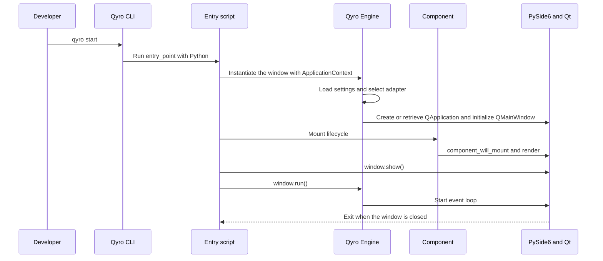

In this guide, you will create a desktop application with **Qyro CLI and PySide6**. You need to have completed the [installation](/en/installation) and keep the Python environment active.

The workflow consists of generating the project with the CLI, developing within its structure, and running it with the CLI. The template prepares the initial files; here you will learn what each step does and how to modify the first window.

## 1. Create the project

From the directory where you keep your projects:

```bash
qyro init --name myapp --target-platform desktop --binding PySide6 --app-name MyApp --version 1.0.0 --author qyro --yes
```

| Option | What it selects |
| --- | --- |
| `--name myapp` | Directory the CLI will create for the project |
| `--target-platform desktop` | Initial desktop project |
| `--binding PySide6` | Toolkit used to build the interface |
| `--app-name MyApp` | Application name in settings |
| `--version 1.0.0` | Your application version |
| `--author qyro` | Author recorded in its configuration |
| `--yes` | Acceptance of the creation confirmation |

The command provides the data for this guide. You can also use `qyro init --name myapp --binding PySide6` and answer the wizard's questions.

The CLI resolves a Qt template, copies its files, applies the provided data, and installs the project dependencies. The first download requires access to GitHub; a previous cache can serve as an alternative. If the download fails, fix the connection/permissions and repeat the creation in a new directory; see [Troubleshooting](/en/troubleshooting).

## 2. Enter and run

```bash
cd myapp
qyro start
```

`cd` enters the generated project. `start` reads its configuration and runs the file specified by `entry_point` in `settings/base.json` with the CLI's Python interpreter. The template's initial application opens. Close it before continuing.

The dependency installation performed by `init` may use Poetry, uv, or Pipenv if they are available. If the package manager created another environment, run the CLI inside that environment and install the same packages from the [installation guide](/en/installation) there. `start` does not switch interpreters automatically. With pip, use the environment you already activated.

## 3. Recognize the files

Open the generated directory in your editor. **`settings/`** contains the configuration and **`resources/`** the files used by the application. Your Python code is in the entry file and in the modules added by the template.

In `settings/base.json`, check `binding` and `entry_point`: the binding should correspond to PySide6 and the entry point identifies the script that `qyro start` opens. Keep the other generated data. The [project structure](/en/project-structure) explains the purpose of each directory.

## 4. Understand and modify the first window

Open the script specified by `entry_point`. With `--binding PySide6 --app-name MyApp`, Qyro CLI generates this structure:

```python
import sys
from PySide6.QtWidgets import QMainWindow, QLabel
from qyro import ApplicationContext
from qyro.ui.component import Component


class MiApp(QMainWindow, Component, ApplicationContext):

    def component_will_mount(self):
        self.setMinimumSize(640, 480)

    def render(self):

        label = QLabel(
            f"Hello, World!\n\n\n"
            f"App Title: {self.window_title}\n\n"
            f"Active Icon: {self.app_icon}\n\n"
            f"Platform: {self.platform.value} (Frozen: {self.is_frozen})\n",
            parent=self
        )
        label.move(50, 50)
        label.resize(label.sizeHint())


if __name__ == "__main__":
    window = MiApp()
    window.show()
    sys.exit(window.run())
```

The `PySide6` import corresponds to the value of `--binding`. The `MiApp` class is derived from `--app-name` and converted to PascalCase when necessary. The generated file is already executable Python: it does not contain template variables that you need to replace manually.

The class combines three responsibilities:

- `QMainWindow` provides the native Qt window.
- `Component` automatically runs the `component_will_mount()` → `render()` lifecycle when the instance is constructed. The first hook sets the minimum size and `render()` creates the child `QLabel`.
- `ApplicationContext` prepares Qyro and exposes `window_title`, `app_icon`, `platform`, `is_frozen`, and `run()`.

`label.resize(label.sizeHint())` adjusts the label to the text. `window.show()` displays the window and `window.run()` starts the binding's event loop. `sys.exit(...)` returns Qt's exit code to the system.

To make the first change without losing the generated structure, replace `Hello, World!` with `Mi primera aplicación con Qyro y PySide6` inside `render()`.

You do not need to learn all the context methods yet. The [Engine introduction](/en/engine) explains its role after the CLI guide.

Run again from the project directory:

```bash
qyro start
```

You will see the window with the text you just wrote and your application's title. Close it using its native close control.



The CLI launches the process; the Engine prepares the services within that process; Qt manages the interface and its events.

## Choose another binding

Qyro CLI supports **PySide6, PyQt6, PyQt5, PySide2, Tkinter, and Kivy**. The `--binding` value selects the template and dependencies. The graphical API used by the code must also correspond to that choice: a PyQt project does not use PySide6 imports.

This guide keeps PySide6. Later, you will find examples for the other toolkits in [Frameworks](/en/frameworks). Check their Python requirements before choosing them.

## Next step

You have now used the main development workflow: `init` to generate and `start` to test changes. Continue with [Project structure](/en/project-structure) and [Build, bundle, and distribution](/en/tooling). Then study [Qyro Engine](/en/engine) to incorporate configuration, resources, and components into your application.