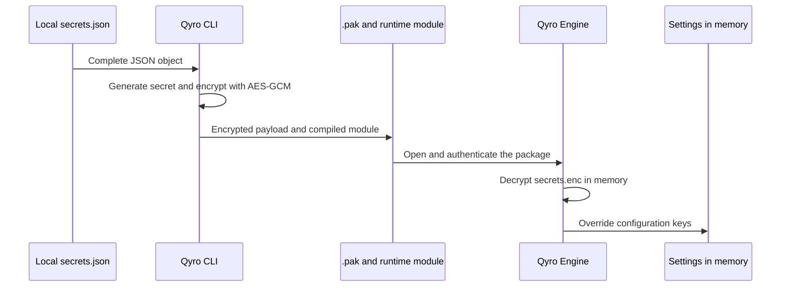

`settings/secrets.json` stores only protected data that the application needs during execution: API keys, tokens, service credentials, licenses, or other runtime values. Qyro applies it as a configuration override.

In source mode, the Engine reads the local file. During `qyro build`, the CLI excludes that plain copy from the bundle, encrypts the entire object, and packages its protected version so the Engine can recover it in frozen mode. Passwords, certificates, identities, and notarization credentials belong in `settings/sign.json`, which is loaded only by `qyro sign` and is never packaged.

A public endpoint or application name does not need the same treatment and can remain in `base.json`. Qyro protects embedded secrets at rest, although it does not replace an operating-system secure store or an authentication backend when the risk model requires the client to never possess a high-value credential.

## Source: local JSON object

The Engine applies `secrets.json` alongside the selected settings folder; if it is missing, it tries `<root>/settings/secrets.json` (in frozen mode, using the bundle as the base). It only applies it if a settings folder was found. The file must be an object:

```json
{
  "api_url": "https://api.example.com",
  "api_key": "<application-api-key>",
  "service_token": "<service-token>",
  "license_key": "<local-license-key>"
}
```

<Warning>
Do not version this file. JSON/read errors from the plain file are silently ignored; validate its syntax during development. Its keys shallowly replace base/platform values. The final override is the encrypted secrets, if found. See [Settings](/en/settings).
</Warning>

After loading settings, the application consumes those values through the same API as any other configuration:

```python
api_key = self.app_settings.get("api_key")
service_token = self.app_settings.get("service_token")
```

In source mode, they come from the local JSON. In frozen mode, they come from the encrypted payload after it has been decrypted in memory; the application code does not need to know the path or implement decryption.

## Frozen: what the CLI does

The build reads the entire object, encrypts it with AES-256-GCM, uses HKDF-SHA256 to derive a key from the generated runtime secret, and places the payload in `.qyro/secrets.enc` inside the `.pak`. It compiles a `runtime` module with Cython containing the material required for decryption.



Without full resource protection, the current build requires `settings/secrets.json`; `{}` is valid for an application without secrets. With full protection, a secrets file is optional if other packageable files exist. Both modes compile the runtime module. The Engine does not automatically encrypt the source JSON.

## Separation between application secrets and signing

The two files have different lifecycles:

- `settings/secrets.json` contains values that the application must recover in source and frozen modes;
- `settings/sign.json` contains configuration required only by the signing process;
- `qyro build` encrypts and packages the entire `secrets.json` object;
- `qyro sign` activates `release.json` and then `sign.json` to sign already-built artifacts;
- the Engine does not load `sign.json`, and the CLI excludes it from normal staging and the protected package.

Local example of `settings/sign.json`:

```json
{
  "sign": {
    "windows": {
      "certificate": "src/sign/windows/certificate.pfx",
      "password": "<certificate-password>"
    },
    "mac": {
      "identity": "Developer ID Application: Ejemplo (TEAMID)",
      "notary": {
        "keychain_profile": "QYRO-NOTARY"
      }
    }
  }
}
```

Do not add `sign` or flat signing aliases to `secrets.json`: `qyro build` rejects them to prevent them from entering the client payload. Although runtime secrets remain encrypted at rest, the client includes the mechanism required to decrypt them. Keep both files out of Git and generate `sign.json` from the CI secret store when automating a release.

## Recommended architecture for high-value secrets

<Warning>
Do not distribute master keys, administrative credentials, or API keys with broad access or unlimited spending capability in a client application. Although Qyro encrypts `secrets.json` inside the build, the application must decrypt its values to use them, and a person with control of the device can inspect the process. Encryption makes direct extraction more difficult; it does not make it impossible to recover a credential included in the client.
</Warning>

For private APIs, payments, artificial intelligence, and privileged operations, keep the real key on a server you control. The application authenticates against your backend over HTTPS and receives only a temporary token, limited data, or the result of the operation.

```text
Client application
        │
        │ HTTPS + session or temporary token
        ▼
Your API / backend
        │
        │ Real API key stored on the server
        ▼
External provider
```

For example, if your application uses OpenAI, Stripe, or another private API:

```text
Client   → api.tudominio.com/generate
Backend  → api.proveedor.com
Backend  → returns only the permitted result
```

The real key remains in the backend. The client receives only the result or a temporary, limited-scope capability. This allows you to apply authentication, usage limits, input validation, auditing, revocation, and rotation without publishing a new version of the application.

Use `secrets.json` when the client necessarily needs to know the value, for example a local credential, license, protected identifier, or limited-scope token. Even then:

- grant only the permissions that are strictly necessary;
- use short expiration and rotation when the provider allows it;
- avoid credentials shared by all users;
- apply spending, quota, and origin limits at the provider;
- never write secrets or the complete settings dictionary to logs;
- immediately revoke a key if you suspect it was exposed.

## Guarantees and limitations

AES-GCM verifies the secrets payload, including its header. An invalid tag produces `SecretsCryptoError` (a subclass of `ValueError`); non-UTF-8 text, invalid JSON, or an object of the wrong type produces `ValueError`. Do not print the complete settings dictionary for diagnostics.

The loader does not extract `.qyro/secrets.enc` to the temporary directory; it keeps the encrypted payload in memory and then merges the decrypted JSON. This does not prevent a debugger or code inside the process from reading the result. The runtime module and payload are distributed together, so the client has what it needs to recover the values.

In addition, a failure of the outer `.pak` is ignored and allows fallback to ordinary resources/settings. Only a secrets payload that has reached the decryption stage triggers the strict errors described above. There is no global mandatory shutdown policy for every form of tampering.

Protection encrypts secrets at rest, detects payload modifications, and increases the cost of extraction. As with any secret that a client application must use, the value eventually becomes available in memory during execution. For especially critical data, combine Qyro with minimum-scope credentials, rotation, short-lived tokens, and, where appropriate, a backend or operating-system store.

## Legacy compatibility

If there are no usable embedded secrets, the Engine tries `.qyro/secrets.json`, which in that location is an **encrypted payload**, not the source JSON. It requires a compatible `runtime*.so`, `.pyd`, or `.dylib`. Regenerate both artifacts together and do not copy compiled modules between Python versions or platforms without validation.

The format of both packages and extraction are explained in [Protected resources](/en/protected-resources).