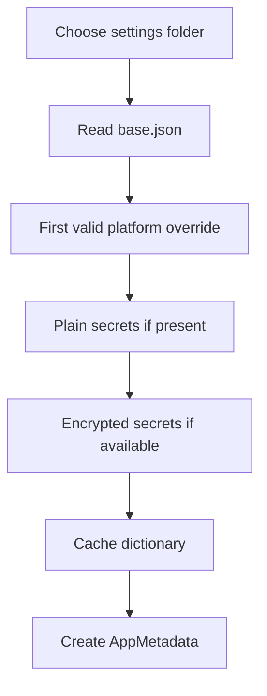

**Settings** describe the application and the build process: identity, binding, entry point, platform options, optimization, bundle, and signing. Qyro CLI uses many of those keys to build and distribute; Qyro Engine reads the files again during startup, but directly consumes only the runtime keys it needs. The rest remains available in `app_settings`. Settings are not preference persistence and do not apply themes, sizes, or widgets by themselves.

The [CLI configuration files](/en/configuration-files) section explains the CLI's deep merge and explicit profiles. Those rules are different from the ones used by the Engine. To prepare the files visually, you can start with [Qyro Settings Builder](https://qyro-settings-builder.up.railway.app/), review the export, and save it in `settings/`. Create `secrets.json` locally for protected runtime data and `sign.json` for signing; keep both out of version control.

## Files

`base.json` is the file that identifies a settings folder. It can be complemented with:

| Platform | Primary name | Alias |
| --- | --- | --- |
| Windows | `windows.json` | `win32.json` |
| macOS | `mac.json` | `darwin.json` |
| Linux | `linux.json` | — |

Only the first existing and valid platform file is used according to that order.

## Value precedence

The merge is shallow and uses `dict.update()`:

```text
base.json
   ↓ overrides
platform file
   ↓ overrides
plain secrets.json
   ↓ overrides
embedded or legacy encrypted secrets
```

Example:

```json
{
  "app_name": "Example",
  "window": {"width": 800, "height": 600},
  "debug": false
}
```

```json
{
  "window": {"width": 1024},
  "debug": true
}
```

The first block is saved in `base.json` and the second in `windows.json`, without comments. The resulting `window` will be `{"width": 1024}`: it does not preserve `height`, because there is no deep merge. Repeat the entire object to preserve all its fields.



Each override replaces entire keys. Use JSON objects: ordinary files do not have schema validation, and `dict.update` can accept unexpected structures or apply data partially before an exception.

## Finding the folder

The supported and recommended structure for a project is a single folder at the root:

```text
<root>/
└── settings/
    ├── base.json
    ├── windows.json, linux.json, or mac.json
    ├── sign.json      # exclusive to qyro sign; the Engine ignores it
    └── secrets.json
```

`base.json` identifies the folder. In source mode, the Engine uses `<root>/settings`; in frozen mode, it uses the protected settings prepared by Qyro CLI and, if they are not available, the settings from the bundle. It selects only one folder: it does not combine files from two different locations.

`sign.json` can coexist in the folder because it belongs to the CLI workflow, but it does not enter the Engine merge. Therefore, certificates and notarization credentials never appear in `app_settings`.

`custom_settings_dir` in `EngineContainer` allows an explicit location for advanced integrations. If it exists, it replaces the normal search; `ApplicationContext` does not expose that parameter directly.

<Note>The adapter preserves internal fallbacks for legacy structures, but they are not part of the recommended structure. New projects should use only `settings/` at the root.</Note>

## Metadata keys

`load_metadata()` specially recognizes:

| Key | Default |
| --- | --- |
| `app_name` | `QyroApp` |
| `version` | `1.0.0` |
| `author` | `Developer` |
| `identifier` | `com.qyro.app` |
| `description` | empty string |

All keys, known or unknown, remain in `metadata.raw_settings` and are available through `metadata.get(key, default)` or `context.app_settings`.

Other keys consumed by the runtime are:

- `binding` or `framework`: toolkit selection; `binding` takes precedence.
- `sentry_dsn`: enables the Sentry adapter if `enable_sentry=True`.
- `icon` or `app_icon`: icon resource; `icon` takes precedence.

```json
{
  "app_name": "QyroApp",
  "version": "2.3.0",
  "author": "Acme",
  "identifier": "com.acme.qyroapp",
  "description": "Desktop client",
  "binding": "PySide6",
  "icon": "icons/app.png",
  "theme": "dark"
}
```

## Caching and reloading

`JsonSettingsAdapter.get_raw_settings()` caches the dictionary after the first read. `LoadSettingsUseCase` also maintains its own `AppMetadata` cache.

```python
metadata = container.load_settings_use_case.execute()
metadata = container.load_settings_use_case.execute(force_reload=True)
```

`force_reload=True` rebuilds `AppMetadata`, but the adapter continues returning its cached dictionary. There is no public API that invalidates `_cached_settings`; the files are intended for startup configuration, not hot reload.

## Application secrets in source mode

`secrets.json` stores API keys, tokens, and other protected data the application needs. In source mode, it can exist alongside `base.json`; if it is not there, `<root>/settings/secrets.json` is attempted. It must contain a JSON object:

```json
{
  "api_url": "https://api.example.com",
  "api_key": "<application-key>",
  "service_token": "<protected-token>"
}
```

Do not version it. The application obtains its values from `context.app_settings` or `self.app_settings`; access is the same in source and frozen mode. Read, JSON, or type errors in the plain file are silently ignored.

## Encrypted secrets in frozen mode

During build, Qyro CLI encrypts the entire `secrets.json` object; it does not distribute its source copy in plaintext. The runtime prefers `.qyro/secrets.enc` embedded inside `protected_resources.pak`. For compatibility, it also accepts the external encrypted `.qyro/secrets.json` file. In both cases, it requires a compiled `runtime*.so`, `.pyd`, or `.dylib` module with `RUNTIME_SECRET_HEX`.

The decrypted payload must be UTF-8, JSON, and an object. Unlike ordinary JSON files, an invalid encrypted secret raises `ValueError`/`SecretsCryptoError`, because silently continuing could start the application with incorrect credentials.

See [Protected resources](/en/protected-resources) for the cryptographic format and its security model.

## Error behavior

- Complete absence of settings: `{}` is returned and `AppMetadata` uses defaults; `SettingsNotFoundError` exists but the current adapter does not raise it.
- Invalid base/platform/plain JSON: silently ignored.
- Corrupted encrypted payload, incorrect key, or invalid decrypted JSON: an error is raised.
- `sentry_dsn` without `sentry-sdk`: startup continues with a warning.

## In-memory configuration and tooling

`context.app_settings` and `get_raw_settings()` return the cached dictionary by reference. Modifying it does not write files or automatically rebuild metadata fields. Snippets using `container` assume a created `EngineContainer`.

`load_metadata` uses the defaults from the table. `AppMetadata(app_name="Ejemplo")` uses the dataclass defaults (`version="0.1.0"`, empty author/identifier); `AppMetadata.default()` uses `author="Author"`. They are not identical forms.

`entry_point`, `release.json`, `sign.json`, `optimization`, `bundle`, `sign`, and `resource_protection` are tooling inputs when the tooling interprets them. The Engine does not activate release/debug/sign profiles or read `build.json`; a `window` or `debug` key does not configure the UI by itself. Your application reads and applies its options. See the [complete CLI configuration reference](/en/configuration-files) for types, defaults, precedence, and examples by platform.

Before using credentials, see [Secrets](/en/secrets), especially the separation between runtime secrets and signing credentials.