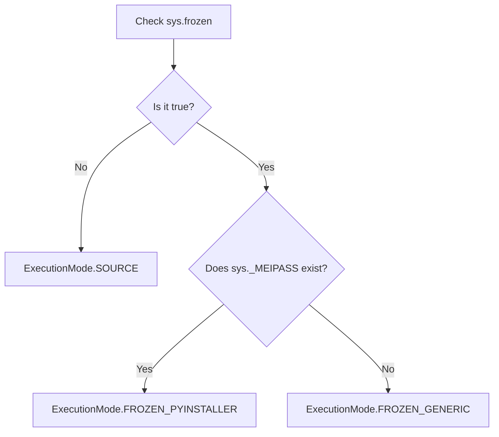

**Source** means running the Python files with an interpreter, for example when running `qyro start` or `python main.py`. **Frozen** means running an artifact that includes the application and its Python environment, normally generated by PyInstaller through Qyro CLI. Freezing does not convert all Python logic into native code or create an installer by itself.

Qyro Engine adapts configuration and resource loading to both environments. When `ApplicationContext` is part of the main class, your code can continue using `self.get_resource("texts/welcome.txt")` even when the file is no longer in the original project tree.

## Detection

`SystemEnvironmentAdapter.is_frozen()` returns `getattr(sys, "frozen", False)`. It is normally boolean, but the adapter does not explicitly convert the value to `bool`. The presence of `_MEIPASS` without `sys.frozen` is not enough.



`ExecutionMode.EMBEDDED` is declared, but the current detector does not return it. Generic names for other freezers in comments do not constitute verified integration with each tool.

## Root and bundle directory

The **root** is used to locate a source project or the executable directory. The **bundle directory** contains the data that the freezer makes available to the application. They are not always the same location.

| Method | Source | Frozen with `_MEIPASS` | Generic frozen |
| --- | --- | --- | --- |
| `get_root_dir()` | First ancestor of the working directory containing `pyproject.toml` or `src`; if none, working directory | Parent of `sys.executable` | Parent of `sys.executable` |
| `get_bundle_dir()` | Root | `Path(sys._MEIPASS).resolve()` | On macOS, `../Resources` from the executable's parent if it exists; otherwise, root |

`custom_root=Path(...)` replaces the root without normalizing it. Use an absolute `Path`. In frozen mode with `_MEIPASS`, it **does not replace the bundle directory**.

```python
from PySide6.QtWidgets import QMainWindow
from qyro import ApplicationContext
from qyro.ui.component import Component


class MiApp(QMainWindow, Component, ApplicationContext):
    def component_will_mount(self):
        print(self.execution_mode.value)
        print(self.container.env_adapter.get_root_dir())
        print(self.container.env_adapter.get_bundle_dir())
```

In normal usage, you do not need to inspect these paths: use `self.get_resource(...)` and let the Engine choose the correct location. `custom_root=Path(...)` is intended for advanced integrations that need to explicitly replace the root.

In source mode, the search starts from the working directory, not from `__file__`. Running `python /ruta/app/main.py` from another folder may select a different root. Enter the project first or pass an explicit root. In frozen mode, avoid calculating the root from the script's `__file__`: its location may belong to the bundle.

The `onedir` and `onefile` formats belong to Qyro CLI, not the Engine. What matters here is that both are detected as `FROZEN_PYINSTALLER`; see [Build, bundle, and distribution](/en/tooling#first-build) to choose and generate the format.

## Configuration and resources

Precedence details are centralized in [Settings](/en/settings) and [Resources](/en/resources).

| Area | Source | Frozen |
| --- | --- | --- |
| Settings | Local configuration with `base.json` first; protected package afterward | Protected-package configuration first; ordinary bundle paths afterward |
| Resources | Protected resources before project resources, if a valid package exists | Protected resources before ordinary bundle resources |
| Encrypted secrets | Searched under `.qyro` in the root | Searched under `.qyro` in the bundle |
| Custom configuration | Existing explicit directories replace the normal search | Same; they are not automatically packaged by specifying a path to the Engine |

There is no guarantee of equivalence between a build and source mode if they load different files. `release.json` is a CLI profile: the Engine does not activate it automatically. Ordinary resources may be flattened during the build; the resolver accepts some variants without the first `base` or platform segment.

## Two different temporary directories

PyInstaller manages its execution location. Separately, Qyro extracts protected resources to `<temp>/qyro_protected_<digest>/`. The second directory is cached and has an `.ok` marker; the loader does not implement automatic cleanup when the application closes or revalidate already extracted content when the marker exists.

Embedded secrets are not written there as decrypted JSON by the loader, but ordinary resources and settings remain readable. See [Protection and limitations](/en/protected-resources).

## User data

Resources are application inputs, not storage for preferences or documents. Qyro does not provide a user-data directory API or settings persistence. Choose an appropriate writable folder for your application and manage the data there; do not write to `_MEIPASS`, the `.pak`, the temporary extraction directory, or the installation folder.

To move from source to frozen, follow [Build and distribution](/en/tooling). The [complete example](/en/examples) shows the same file access in both modes.