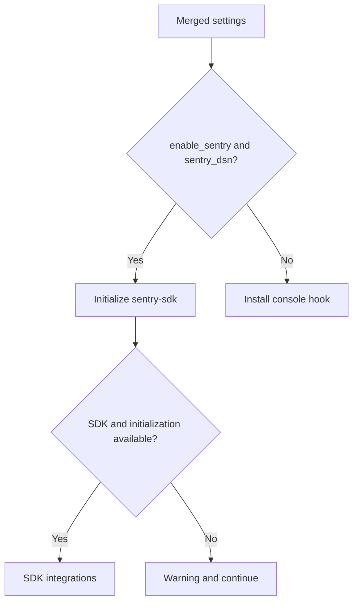

Qyro installs an exception hook during `InitializeEngineUseCase.execute()`. The adapter is selected when `EngineContainer` is constructed.

## Selection

```text
enable_sentry=True and non-empty sentry_dsn → SentryExceptionHookAdapter
any other case                              → ConsoleExceptionHookAdapter
```

The selection uses the already-merged settings value.

## Configuration in settings

To enable Sentry, install `sentry-sdk` and add `sentry_dsn` to `settings/base.json`:

```bash
pip install sentry-sdk
```

With Poetry, use:

```bash
poetry add sentry-sdk
```

```json
{
  "app_name": "MyApp",
  "version": "2.1.0",
  "binding": "PySide6",
  "sentry_dsn": "https://public@example.ingest.sentry.io/123"
}
```

The Engine uses two values:

| Setting | Usage |
| --- | --- |
| `sentry_dsn` | If it contains a non-empty string, selects `SentryExceptionHookAdapter`. |
| `version` | Sent to Sentry as the release name. The internal fallback is `0.1.0`. |

The DSN can be in `base.json`, the platform file, or `secrets.json`. The Engine applies its usual shallow merge and uses the final value. A later profile can disable Sentry by overriding it with an empty string:

```json
{
  "sentry_dsn": ""
}
```

There are no settings for changing `environment` or `traces_sample_rate`: the current adapter uses `"production"` and `0.2`. There is also no JSON setting named `enable_sentry`; that value is a construction option of `ApplicationContext` and `EngineContainer`.

## Usage with the ApplicationContext mixin

In an application generated by Qyro, you do not need to initialize Sentry manually. The main class mixes in `ApplicationContext`, which loads the settings and configures telemetry before finishing construction of the window:

```python
import sys
from PySide6.QtWidgets import QLabel, QMainWindow
from qyro import ApplicationContext
from qyro.ui.component import Component


class MyApp(QMainWindow, Component, ApplicationContext):
    def render(self):
        label = QLabel(
            f"App: {self.window_title}\n"
            f"Release: {self.app_settings.get('version', 'no version')}",
            parent=self,
        )
        label.move(40, 40)
        label.resize(label.sizeHint())


if __name__ == "__main__":
    window = MyApp()
    window.show()
    sys.exit(window.run())
```

The flow happens automatically:

1. `ApplicationContext` creates the shared Engine.
2. The Engine merges `base.json`, the platform profile, and secrets.
3. If the result contains a non-empty `sentry_dsn`, it selects Sentry.
4. During startup, it installs the adapter before creating or retrieving the native application.
5. The window continues with `component_will_mount()` and `render()`.

Do not call `sentry_sdk.init()` from `render()` or from each component. That would repeat an initialization that belongs to global startup. Child components reuse the same Engine and do not need to inherit from `ApplicationContext`.

## Console

`ConsoleExceptionHookAdapter.install()` replaces `sys.excepthook`. An unhandled exception prints:

- a Qyro banner to `stderr`;
- type, message, and complete traceback;
- a final separator.

`KeyboardInterrupt` is forwarded to the original hook to preserve normal Ctrl+C termination.

```python
from qyro.adapters.telemetry.console_hook import ConsoleExceptionHookAdapter

hook = ConsoleExceptionHookAdapter(show_banner=True)
hook.install()
```

The `show_banner` parameter is stored, but the current implementation always prints the banner.

## Sentry

Once selected, the adapter internally performs this call:

This block describes the internal call; `dsn` and `version` are configuration values, not variables defined by the snippet.

```python
sentry_sdk.init(
    dsn=dsn,
    environment="production",
    release=version,
    traces_sample_rate=0.2,
)
```

If the constructor receives an empty DSN, it also checks the `SENTRY_DSN` environment variable. However, `EngineContainer` only creates this adapter when `raw_settings["sentry_dsn"]` is already truthy; through that path, an environment variable by itself does not change the selection.

If `sentry-sdk` is missing or initialization fails, a warning is printed and the process continues. `handle_exception()` captures the error only after successful initialization.

## Disabling Sentry

With the mixin pattern, the simplest option is to omit `sentry_dsn` or leave its final value empty. Qyro then automatically selects the console hook.

In an advanced integration that constructs the context explicitly, you can also disable it through code:

```python
from qyro import ApplicationContext

ctx = ApplicationContext(enable_sentry=False)
```

This selects the console hook even if `sentry_dsn` exists. Do this before creating a window that mixes in `ApplicationContext`, because the first context establishes the global container. Do not pass `enable_sentry` as a prop to a child component.

## Actual scope

- The global hook covers exceptions that reach `sys.excepthook`.
- Some toolkits intercept errors inside callbacks; their own mechanism may be required.
- The Sentry adapter does not explicitly replace `sys.excepthook`; it relies on `sentry-sdk` integrations, and its `handle_exception` method is not directly registered in `install()`.
- Qyro does not send logs, custom breadcrumbs, or user information.

Do not include secrets in exception messages. Cryptographic functions do not log plaintext or runtime secrets, but your application may do so accidentally.



A Sentry failure does not automatically install Qyro's console hook. Selection occurs when constructing the container; `install` occurs during startup. Coverage of all callback or thread errors is not guaranteed.