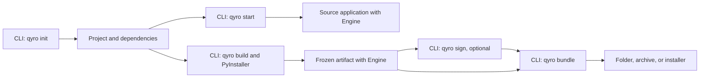
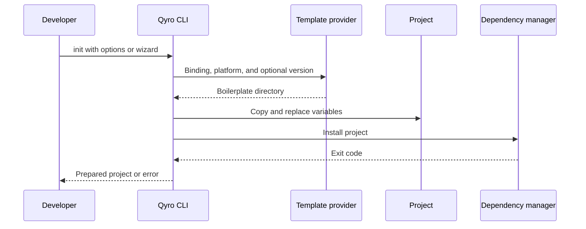
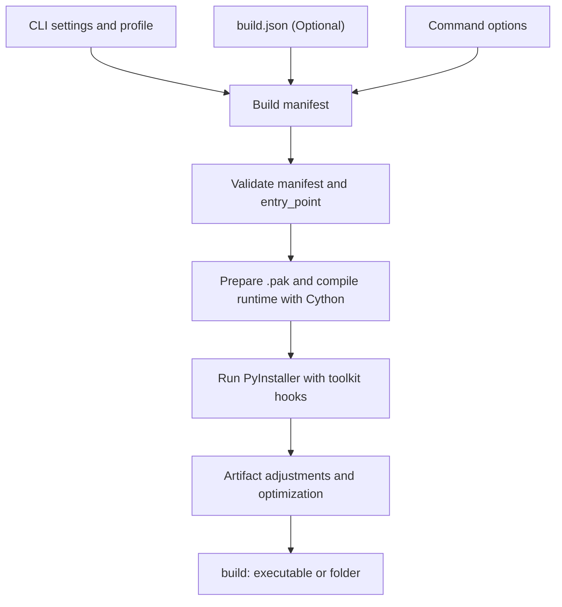

This guide completes the [Qyro CLI](/en/cli) journey. After creating the project and testing it with `qyro start`, you need to prepare an executable application and organize its files for distribution. Here you will learn the build, signing, and bundle stages, and the configuration they use.



Signing works on build artifacts. If you are going to sign them, do so before copying them into a final bundle. `bundle` does not freeze code or automatically sign the installer it generates. There is no public command for publishing or uploading releases in the current registry.

## Install the tooling

With your application's environment active:

```bash
pip install --pre "qyro-cli[desktop]"
qyro_cli --help
```

`[desktop]` adds PyInstaller, Pillow, and Cython. The CLI imports Pillow from its container; installing only the base package may fail before even executing commands unrelated to the build. The CLI distribution also declares a dependency on the Engine. See [Installation](/en/installation).

The `qyro` and `qyro_cli` executables invoke the same command application. The second form makes it easier to ensure which interpreter is being used.

## Create with `qyro init`

```bash
qyro init --name my-app --target-platform desktop --binding PySide6 --app-name MyApp --version 1.0.0 --author Ejemplo --yes
```

`--name` is the folder; `--app-name` is the application name. `--binding` selects the toolkit. `--target-platform desktop` is normalized to the x86_64 scaffolding option; it does not start a compilation. `--yes` accepts the confirmation; it does not fill in all questions if other values are missing. The command above supplies the required data and omits addons.

The initializer checks whether `main.py` exists at the destination, gathers options, resolves a template, copies its tree, replaces variables with `string.Template`, and installs dependencies. It does not delete the destination directory beforehand: use a new folder to avoid mixing projects.



The provider queries `Neuri-AI` repositories: `qyro-boilerplate-qt` for Qt and `qyro-boilerplate-tkinter` / `qyro-boilerplate-kivy` for those toolkits. It tries tags compatible with the minimum version `1.0.0`, the default branch when appropriate, the cache at `~/.qyro/templates`, and finally packaged templates.

`--template-version` requires a specific parseable version, for example `1.0.0`; `1.0.x` is not a valid version. The implemented range keeps tags with the same major version and no lower than the minimum. The Qt cache is shared by the binding family. Remote content may change: inspect the generated project instead of assuming an identical structure for all templates.

<Note>There is no `qyro_cli/templates` in the audited checkout. The fallback provider is implemented, but there are no local templates that can guarantee `init` without a network connection or a previous cache. If the download fails and you have no cache, you need to resolve the connection to complete `init`.</Note>

The installer selects the first available manager in this order: Poetry (`lock`, `install`), uv (`lock`, `sync`), Pipenv (`lock`, `install`), or the CLI's Python (`pip install .`). The subsequent `start` process does **not automatically switch** to the environment created by that manager. Activate the project environment or run `poetry run qyro start` / `uv run qyro start` if the CLI is installed there.

Additional implemented options: repeatable `--addon` (`hotrl`, `pydux`, `sentry-sdk`, `requests`), `--bundle-id`, and platforms `x86_64`, `apple-silicon`, `iphone`, `android`. The addon registers dependencies/configuration; it does not guarantee that your UI already has state connections or hot reload. [Mobile support](/en/compatibility) is incomplete.

## Run with `qyro start`

Run from the project root:

```bash
qyro start
```

The CLI requires `pyproject.toml`, reads `settings/base.json` and local secrets, checks `binding`, checks `entry_point`, and launches `[sys.executable, entry_point]` in a subprocess with the root added to `PYTHONPATH`. The Engine starts inside that process. `start` does not accept its own arguments or implement a reload watcher in its current use case.

The CLI settings repository does not activate the platform profile in `start`; the Engine does apply its override when starting. Keep the bindings in the configuration files consistent.

## First build

You need an installed toolkit, `[desktop]`, a C compiler compatible with your Python, and the project data. Cython is used even when `resource_protection.enabled` is `false`.

Before the first build, check that the generated project contains `settings/secrets.json`. If your application does not use secrets, its content must be an empty object:

```json
{}
```

An empty file is not equivalent to `{}`. In the path without resource protection, the CLI requires this file; in the path with full protection, finding settings/resources is sufficient, and secrets are optional. Put only API keys, tokens, and other protected values that the application needs there. The CLI encrypts **the entire** object during the build and the Engine recovers it in frozen mode. Signing credentials belong in `settings/sign.json`. Read [Secrets](/en/secrets) to understand the separation and its limits.

```bash
qyro build --mode onedir --debug
```

`--mode onedir` generates a folder; `--debug` enables a console. By default, the profile is `release`, the output is placed in `build/`, and the PyInstaller from the current interpreter is executed. On Windows, an `app_name` of `MyApp` normally produces `build/MyApp/MyApp.exe`. On windowed macOS, `build/MyApp.app` is expected; on Linux, `build/MyApp/MyApp`.



The CLI's loading behavior differs from the runtime's: its repository recursively combines nested objects, activates the host profile first and then the requested profile, and reapplies secrets after each profile. `_load_manifest` selects fields from `build.json` with fallbacks to settings and CLI options; it is not a uniform merge of all fields. Many choices use `or`, so false or empty values in `build.json` may fall back to the settings value. `hidden_imports`, `paths`, `collect_all`, and additional arguments are aggregated.

`build.json` is optional. The recommended configuration lives in `settings/base.json` and in `settings/windows.json`, `settings/linux.json`, or `settings/mac.json`; place `optimization` there, because it remains alongside the other platform-specific options.

If you need to temporarily isolate a freezer problem, you can create this diagnostic `build.json` and remove it afterward:

```json
{
  "bundle": "onedir",
  "optimization": {
    "upx_enabled": false,
    "strip_binaries": false,
    "bytecode_opt": 0,
    "clean_build": false,
    "remove_translations": false,
    "exclude_modules": []
  },
  "resource_protection": {"enabled": false}
}
```

This configuration makes it easier to diagnose the first artifact. Default optimizations may remove translations, metadata, plugins, or libraries. Check all your application's functions before reducing its size. `build.json` is interpreted only by the CLI; the Engine does not read it and it is not required for a normal build. See [Configuration files](/en/configuration-files) to learn which file values can replace or concatenate settings.

Actual build options: `-m/--mode`, `--onefile`, `--debug`, `--console`, `--uac`, `-p/--profile`, `-c/--clean`, `-i/--interactive`, `--target`, `--init-spec`. `freeze` is an alias for `build`. There is no custom manifest option or `--extra-args` in the current parser; `build.json` supports `extra_args`.

`--target windows/mac/linux` selects profile and parameters; it does not provide a cross-compiler. Build and test on the target system. Mobile options detect a use case that the current container does not configure and return an error.

## Test the artifact before distribution

Open the executable directly, from a different working directory, and check resources, configuration, and important tasks. If it fails, check `build/pyinstaller_command.txt`, `build/pyinstaller_output.log`, and, when the build finishes, `build/build_log.txt`.

The [source/frozen guide](/en/source-frozen) explains why paths change. For undetected data/imports, check `hidden_imports`, `collect_all`, and the CLI hooks. Installing the Engine on the user's computer does not solve missing dependencies: the build must include them.

## Optional signing

```bash
qyro sign --check
qyro sign
```

The first command validates requirements without signing files; the second signs already built artifacts. Configure both platforms in the local `settings/sign.json` file. Windows requires `signtool`, a certificate, and a password in `sign.windows`; it recursively signs the extensions recognized by the signer. macOS requires `codesign`, an identity in `sign.mac`, and a valid `.app`; it signs nested binaries and the bundle, and can perform notarization, stapling, and Gatekeeper assessment.

Options: `--platform auto/windows/mac`, `--check`, `--notarize`, `--staple`, `--no-assess`, `--keychain-profile`. `--staple` implies notarization. Linux does not have a configured signer. The macOS build also attempts ad hoc signing: it is not equivalent to distribution signing with an identity and notarization.

`qyro sign` loads `release.json` first and then `sign.json`. The Engine never reads `sign.json`, and the build excludes it from PyInstaller and the protected package. Add it to `.gitignore`; in CI, create it from the secret store immediately before signing. `secrets.json` remains reserved for values used by the application at runtime.

## Bundle and distribution

A first distribution without installer dependencies:

```bash
qyro bundle --format dir --no-resources
```

Copies the build artifact to `release/<app_name>/`. In `onedir`, it avoids nesting two folders with the same name. `--no-resources` prevents additionally copying the original `resources/`: the required data must already be part of the build. This is especially important in protected builds, because the bundle copies ordinary resources by default and could include a second readable copy.

```bash
qyro bundle --format zip --no-resources
qyro bundle --check
```

`--format zip` creates a distribution archive with name and version. `--zip` is another option: it adds a ZIP in addition to the main format. `installer` is an alias for `bundle`.

| Format | Main requirements |
| --- | --- |
| `dir`, `zip`, `tar.gz` | CLI filesystem and archive operations |
| `auto` | macOS: `dmg`; Windows: `nsis`; Linux: `tar.gz` |
| `dmg` | macOS and DMG creation tools; customizations require `create-dmg` |
| `nsis` | Windows, `makensis`, NSIS template, and valid options |
| `deb`, `rpm`, `arch` | Linux and `fpm` |

Other options: `--release-dir`, `--platform`, `--no-resources`, `--zip`, `--format`, `--check`. `settings/release.json` can contain `bundle.extra_files`, `bundle.dmg.extra_files`, and `bundle.nsis`; `bundle.dmg.extra_files` is included inside the DMG only with `create-dmg`, not with `hdiutil`. The [CLI configuration file reference](/en/configuration-files) documents their types, defaults, and validations. The commands do not upload the distribution to an external service.

## Clean and check versions

```bash
qyro version
qyro clean
qyro clean --release
```

`version` shows CLI and Engine versions using distribution metadata and fallbacks. `clean` removes `freeze_dir` (`build` by default); `--release` adds the literal `release` folder. It does not remove `.qyro`, template caches, temporary extraction, or a custom release folder. Review custom paths before cleaning: the code does not enforce that `freeze_dir` remains inside the project.

To diagnose commands and differences from older documentation, continue with [Troubleshooting](/en/troubleshooting) and [Compatibility](/en/compatibility).