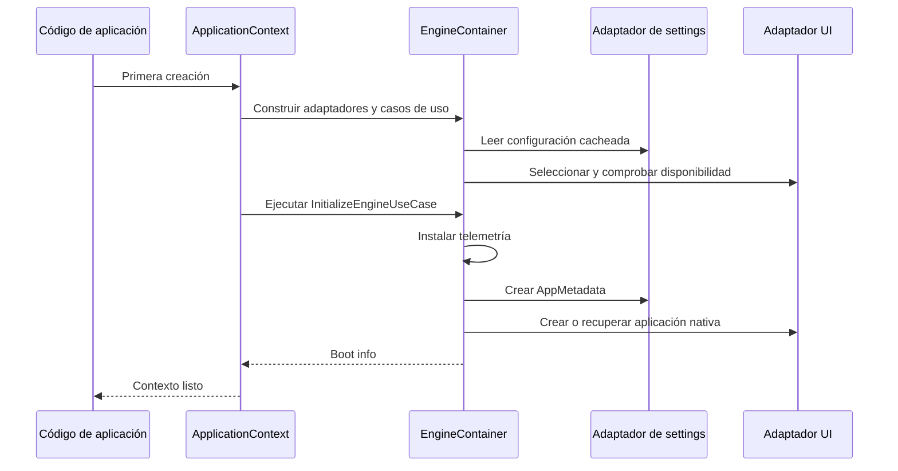

# ApplicationContext

Una aplicación necesita configuración, recursos y una instancia del framework antes de iniciar su bucle de eventos. `ApplicationContext` es la fachada que reúne estas responsabilidades. Puedes usarlo por composición junto a widgets nativos, como en el [inicio rápido](/es/quickstart), o como mixin en una ventana.

## Crear un contexto

```python
from pathlib import Path
from qyro import ApplicationContext

context = ApplicationContext(
    framework="headless",
    custom_root=Path.cwd().resolve(),
    enable_sentry=False,
    argv=[],
)
print(context.metadata.app_name)
print(context.platform.value, context.execution_mode.value)
```

| Parámetro | Default | Significado |
| --- | --- | --- |
| `framework` | `None` | Nombre del adaptador; sin valor usa settings y después autodetección |
| `custom_root` | `None` | `Path` que sustituye la raíz; utiliza un path absoluto |
| `enable_sentry` | `True` | Permite seleccionar Sentry si settings contiene un DSN |
| `argv` | `None` | Argumentos para crear la aplicación nativa; Qt usa `sys.argv` cuando no se indican |
| `*args`, `**kwargs` | — | Reenvío cooperativo al constructor siguiente en la herencia |

## El arranque



El **boot info** es el resultado de arranque: instancia nativa, metadatos, plataforma, modo y condición frozen. Construir `EngineContainer` por sí solo carga settings y selecciona framework, pero no ejecuta ese caso de uso ni inicia un bucle de eventos.

## Estado global y primera inicialización

En el uso habitual, el primer contexto fija el contenedor compartido y sus opciones. Una instancia posterior con otro `framework` o raíz no sustituye el motor. Elige esas opciones antes de construir ventanas y evita efectos secundarios de arranque al importar módulos.

Los helpers `qyro.get_resource`, `load_build_settings` e `is_frozen` usan el contenedor del contexto cuando existe. Si se llaman primero crean un contenedor procedural independiente, sin ejecutar la inicialización del framework; un contexto posterior puede reemplazar ese contenedor procedural. No interpretes un helper como una garantía de arranque completo.

La implementación utiliza atributos de clase y tiene rutas de inicialización por subclases y mixins. No está diseñada para gestionar varias aplicaciones/toolkits aislados en un proceso. No hay reset público; los tests restablecen atributos privados. Para tests de frameworks diferentes utiliza procesos separados.

## Propiedades

| Propiedad | Resultado |
| --- | --- |
| `container` | `EngineContainer`, con adaptadores y casos de uso |
| `app` | Instancia nativa o `None`, según el momento y toolkit |
| `metadata` | `AppMetadata` |
| `app_settings` | Diccionario final de settings, por referencia |
| `platform` | `PlatformType` detectado |
| `execution_mode` | `ExecutionMode` detectado |
| `is_frozen` | Valor del arranque que normalmente es booleano |
| `window_title` | Título del contexto, con getter/setter |
| `app_icon` | Ruta del icono o `None`, con getter/setter |

Modificar `app_settings` cambia memoria compartida: no persiste un JSON ni reconstruye automáticamente los campos de `metadata`. Usa configuración de arranque y estado mutable de aplicación como conceptos separados.

## Título e icono

```python
context.set_window_title(context.get_default_window_title(), window=window)
context.set_window_icon("icons/app.png", window=window)
```

Este fragmento presupone una ventana nativa ya creada. Por composición, especifica `window`; la propiedad `context.window_title` por sí sola actúa sobre el contexto, no descubre tu ventana.

El título por defecto sale de `metadata.app_name`, después del valor raw y finalmente `Qyro Application`. En modo mixin intenta conservar un título explícito del widget tras el constructor. `get_window_title()` puede devolver el último título cacheado aunque después lo cambies por la API nativa; usa un mecanismo coherente.

El icono explícito usa `icon` o `app_icon` como nombre de recurso. Sin valor, prueba candidatos por plataforma y fallbacks (`icons/Icon.ico`, PNG con tamaños, `app.icns`, etc.). No todos los nombres son equivalentes ni todos los formatos funcionan en cada toolkit. `set_window_icon` acepta un path existente o un recurso relativo; devuelve falso al no resolverlo, pero verdadero con una ruta válida aunque el toolkit no lo muestre.

## Herencia múltiple

En Qt, una ventana puede combinar `QMainWindow`, `Component` y `ApplicationContext`. El wrapper del contexto prepara la aplicación nativa antes del constructor del widget; al finalizar intenta aplicar título e icono. Consulta el [ejemplo PySide6](/es/frameworks/pyside6).

Los wrappers también pueden inicializar sin opciones explícitas antes de que tu constructor las procese. Para elegir framework/raíz de forma determinista, crea primero un contexto separado con esas opciones y luego la ventana. Evita pasar `framework=` como keyword a un `Component`: lo interpretaría como prop.

## Ejecutar y terminar

`context.run()` delega al adaptador. Qt devuelve el código de `exec`/`exec_`; Tkinter, Kivy y headless devuelven `0`. En Kivy, una subclase nativa `App` debe ejecutar su propio `run`; el adaptador sin un `App` existente puede crear una aplicación genérica sin tu UI.

Para terminar por el adaptador utiliza `context.container.framework_adapter.exit(code=0)`. No existe `context.exit()` ni un lifecycle de cierre automático de recursos Python. Qt sale del loop, Tkinter destruye su root y Kivy detiene la app que el adaptador conoce. Libera conexiones y suscripciones según el toolkit.

Las rutas y diferencias de arranque están en [Source/frozen](/es/source-frozen); los errores globales, en [Telemetría](/es/telemetry).
