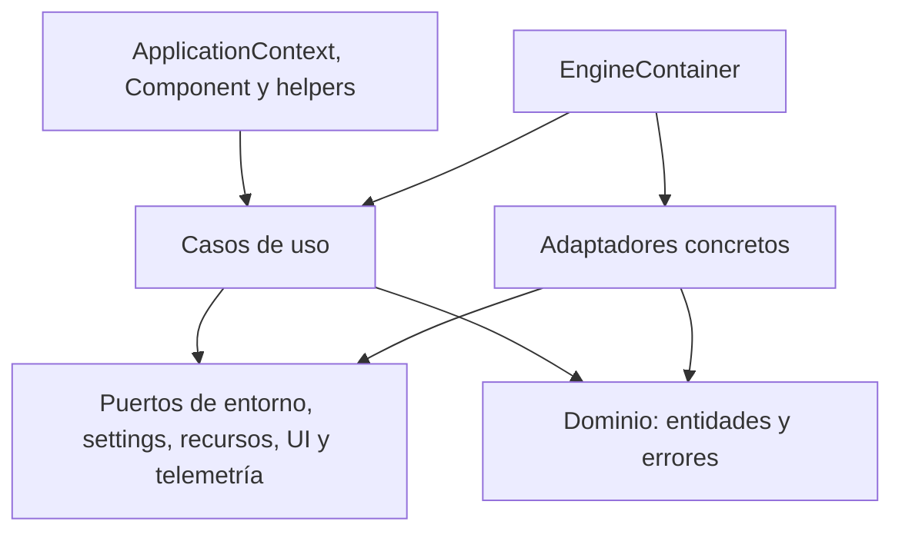

El proyecto aplica una variante práctica de Clean Architecture. Las dependencias apuntan desde infraestructura hacia contratos y dominio, mientras `EngineContainer` actúa como composition root.

Esta es una guía avanzada. Comienza por [Introducción](/es/index) y [Source/frozen](/es/source-frozen). Un **puerto** expresa un contrato; un **adaptador** lo implementa; la **raíz de composición** conecta las piezas.



Las flechas muestran dependencias/construcción, no eventos temporales. `Component` también accede al contenedor global; no todo su comportamiento pasa por un caso de uso.

## Capas

### Dominio

No importa toolkits ni infraestructura. Contiene:

- `PlatformType` y sus propiedades `is_desktop`/`is_mobile`;
- `ExecutionMode`;
- `ResourceQuery` y `ResourceResult`;
- `AppMetadata`;
- jerarquía de errores Qyro.

### Aplicación

Los puertos ABC describen las capacidades necesarias:

| Puerto | Responsabilidad |
| --- | --- |
| `IEnvironmentPort` | modo, plataforma, root y bundle. |
| `ISettingsPort` | configuración y metadatos. |
| `IResourcePort` | resolver y listar recursos. |
| `IUIFrameworkPort` | aplicación nativa, event loop, iconos y títulos. |
| `ITelemetryPort` | instalar y atender excepciones globales. |

Los casos de uso son pequeños:

- `ResolveResourceUseCase`: normaliza una consulta y aplica la regla `required`.
- `LoadSettingsUseCase`: cachea metadatos y ofrece `get_setting()`.
- `InitializeEngineUseCase`: valida el framework, instala telemetría, carga metadata, crea la app y devuelve boot info.

### Adaptadores

Implementan los puertos con detalles concretos. Las dependencias GUI se importan dentro de métodos o después de verificar disponibilidad, para que el paquete base funcione sin todos los toolkits.

### Cliente

Expone una API cómoda. `ApplicationContext` traduce los resultados de casos de uso a propiedades; `Component` encapsula convenciones de UI.

## Composition root

`EngineContainer` construye en orden:

1. `SystemEnvironmentAdapter`.
2. `JsonSettingsAdapter`.
3. `FileSystemResourceAdapter`.
4. Lee settings para elegir telemetría.
5. Elige framework explícito/configurado/autodetectado.
6. Construye los tres casos de uso.

```python
from qyro import EngineContainer

container = EngineContainer(
    framework_name=None,
    custom_root=None,
    custom_resources_dir=None,
    custom_settings_dir=None,
    enable_sentry=True,
)
```

El contenedor no ejecuta `InitializeEngineUseCase` por sí mismo; lo hace `ApplicationContext._ensure_global_engine()`.

## Boot info

`InitializeEngineUseCase.execute(argv)` devuelve un diccionario:

```python
{
    "app_instance": app_instance,
    "metadata": AppMetadata(...),
    "platform": PlatformType.MACOS,
    "execution_mode": ExecutionMode.SOURCE,
    "is_frozen": False,
}
```

`ApplicationContext` lo guarda globalmente y lo proyecta mediante propiedades.

## Detección de entorno

`SystemEnvironmentAdapter` considera frozen cualquier valor truthy en `sys.frozen`.

- Con `sys._MEIPASS`: `FROZEN_PYINSTALLER` y bundle en `_MEIPASS`.
- Frozen sin `_MEIPASS`: `FROZEN_GENERIC`; en macOS intenta `Contents/Resources`.
- Sin frozen: `SOURCE`; busca hacia arriba `pyproject.toml` o `src/`.

`PlatformDetector` mapea `sys.platform` y además ofrece detección de Ubuntu, Fedora, Arch/Manjaro, GNOME y KDE. iOS está definido en el enum, pero el detector actual no contiene una rama iOS.

## Extensión y pruebas

Los puertos permiten usar dobles sin importar frameworks:

```python
from qyro import AppMetadata
from qyro.application.ports.settings import ISettingsPort

class MemorySettings(ISettingsPort):
    def __init__(self, values):
        self.values = values

    def get_raw_settings(self):
        return dict(self.values)

    def load_metadata(self):
        return AppMetadata(
            app_name=self.values.get("app_name", "Test"),
            raw_settings=dict(self.values),
        )
```

El contenedor actual construye adaptadores concretos internamente; para inyección total en tests, la suite reemplaza métodos/globales o instancia casos de uso directamente con fakes.

## Decisiones importantes

- **Contexto global:** el uso habitual comparte motor y fija opciones en la primera inicialización; las rutas por subclases/mixins usan atributos de clase y no deben considerarse gestores de motores aislados.
- **Errores best-effort en UI:** título, icono y estilos no deben derribar el proceso por diferencias de toolkit.
- **Errores estrictos en secretos autenticados:** un payload presente pero inválido no se ignora.
- **Rutas de filesystem:** incluso un bundle protegido se extrae, preservando compatibilidad con APIs que exigen paths.
- **Merge superficial:** sencillo y predecible, pero objetos anidados deben redefinirse completos.

## Otros contenedores y extensión

El contenedor del CLI es distinto: conecta plantillas, procesos, freezer, bundler y signer. No orquesta un build dentro del ejecutable. Pydux mantiene otro subsistema independiente de store, selectors y middleware. Consulta [Tooling](/es/tooling) y [Pydux](/es/pydux).

`EngineContainer` construye adaptadores concretos y no recibe todos sus puertos como parámetros de inyección. Para una alternativa instancia casos de uso directamente con tus puertos o prepara otra composición. No hay registro público de plugins implementado.
