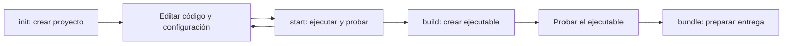

Qyro CLI es la herramienta de trabajo del desarrollador. La utilizas desde una terminal mediante el comando `qyro`. El recorrido habitual de una aplicación Qyro empieza aquí: el CLI crea un proyecto con el binding elegido y te acompaña durante desarrollo, build y distribución.

Antes de comenzar, distingue dos elementos: **el proyecto** contiene tu código y sus datos; **el CLI** ejecuta operaciones sobre ese proyecto. Cuando `qyro start` abre la aplicación, el código utiliza Qyro Engine para su arranque. El Engine no crea proyectos ni ejecuta builds.

## Un comando, una tarea

La forma general es `qyro <comando> [opciones]`. El comando indica la tarea; las opciones permiten configurar esa tarea. Por ejemplo, en `qyro init --name mi-app --binding PySide6`, `init` crea el proyecto, `--name` elige la carpeta y `--binding` el toolkit gráfico.

| Comando | Para qué lo utilizas | Resultado |
| --- | --- | --- |
| `qyro init` | Crear un proyecto desde una plantilla | Código inicial, configuración y dependencias |
| `qyro start` | Ejecutar la aplicación durante desarrollo | Proceso Python que abre tu aplicación |
| `qyro build` | Congelar código y dependencias con PyInstaller | Ejecutable y archivos necesarios para ejecutarlo |
| `qyro sign` | Firmar una aplicación ya construida | Artefactos firmados, con requisitos del sistema |
| `qyro bundle` | Preparar la distribución a partir del build | Carpeta, archivo o instalador |
| `qyro clean` | Retirar artefactos generados | Limpieza del directorio de build configurado |
| `qyro version` | Consultar versiones | Versiones del CLI y Engine |

**Build** prepara una aplicación ejecutable que incluye su entorno de ejecución. **Bundle** organiza ese resultado para entregarlo: puede ser una carpeta, archivo comprimido o instalador. Son etapas distintas; primero construyes y pruebas, después preparas la distribución.



Si necesitas firma de distribución, firma los artefactos construidos antes de copiarlos al bundle final. Los requisitos y comandos específicos se explican en [Build, bundle y distribución](/es/tooling).

## Dónde ejecutar cada comando

Ejecuta `init` desde la carpeta donde quieres crear el proyecto. Después entra en la carpeta creada con `cd mi-app`. Ejecuta allí `start`, `build`, `sign`, `bundle` y `clean`: el CLI necesita encontrar `pyproject.toml` y la configuración del proyecto.

Mantén activo el entorno Python de esa aplicación. `start` y build utilizan el intérprete del CLI; si instalaste dependencias en otro entorno, el CLI no las encontrará automáticamente.

## Consultar ayuda

Una vez instalado:

```bash
qyro --help
qyro init --help
qyro build --help
```

La primera orden enumera comandos. Las siguientes muestran opciones del comando indicado. También puedes utilizar `python -m qyro_cli --help`; invoca el CLI con el intérprete `python` seleccionado.

## Qué crea `init`

Una **plantilla**, también llamada boilerplate, es un proyecto inicial para el toolkit elegido. El CLI la resuelve, copia sus archivos, sustituye los datos de tu aplicación e instala dependencias. Así comienzas con un proyecto preparado para desarrollar, sin construir manualmente su estructura.

La primera aplicación usa PySide6. También puedes elegir PyQt6, PyQt5, PySide2, Tkinter o Kivy. Cada toolkit tiene sus requisitos de Python y dependencias; la [instalación](/es/installation) explica cómo elegirlos.

Continúa con [Instalación](/es/installation). Después sigue [Tu primera aplicación](/es/quickstart). La [referencia completa de archivos de configuración](/es/configuration-files) explica cada campo de `base.json`, los perfiles de plataforma, `build.json`, `release.json`, `sign.json` y `secrets.json`; la guía [Build, bundle y distribución](/es/tooling) desarrolla el flujo de entrega.
