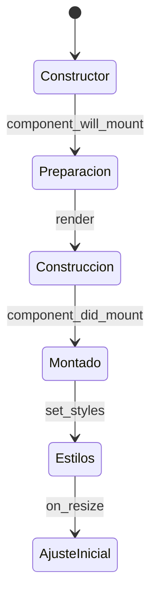

# Componentes

`Component` añade un ciclo de construcción común a widgets de **Qt**, **Tkinter** y **Kivy**. El toolkit continúa proporcionando las ventanas, widgets, layouts, eventos y estilos; Qyro organiza cuándo preparar y construir cada componente mediante hooks síncronos.

No es un sistema de render reactivo: cambiar `props` no vuelve a ejecutar `render()` y no existe reconciliación automática de árboles. Puedes importarlo como `qyro.Component`, `qyro.ui.Component` o `qyro.ui.component.Component`.

## Compatibilidad por framework

| Capacidad | Qt | Tkinter | Kivy |
| --- | --- | --- | --- |
| `component_will_mount()` | Sí | Sí | Sí |
| `render()` | Sí | Sí | Sí |
| `component_did_mount()` | Sí | Sí | Sí |
| `props` | Sí | Sí, con argumentos nativos posicionales | Sí, con argumentos nativos posicionales |
| `get_resource`, `app_settings`, `is_frozen` | Sí | Sí | Sí |
| `set_styles()` con QSS | Sí | No | No |
| Actualización automática mediante `resizeEvent` | Sí | No | No |
| `find()` y `destroy_component()` | Orientados a Qt | Usa APIs nativas | Usa APIs nativas |

Los hooks y helpers son multiplataforma. QSS, `resizeEvent`, `findChild`, `setParent` y `deleteLater` pertenecen a Qt y no se traducen a Tkinter o Kivy.

## Ciclo común

Después de que termina el constructor nativo, `Component` ejecuta una vez:

1. preparación del fondo estilizable, únicamente cuando el widget ofrece la API de Qt;
2. `component_will_mount()`;
3. `render()`;
4. `component_did_mount()`;
5. `set_styles()`;
6. `on_resize()` inicial.



`component_did_mount()` significa que `render()` ya terminó; no garantiza que el toolkit haya pintado la ventana. El flag interno `_component_lifecycle_mounted` evita montar la misma instancia más de una vez. El valor retornado por `render()` no es utilizado por `Component`; Kivy puede recuperarlo explícitamente desde `App.build()`.

## Componentes en Qt

En PySide6, PySide2, PyQt5 y PyQt6, coloca primero la clase nativa y después `Component`:

```python
from PySide6.QtWidgets import QLabel, QWidget
from qyro import Component


class UserCard(QWidget, Component):
    STYLES = "QWidget { border-radius: 8px; background: #252033; }"

    def component_will_mount(self):
        self.user_name = self.props.get("name", "Invitado")

    def render(self):
        self.title = QLabel(self.user_name, parent=self)

    def component_did_mount(self):
        self.title.show()

    def on_resize(self):
        self.title.resize(self.calc(self.width(), 90), 32)
```

También puedes utilizarlo como decorador:

```python
from PySide6.QtWidgets import QWidget
from qyro import Component


@Component
class UserCard(QWidget):
    pass
```

El decorador crea una clase con el mismo nombre, módulo, `qualname` y docstring. Si la clase ya hereda de `Component`, se devuelve sin cambios.

### Props en Qt

Puedes pasar un diccionario o keywords:

```python
card = UserCard(parent=window, props={"name": "Ada", "user_id": 7})
card = UserCard(parent=window, name="Ada", user_id=7)
```

`parent` es el único keyword reservado para el constructor Qt. Las demás keywords se retiran del constructor nativo y se guardan en `self.props`; si una clave aparece también dentro de `props`, gana el keyword directo.

<Warning>En algunos objetos SIP de PyQt5, consultar props antes de inicializar la clase nativa puede producir `RuntimeError`. Si aparece, pasa los argumentos nativos de forma posicional, inicializa primero el widget y asigna después `self.props`.</Warning>

### Resize en Qt

Qyro envuelve `resizeEvent`, ejecuta `on_resize()` y después intenta reenviar el evento al handler original:

```python
def on_resize(self):
    width = self.calc(self.width(), 50)
    self.panel.resize(width, self.height())
```

`calc(a, b)` devuelve `int((a * b) / 100.0)`. Un evento de resize puede llegar antes de terminar la construcción de todos los hijos; usa `hasattr` cuando un acceso pueda ser prematuro.

### Estilos QSS en Qt

`set_styles()` funciona cuando el objeto implementa `setStyleSheet`. Acepta QSS inline, un archivo existente o la ruta de un recurso Qyro. Sin argumento utiliza, en orden, `STYLES`, `CSS` o `STYLESHEET`.

```python
from qyro import get_resource

panel.set_styles("QLabel { color: #a78bfa; }")
panel.set_styles(get_resource("styles/debug.qss"))
```

En la ventana raíz con `ApplicationContext` puedes usar:

```python
self.set_styles(self.get_resource("styles/debug.qss"))
```

Una cadena que contiene `{` o `;` se interpreta como QSS inline. `_allow_styled_background()` detecta el binding Qt y activa `WA_StyledBackground` cuando está disponible.

## Componentes en Tkinter

En Tkinter hereda de un widget nativo y de `Component`. Pasa el padre de forma posicional, porque el constructor de Tkinter utiliza `master`, no el keyword Qt `parent`:

```python
import tkinter as tk
from qyro import Component


class StatusPanel(tk.Frame, Component):
    def component_will_mount(self):
        self.message = self.props.get("message", "Listo")

    def render(self):
        self.label = tk.Label(self, text=self.message)
        self.label.pack(padx=12, pady=12)


panel = StatusPanel(root, message="Conectado")
panel.pack(fill="x")
```

Los hooks y helpers de Qyro funcionan, pero las operaciones visuales siguen siendo de Tkinter:

- usa `pack`, `grid` o `place` para layout;
- usa `<Configure>` si necesitas reaccionar continuamente al tamaño;
- usa opciones de widgets o `ttk.Style` para estilos;
- usa `destroy()` para eliminar el widget.

`set_styles()`, QSS, `resizeEvent`, `find()` y `destroy_component()` no sustituyen esas APIs nativas.

## Componentes en Kivy

En Kivy puedes añadir el ciclo de Qyro a un widget reutilizable:

```python
from kivy.uix.boxlayout import BoxLayout
from kivy.uix.label import Label
from qyro import Component


class StatusPanel(BoxLayout, Component):
    def component_will_mount(self):
        self.message = self.props.get("message", "Listo")

    def render(self):
        self.add_widget(Label(text=self.message))
```

Los hooks y helpers funcionan, pero Kivy conserva sus propias reglas:

- usa propiedades, `bind`, KV, canvas y `Clock`;
- usa `size`/`size_hint` y eventos Kivy en lugar de `resizeEvent`;
- QSS y `set_styles()` no se aplican;
- elimina widgets con `remove_widget()` o las APIs de Kivy.

La aplicación raíz puede combinar `App, Component, ApplicationContext`. La plantilla oficial implementa `build()` devolviendo `self.render()`; consulta [Qyro con Kivy](/es/frameworks/kivy). Mantén `render()` libre de registros o efectos externos que no deban repetirse.

## Props y argumentos nativos

`props` se crea como un diccionario vacío cuando se consulta por primera vez y admite asignación completa:

```python
self.props = {"title": "Nuevo"}
```

El wrapper solo reenvía automáticamente el keyword `parent`; cualquier otro keyword se convierte en prop. Esto resulta natural para componentes Qt, pero Tkinter y Kivy utilizan otros nombres en sus constructores. Para esos toolkits pasa argumentos nativos de forma posicional o escribe un `__init__` adaptado.

Cambiar `self.props` después del montaje no vuelve a llamar a `render()`. Actualiza el widget con la API de su framework.

## Helpers disponibles en todos los frameworks

| Método o propiedad | Comportamiento |
| --- | --- |
| `get_resource(*segments, required=True)` | Resuelve un recurso mediante el contenedor adjunto o el helper global. |
| `app_settings` | Devuelve los settings finales del Engine. |
| `is_frozen` | Indica si se ejecuta una aplicación empaquetada. |
| `props` | Diccionario de propiedades del componente. |
| `calc(a, b)` | Calcula un porcentaje y devuelve un entero. |

Un componente hijo no necesita heredar de `ApplicationContext` para utilizar estos helpers:

```python
class LogoPanel(QWidget, Component):
    def render(self):
        logo_path = self.get_resource("images/logo.png")
        settings = self.app_settings
        frozen = self.is_frozen
```

En funciones o clases que no heredan de `Component`, importa solo los helpers necesarios:

```python
from qyro import get_resource, is_frozen, load_build_settings

logo = get_resource("images/logo.png")
settings = load_build_settings()
frozen = is_frozen()
```

## Component y ApplicationContext

La aplicación raíz combina el objeto principal del toolkit con ambos mixins:

```python
# Qt
class MainWindow(QMainWindow, Component, ApplicationContext):
    ...

# Tkinter
class MainWindow(tk.Tk, Component, ApplicationContext):
    ...

# Kivy
class MainApp(App, Component, ApplicationContext):
    ...
```

`ApplicationContext` conecta framework, settings, recursos, metadatos, telemetría y ejecución. `Component` construye la interfaz. Reserva `ApplicationContext` para la aplicación raíz; los widgets hijos normalmente solo necesitan `Component`.

## Destrucción y límites

`destroy_component()` ejecuta `setParent(None)` y `deleteLater()` cuando el objeto los ofrece, por lo que está orientado a Qt. No llama a un hook `component_will_unmount` ni cierra conexiones, tareas, bindings o suscripciones externas.

Limpia esos recursos con los eventos de cierre del toolkit. Con [Pydux](/es/pydux), ejecuta explícitamente el cleanup de las suscripciones. Los hooks de `Component` son síncronos y varias operaciones visuales son *best effort* para no interrumpir el loop del framework.
