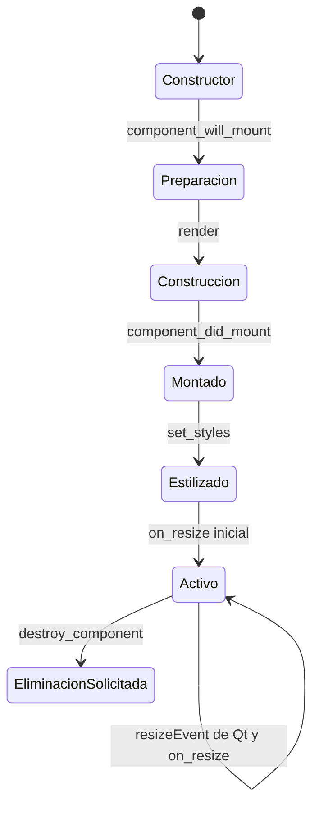

# Componentes

`Component` organiza la construcción de un widget mediante hooks síncronos. Un **hook** es un método que sobrescribes para ejecutar código en una etapa; un **mixin** añade comportamiento por herencia. El framework sigue proporcionando widgets y eventos. No hay render reactivo ni reconciliación de árboles. Está disponible como `qyro.Component`, `qyro.ui.Component` y `qyro.ui.component.Component`.

## Dos formas de uso

Como mixin:

```python
class UserCard(QWidget, Component):
    pass
```

Como decorador de clase:

```python
@Component
class UserCard(QWidget):
    pass
```

El decorador crea una nueva clase con el mismo nombre, módulo, `qualname` y docstring, que hereda de la clase original y de `Component`. Si la clase ya es un componente, se devuelve sin cambios.

## Ciclo de vida

El montaje ocurre una sola vez, inmediatamente después del constructor original:

1. `_allow_styled_background()`
2. `component_will_mount()`
3. `render()`
4. `component_did_mount()`
5. `set_styles()`
6. `on_resize()`

```python
class Card(QWidget, Component):
    STYLES = "QWidget { border-radius: 8px; background: #252033; }"

    def component_will_mount(self):
        self.model = {"name": "Invitado"}

    def render(self):
        self.title = QLabel(self.props.get("title", "Sin título"), self)

    def component_did_mount(self):
        self.title.show()

    def on_resize(self):
        self.title.resize(self.calc(self.width(), 90), 32)
```

El flag interno `_component_lifecycle_mounted` evita montajes repetidos.



Son etapas ejecutadas, no un enum de estados almacenado. `component_did_mount` significa que se ejecutó `render`, no que la ventana esté pintada. Un resize Qt puede llegar antes de terminar la construcción de tus hijos; protege accesos con `hasattr` si es necesario. Cambiar props no programa un nuevo render.

## Props

Puedes pasar un diccionario o keywords:

```python
card = Card(parent=window, props={"title": "Perfil", "user_id": 7})
card = Card(parent=window, title="Perfil", user_id=7)
```

`parent` se reserva para el constructor Qt. Todas las demás keywords se retiran del constructor nativo y se guardan en `self.props`. Si se usan ambas formas, primero se combina el diccionario y después las keywords; por tanto las keywords sobrescriben claves repetidas.

<Warning>Solo `parent` se reconoce como keyword del toolkit. Otros argumentos nombrados que el widget nativo necesite serán tratados como props. Pásalos de forma posicional o adapta tu propio `__init__`.</Warning>

`props` crea perezosamente un diccionario vacío y también admite asignación completa:

<Warning>En la ejecución local con PyQt5, pasar props por keyword produjo `RuntimeError: super-class __init__() ... was never called`: el wrapper consulta `self.props` antes de inicializar el objeto SIP. No es una garantía multiplataforma para todos los bindings. Los ejemplos PyQt utilizan argumentos posicionales y asignan props después del constructor nativo; el fallo queda registrado sin cambiar el Engine.</Warning>

```python
self.props = {"title": "Nuevo"}  # después de inicializar el widget nativo
```

## Resize responsivo

Qyro envuelve `resizeEvent` en cada subclase. Ejecuta `on_resize()` y después intenta reenviar al handler original. Las excepciones del handler original se silencian para proteger el event loop.

```python
def on_resize(self):
    width = self.calc(self.width(), 50)  # 50 %
    self.panel.resize(width, self.height())
```

`calc(a, b)` retorna `int((a * b) / 100.0)`, por lo que trunca decimales.

## Estilos

`set_styles()` solo actúa si el objeto implementa `setStyleSheet`. Acepta:

1. una ruta absoluta o relativa existente;
2. una ruta de recurso resoluble por Qyro;
3. CSS/QSS inline.

Cuando se invoca sin argumento, busca en este orden: `STYLES`, `CSS`, `STYLESHEET`.

```python
class Panel(QWidget, Component):
    STYLES = "styles/panel.qss"

# También válido:
panel.set_styles("QLabel { color: #a78bfa; }")
panel.set_styles("/tmp/debug.qss")
```

Una cadena con `{` o `;` se considera estilo inline y no se intenta resolver como recurso. Errores de lectura o aplicación se ignoran.

Para Qt, `_allow_styled_background()` detecta el binding real a partir del MRO y módulos cargados, y activa `WA_StyledBackground`. Esto permite fondos, bordes y radios en subclases de `QWidget`.

## Utilidades

| Método/propiedad | Comportamiento |
| --- | --- |
| `find(type, name="")` | Delega a `findChild`; devuelve `None` si no existe. |
| `destroy_component()` | Ejecuta `setParent(None)` y `deleteLater()` si están disponibles. |
| `get_resource(*segments, required=True)` | Usa el contenedor adjunto o el helper global. |
| `app_settings` | Lee `AppMetadata.raw_settings`. |
| `is_frozen` | Consulta el adaptador de entorno. |
| `props` | Diccionario de propiedades del componente. |

## Con ApplicationContext

La ventana raíz puede combinar ambos mixins:

```python
class MainWindow(QMainWindow, Component, ApplicationContext):
    ...
```

`ApplicationContext` se ocupa del runtime y el event loop; `Component` monta la interfaz. En widgets hijos normalmente solo necesitas `Component`, ya que su acceso a recursos cae al contenedor global si no tiene `_container` propio.

## Límites

- El sistema de estilos está orientado a Qt; no traduce QSS a Kivy o Tkinter.
- El valor retornado por `render()` no es usado por el ciclo de vida de `Component`; Kivy puede reutilizarlo desde su propio `build()`.
- Los hooks no son async.
- Muchas operaciones visuales son best-effort y silencian errores del toolkit.

## Destrucción y suscripciones

`destroy_component()` no invoca `component_will_unmount` ni cierra conexiones o bindings externos. Solo desacopla el widget y solicita borrado si tiene los métodos correspondientes. Con [Pydux](/es/pydux), llama explícitamente al cleanup desde cierre/destrucción nativos.

Tkinter/Kivy requieren sus eventos propios de tamaño y estilos. En una `App` Kivy evita construir dos veces desde `render` y `build`: sigue [Kivy](/es/frameworks/kivy). Los hooks no usan el valor de retorno de `render`.

El `Panel` de [Aplicaciones completas](/es/examples) es ejecutable y une props, señales, estado local y un stylesheet de recurso. Los fragmentos de esta guía que usan `QWidget`, `QLabel` o `window` presuponen esos objetos/imports en una aplicación Qt ya inicializada.
