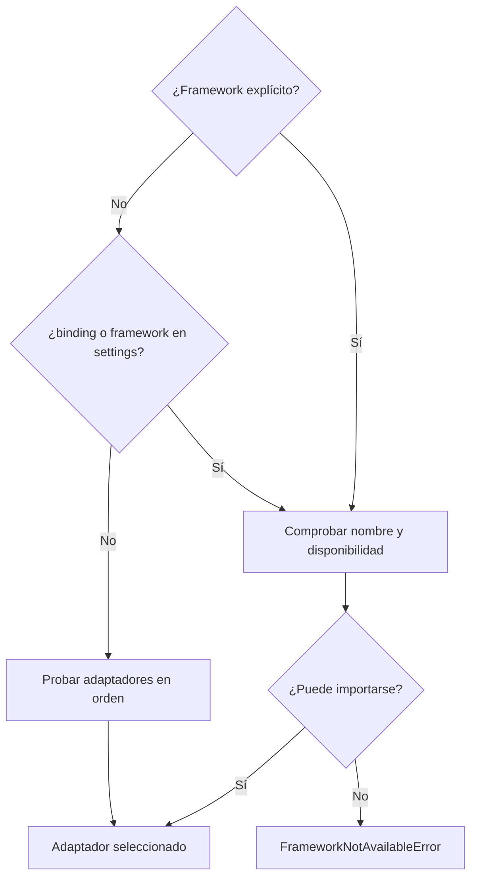

# Frameworks y adaptadores

Un **framework UI** proporciona ventanas, widgets y eventos. Un **binding** Qt expone Qt en Python. El adaptador de Qyro conecta el arranque y unas operaciones comunes con cada toolkit; no traduce widgets entre frameworks.

## Elegir explícitamente

La prioridad es `framework` del contexto (`framework_name` del contenedor), `binding` de settings, `framework` de settings y autodetección. En los archivos del proyecto usa la escritura canónica en PascalCase: `PySide6`, `PyQt6`, `PySide2`, `PyQt5`, `Kivy` y `Tkinter`; `Headless` queda para pruebas sin UI.

La implementación actual elimina espacios externos y normaliza el valor a minúsculas antes de buscar el adaptador, por lo que no es *case-sensitive*: `PySide6` y `pyside6` seleccionan el mismo binding. PascalCase es la convención recomendada y la que deben mostrar los ejemplos y archivos generados.



Autodetección: PySide6 → PyQt6 → PySide2 → PyQt5 → Kivy → Tkinter → headless. Un nombre solicitado que no está disponible produce error, no fallback silencioso. Importable no significa que exista display utilizable. El primer contexto fija la selección habitual del proceso.

## Recorridos por toolkit

| Toolkit | Guía | Aplicación nativa y ejecución |
| --- | --- | --- |
| PySide6 | [Ejemplo completo](/es/frameworks/pyside6) | Crea/reutiliza `QApplication`; `exec()` |
| PyQt6 | [Ejemplo completo](/es/frameworks/pyqt6) | Crea/reutiliza `QApplication`; `exec()` |
| PyQt5 | [Ejemplo completo](/es/frameworks/pyqt5) | Crea/reutiliza `QApplication`; `exec` si existe, si no `exec_` |
| PySide2 | [Ejemplo completo](/es/frameworks/pyside2) | Igual que Qt 5; extra del Engine para Python 3.10 |
| Tkinter | [Ejemplo completo](/es/frameworks/tkinter) | Recupera `_default_root`; `mainloop` |
| Kivy | [Ejemplo completo](/es/frameworks/kivy) | Busca `App.get_running_app`; una app propia ejecuta `App.run` |
| Headless | Ejemplo siguiente | Objeto de prueba en memoria; `run()` devuelve `0` |

No mezcles dos bindings Qt en un proceso. Aunque el adaptador de iconos identifica el binding de un widget por su MRO, eso no hace seguro mezclar `QApplication` y widgets de bindings distintos.

## Contrato común

`IUIFrameworkPort` expone `framework_name`, `is_available()`, `create_application(argv=None)`, `run()`, `exit(code=0)` y los métodos de título/icono. Las operaciones visuales son intentos tolerantes a diferencias de toolkit; comprueba el resultado en la UI real.

Tkinter no crea un root en `create_application`; `run` puede recuperar o crear uno. Kivy tampoco crea inmediatamente tu `App`; si el adaptador no conoce una app al ejecutar `run`, crea una genérica. Qt necesita su `QApplication` antes de cualquier widget, por lo que en los ejemplos se crea primero el contexto.

## Headless

```python
from qyro import ApplicationContext

context = ApplicationContext(framework="headless", enable_sentry=False)
print(context.app.argv)
assert context.run() == 0
```

Headless siempre está disponible; no realiza una UI real ni garantiza disponibilidad de otros frameworks. Sus setters guardan valores en memoria, útiles para tests. Para rango de Python y evidencia de pruebas consulta [Compatibilidad](/es/compatibility). Para ejecutar ejemplos con recursos consulta [Aplicaciones completas](/es/examples).
