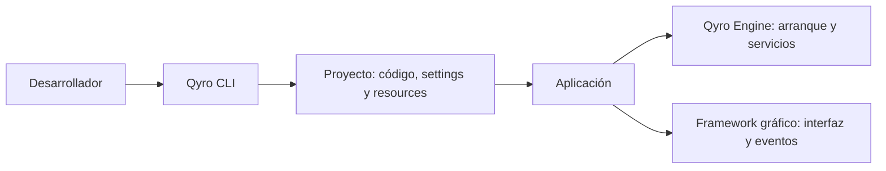

# Fundamentos de Qyro

Qyro es un ecosistema para desarrollar, ejecutar y distribuir aplicaciones Python con interfaz gráfica. Proporciona una forma común de organizar el proyecto, preparar su arranque y convertirlo en una aplicación que otra persona pueda utilizar.

El punto de partida es una necesidad habitual: escribir la interfaz es solo una parte del trabajo. También necesitas organizar configuración y archivos, ejecutar el proyecto con sus dependencias y preparar una entrega para cada sistema operativo. Qyro reúne esas responsabilidades en un flujo de desarrollo que puedes seguir desde la terminal.

## Por qué existe

Los frameworks gráficos resuelven la construcción de la interfaz y sus eventos. Alrededor de esa interfaz quedan tareas que se repiten entre aplicaciones:

- **Organizar el proyecto:** mantener código, configuración y archivos de entrada en lugares reconocibles.
- **Preparar el arranque:** cargar metadatos y opciones, y disponer de la aplicación nativa del framework antes de crear la interfaz.
- **Adaptarse al sistema:** seleccionar configuración y recursos propios de Windows, macOS o Linux cuando sean necesarios.
- **Encontrar archivos:** utilizar textos, imágenes, fuentes, estilos, plantillas y otros assets durante el desarrollo y dentro de una aplicación empaquetada.
- **Preparar una entrega:** reunir código, intérprete, dependencias y archivos; después crear una carpeta distribuible, archivo o instalador y, cuando corresponda, firmar la aplicación.

El diseño de Qyro separa estas tareas en herramientas de desarrollo y servicios que utiliza la aplicación mientras está en ejecución. Esa separación permite mantener el mismo modelo de proyecto durante el desarrollo y al preparar una distribución.

## Los dos componentes de Qyro

**Qyro CLI** es la herramienta de terminal que utilizas para trabajar en el proyecto. Crea la estructura inicial desde una plantilla, ejecuta la aplicación y automatiza build, bundle, firma y limpieza. Es el punto de entrada del recorrido de esta documentación.

**Qyro Engine** es el motor que utiliza tu código al arrancar. Proporciona `ApplicationContext`, configuración, resolución de recursos, información del entorno e integración con el framework gráfico. Se instala como dependencia y se incluye en la aplicación que distribuyes.

Una **CLI** es una interfaz de comandos: la utilizas desde la terminal. Un **runtime** es el conjunto de servicios que acompaña a la aplicación mientras se ejecuta. Aquí esos papeles corresponden al CLI y al Engine, respectivamente.

El CLI trabaja sobre los archivos del proyecto y sus entregas. Al ejecutar la aplicación, su código utiliza el Engine y el framework gráfico. En las siguientes páginas aprenderás primero las herramientas del proyecto y después los servicios del motor.

## Frameworks y bindings

Qyro trabaja con frameworks y bindings populares del ecosistema Python: **PySide6, PyQt6, PyQt5, PySide2, Tkinter y Kivy**.

Un **framework gráfico** proporciona ventanas, layouts y un bucle que atiende eventos. Un **binding** permite utilizar una biblioteca nativa desde Python: PySide y PyQt son bindings de Qt. La elección determina los imports y APIs con los que escribirás tu interfaz.

El CLI prepara el proyecto para la elección que hagas y el Engine conecta su arranque con ese toolkit. Tu aplicación continúa utilizando la API nativa del framework. El recorrido principal usa **PySide6**, el binding Qt elegido para la primera aplicación.

## Cómo se trabaja con Qyro

Comienzas creando un entorno Python e instalando el CLI. Después utilizas `qyro init` para crear el proyecto y elegir su binding. Desarrollas la aplicación dentro de esa estructura, la ejecutas con `qyro start` y, cuando está preparada, utilizas `qyro build` y `qyro bundle` para generar una entrega.

La configuración del proyecto reside en **`settings/`** y los archivos de entrada de la aplicación en **`resources/`**. El Engine ofrece acceso a ambos desde el código. No tienes que diseñar ese flujo desde cero en cada proyecto.

## Recorrido de aprendizaje

1. **Qyro:** comprende estos fundamentos.
2. **Qyro CLI:** conoce [la herramienta](/es/cli), prepara la [instalación](/es/installation), crea [tu primera aplicación](/es/quickstart) y aprende su [estructura](/es/project-structure) y [flujo de entrega](/es/tooling).
3. **Qyro Engine:** estudia [el motor](/es/engine), su contexto, settings, resources y componentes cuando necesites utilizarlos en tu código.
4. **Estado compartido:** conoce la [integración opcional con Pydux](/es/pydux), después de comprender el motor.
5. **Demos:** explora las [aplicaciones completas](/es/examples) para reunir los conceptos aprendidos.

Continúa con [Qyro CLI](/es/cli).
