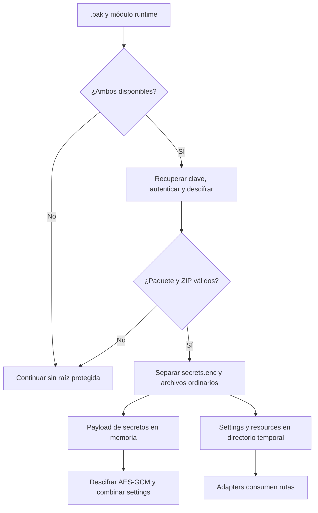

# Recursos protegidos y secretos

Qyro Runtime consume artefactos generados por Qyro CLI. No crea el paquete protegido: lo descubre, valida, descifra y conecta con los adaptadores existentes.

<Warning>La protección cifra datos en reposo y detecta manipulación. No puede ocultar de forma absoluta un secreto a una persona capaz de ejecutar, depurar o inspeccionar el binario y la memoria del proceso.</Warning>

## Artefactos esperados

```text
.qyro/
├── resources.pak
└── runtime*.so | runtime*.pyd | runtime*.dylib
```

El módulo compilado debe exportar `RUNTIME_SECRET_HEX`, una cadena hexadecimal que represente al menos 16 bytes.

## Flujo de carga

1. Determina `bundle_dir` en frozen o `root_dir` en source.
2. Busca `.qyro/resources.pak` y el primer `runtime*` soportado.
3. Calcula una cache key con ruta, tamaño y `mtime_ns` de ambos archivos.
4. Lee el runtime secret cargando el módulo de extensión como `runtime`.
5. Verifica y descifra el `.pak` en memoria.
6. Lee `.qyro/secrets.enc` en memoria, sin extraerlo.
7. Extrae settings y recursos ordinarios a un directorio temporal.
8. Inserta esas rutas en las prioridades normales de configuración y recursos.

## Formato del paquete de recursos

El archivo comienza con:

```text
QYRPKG | salt(16) | wrapped_key(32) | nonce(16) | HMAC-SHA256(32) | ciphertext
```

- La clave de recursos de 32 bytes está envuelta mediante XOR con un keystream derivado de `SHA-256(runtime_secret + salt)`.
- El contenido se cifra con un keystream por bloques basado en `SHA-256(key + nonce + counter)` y XOR.
- El tag `HMAC-SHA256(key, nonce + ciphertext)` autentica nonce y ciphertext.
- El plaintext resultante debe ser un ZIP válido.

Este esquema es un formato interno específico de Qyro. Para secretos se usa un esquema estándar distinto.

## Extracción y caché

La carpeta es:

```text
<temp>/qyro_protected_<16 hex del SHA-256 del paquete>/
```

Un archivo `.ok` marca una extracción completa y permite reutilizarla. El proceso mantiene cachés de clase protegidas por `threading.Lock`.

No hay limpieza automática al salir ni validación nueva del contenido extraído cuando existe `.ok`. El lock es del proceso, no entre varios procesos. Settings y resources extraídos quedan legibles: esa carpeta no es un almacén seguro.

Durante la extracción:

- se omite `.qyro/secrets.enc`;
- se omite cualquier entrada bajo `.qyro/`;
- settings y recursos se extraen para que las APIs sigan devolviendo paths de filesystem.

Si falta un artefacto, la firma no coincide, el formato es inválido o la extracción falla, `ProtectedResourceBundle` devuelve `None` y el runtime continúa con otras raíces. Esta tolerancia aplica al paquete general.

## Formato de secretos

Los secretos usan AES-256-GCM y HKDF-SHA256:

```text
QYRSEC | version | kdf_id | cipher_id | salt_len | nonce_len | salt | nonce | ciphertext+tag
```

Valores actuales:

- versión `1`;
- KDF id `1`: HKDF-SHA256;
- cipher id `1`: AES-GCM;
- clave derivada de 32 bytes;
- nonce de 12 bytes;
- info HKDF `qyro-secrets-v1`;
- el header completo se autentica como AAD.

```python
from qyro.adapters.resources.secrets_crypto import (
    decrypt_secrets_payload,
    encrypt_secrets_payload,
)

runtime_secret = b"a" * 32
encrypted = encrypt_secrets_payload(b'{"token":"abc"}', runtime_secret)
plaintext = decrypt_secrets_payload(encrypted, runtime_secret)
```

Estas funciones son infraestructura interna; normalmente Qyro CLI cifra y el runtime descifra.

El uso habitual es guardar en `settings/secrets.json` las claves de API, tokens, licencias y demás datos protegidos que la aplicación necesita. El build omite el archivo plano, incorpora su payload cifrado al paquete y el Engine lo descifra en memoria; la aplicación los consulta mediante `app_settings` sin invocar directamente estas funciones criptográficas.

## Merge de secretos

El JSON descifrado debe ser un objeto. Sus claves sobrescriben settings base, plataforma y secretos planos. El merge es superficial.

Compatibilidad legacy: si el bundle no contiene `.qyro/secrets.enc`, el runtime busca `.qyro/secrets.json` como payload **cifrado**, no como JSON plano.

## Fallos y garantías

| Situación | Resultado |
| --- | --- |
| Falta `.pak` o runtime module | Se ignora el origen protegido. |
| Firma HMAC del `.pak` inválida | El paquete se descarta silenciosamente. |
| Secretos embebidos sin runtime module | En la práctica no se puede abrir el `.pak`; no se aplican. |
| AES-GCM tag o runtime secret incorrecto | `SecretsCryptoError` (`ValueError`). |
| Plaintext no UTF-8/JSON/objeto | `ValueError`. |
| Payload de secretos manipulado | AES-GCM rechaza la autenticación. |

## Recomendaciones

- No registres `RUNTIME_SECRET_HEX`, claves derivadas ni plaintext.
- No versiones `settings/secrets.json` ni `settings/sign.json`.
- Usa credenciales de alcance mínimo y rotación frecuente.
- Para secretos de alto valor, prefiere un backend remoto o almacén del sistema operativo y obtén tokens cortos en runtime.
- Considera comprometidos los secretos de un cliente si un atacante controla su proceso.
- Regenera bundle y módulo juntos; la cache key depende de ambos.

## Build, runtime y fallback



El loader abre el paquete completo y extrae el ZIP, no descifra solo el archivo solicitado. La caché evita repetir extracción. Fallos exteriores permiten fallback; fallos AES-GCM de un payload recibido son estrictos.

En `build.json`, el CLI admite:

```json
{
  "resource_protection": {
    "enabled": true,
    "settings_dir": "settings",
    "resources_dir": "resources",
    "bundle_path": ".qyro/resources.pak"
  }
}
```

Empaqueta recursivamente esas carpetas bajo `settings/` y `resources/`, excluye los archivos locales `secrets.json` y `sign.json`, y añade únicamente la versión cifrada de los secretos de runtime si existe. Genera secreto/clave por build, compila runtime mediante Cython y agrega ambos artefactos bajo `.qyro` en PyInstaller. El módulo runtime también se compila sin protección completa para empaquetar secretos.

Mantén el basename `resources.pak`: el runtime busca ese nombre fijo aunque el CLI acepte otro `bundle_path`. No hay una clasificación automática de datos sensibles; no incluyas otras copias de secretos en assets.

Usa `qyro bundle --format dir --no-resources`, o tu formato con `--no-resources`, cuando los assets ya estén incluidos. De lo contrario copia resources originales legibles junto a la aplicación protegida.

El XOR/keystream exterior es un formato propio, distinto de AES-GCM de secrets; no se presenta como criptografía auditada independientemente. El material para descifrar viaja con el cliente. Consulta [Secrets](/es/secrets) y [Tooling](/es/tooling). `clean` no elimina `.qyro` ni esta extracción temporal.
