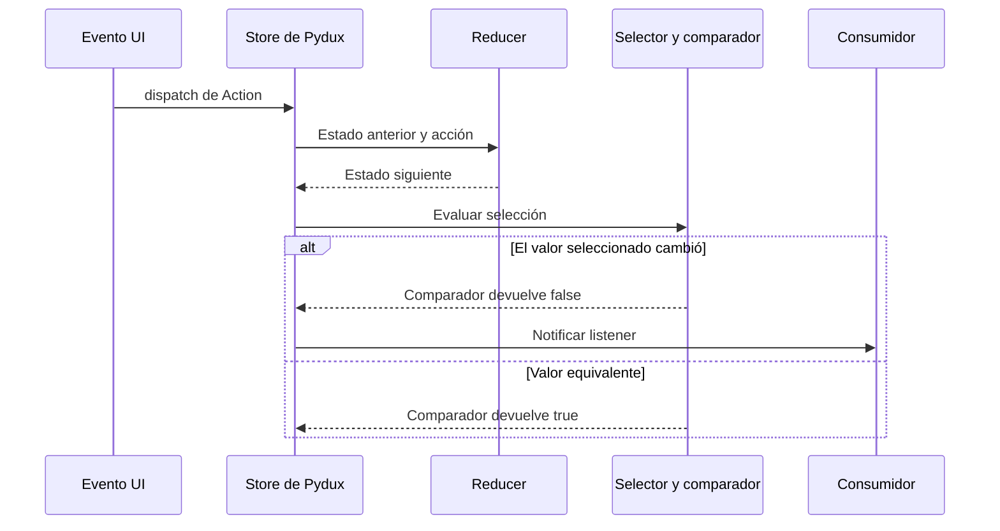
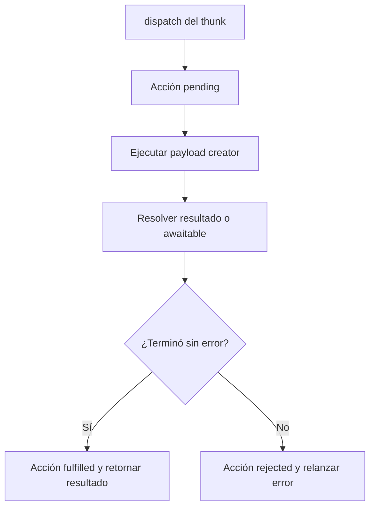

# Manejo de estado con Pydux

**Pydux es una librería independiente y opcional: no forma parte de Qyro Engine ni de Qyro CLI.** Funciona sin Qyro. El Engine organiza el runtime y recursos; Pydux organiza estado compartido; el framework presenta la interfaz. El addon `pydux` del CLI ayuda a preparar dependencias, no transforma el Engine en un store.

## Cuándo aporta valor

Un contador local puede ser un atributo Python o una variable Tk. Considera Pydux cuando varias vistas necesitan los mismos datos, reglas de cambio explícitas, suscripciones selectivas o historial de diagnóstico. No lo añadas solo para leer settings: settings es configuración de arranque, mientras un store representa estado que cambia durante el uso.

## Cinco conceptos

| Concepto | Significado |
| --- | --- |
| Store | Contenedor del estado y de sus suscripciones |
| Acción | `Action` con `type`, `payload` y `meta`: describe una intención de cambio |
| Reducer | Función que calcula el estado siguiente |
| Slice | Agrupa estado inicial, reducers y creadores de acciones con namespace |
| Selector | Extrae o deriva el dato que un consumidor necesita |



El store ejecuta reducer y notificaciones en el hilo que llama a `dispatch`, bajo su lock reentrante. No reconstruye por sí solo widgets. Un bridge puede programar la llamada visual en el loop del framework.

## Un store sin UI

```python
from pydux import configure_store, create_slice

counter = create_slice(
    name="counter",
    initial_state={"value": 0},
    reducers={"increment": lambda state, action: state.update(value=state["value"] + 1)},
)
store = configure_store({"counter": counter}, devtools=False)
values = []
unsubscribe = store.select(
    lambda state: state["counter"]["value"], values.append, fire_immediately=True
)
store.dispatch(counter.actions.increment())
unsubscribe()
store.dispatch(counter.actions.increment())
assert values == [0, 1]
assert store.get_state()["counter"]["value"] == 2
```

Instala Pydux en el entorno de tu proyecto con `python -m pip install --pre pydux`. `create_slice` pasa un `deepcopy` como borrador al reducer: si retorna `None`, utiliza el borrador; cualquier otro retorno reemplaza el estado del slice. No modifiques el resultado de `get_state` directamente.

`select` usa `shallow_equal` por defecto. En esta implementación compara con igualdad Python los valores de primer nivel; esos valores pueden a su vez realizar igualdad estructural. `subscribe` notifica después de cada acción incluso si no cambia el estado. `create_selector` memoriza el último conjunto de entradas y el resultado, no todo el historial.

## Aplicación Qt completa

El siguiente archivo es `docs/es/example-apps/pydux_pyside6_app.py`. Instala Engine/PySide6, CLI y Pydux en el mismo entorno. En los settings de las demos conserva `binding: "PySide6"`, cambia `entry_point` a `pydux_pyside6_app.py` y ejecuta `qyro start` desde esa carpeta. También puedes incorporar el archivo al proyecto que generaste con `qyro init`.

```python
"""Reactive requiere invocar su limpieza; Component no hace unmount automático."""
from pathlib import Path
import sys

from PySide6.QtWidgets import QLabel, QMainWindow, QPushButton, QVBoxLayout, QWidget
from qyro import ApplicationContext, Component
from pydux import configure_store, create_slice
from pydux.adapters.qyro import Reactive


def create_store():
    counter = create_slice(
        "counter", {"value": 0},
        {"increment": lambda state, action: state.update(value=state["value"] + 1)},
    )
    return configure_store({"counter": counter}, devtools=False), counter


def create_ui():
    root_dir = None if getattr(sys, "frozen", False) else Path(__file__).resolve().parent
    context = ApplicationContext(framework="pyside6", custom_root=root_dir, enable_sentry=False)
    store, counter = create_store()

    class CounterWindow(QMainWindow, Component, Reactive):
        def render(self):
            self._closing = False
            central = QWidget(self)
            layout = QVBoxLayout(central)
            self.label = QLabel("Preparando contador", central)
            self.button = QPushButton("Incrementar", central)
            self.button.clicked.connect(lambda: store.dispatch(counter.actions.increment()))
            layout.addWidget(self.label)
            layout.addWidget(self.button)
            self.setCentralWidget(central)

        def component_did_mount(self):
            self.bind_selector(
                store, lambda state: state["counter"]["value"],
                self.update_label,
            )

        def update_label(self, value):
            if not self._closing:
                self.label.setText(f"Contador: {value}")

        def stop_bindings(self):
            self._closing = True
            self.component_will_unmount()

        def closeEvent(self, event):
            self.stop_bindings()
            super().closeEvent(event)

        def destroy_component(self):
            self.stop_bindings()
            super().destroy_component()

    window = CounterWindow()
    window.resize(420, 240)
    context.set_window_title("Qyro + Pydux opcional", window=window)
    context.app.aboutToQuit.connect(window.stop_bindings)
    return context, window, store, counter


def main():
    context, window, store, counter = create_ui()
    window.show()
    try:
        return context.run()
    finally:
        window.stop_bindings()


if __name__ == "__main__":
    raise SystemExit(main())
```

Las suscripciones se crean en `component_did_mount`, cuando existe el label. `Reactive` difiere la entrega inicial al siguiente tick conocido y rastrea las funciones para cancelar. Los cambios posteriores llaman al listener directamente: **no garantiza transferir todos los dispatch de otros hilos al hilo UI**. El ejemplo solo despacha desde la UI.

## La limpieza debe conectarse

El Engine actual no define ni invoca `component_will_unmount` desde `destroy_component`. Ese método solo intenta `setParent(None)` y `deleteLater`. Pydux ofrece limpieza en su hook, pero necesitas invocarlo desde el cierre o destrucción adecuados. El ejemplo lo conecta a `closeEvent`, `aboutToQuit`, `destroy_component` y un `finally` para las rutas que controla.

`connect_qyro(store, selectors)` envuelve hooks de montaje y unmount, asigna selecciones como atributos y llama opcionalmente a `on_state_change`. Requiere una clase cuyo lifecycle invoque esos hooks; decorar una clase plana no inicia suscripciones al construirla. El primer callback puede contener solo algunas propiedades entregadas. Tampoco dispone de unmount automático si el Engine no lo llama.

No asumas que cancelar evita callbacks **ya programados**: el callback inicial diferido no comprueba si el consumidor fue eliminado antes de ejecutarse. Para destrucción inmediata o trabajo concurrente añade guardas apropiadas y controla el scheduler. Los adapters Qyro/Qt pueden importar Qt por orden de preferencia y elegir un binding instalado distinto del activo. Mantén un toolkit por entorno/proceso cuando uses estos adapters.

## Tkinter, Kivy y bridges

`ReactiveBinding` conecta una selección con un setter mediante un bridge; utiliza `fire_immediately=True` y ofrece `dispose`. El ejemplo `pydux_tkinter_app.py` utiliza `TkinterBridge(root)`, actualiza un label y dispone el binding al cerrar. Consulta [Aplicaciones completas](/es/examples).

| Bridge | Mecanismo implementado |
| --- | --- |
| `QtMainThreadBridge` | Busca QTimer por orden de bindings; llama `singleShot(0, fn)` |
| `TkinterBridge(widget)` | `after_idle(fn)`; si falla ejecuta directamente |
| `KivyBridge` | `Clock.schedule_once`; sin Clock ejecuta directamente |
| `DirectThreadBridge` | Ejecuta directamente en el hilo actual |

Estos mecanismos no equivalen a una garantía universal de seguridad entre hilos. En especial, QTimer sin objeto receptor se programa desde el contexto que lo invoca, y el fallback directo de Tk puede tocar widgets desde el hilo del llamador. Para worker threads diseña una transferencia explícita y probada al loop UI del toolkit. `dispose` cancela la suscripción; no retira una tarea visual ya encolada.

El decorador genérico `connect` almacena sus unsubscribers, pero no agrega destrucción automática. Qyro no cambia ese comportamiento.

## Thunks: ciclo de acciones y espera

Un thunk es una función que el middleware ejecuta con `dispatch`, `get_state` y un argumento adicional. `configure_store` instala el middleware de thunks. `create_async_thunk` envuelve una función o coroutine y genera tipos `pending`, `fulfilled` y `rejected`.



El dispatch actual **espera** el resultado. Sin loop asyncio usa `asyncio.run`; con un loop activo usa un hilo auxiliar y `join`. Un thunk lento puede bloquear la UI si lo despachas desde un callback UI. El nombre async no inicia automáticamente una tarea de fondo no bloqueante. Un awaitable vinculado a otro loop también puede requerir un diseño específico.

La documentación propia explica argumentos y `extra_reducers`; no se duplica aquí una API de tareas. Antes de usarlo en una app, separa trabajo lento de callbacks y verifica la transferencia del resultado al hilo visual.

## DevTools

`configure_store` habilita DevTools e intenta iniciar un inspector HTTP por defecto en `127.0.0.1:8765`; si está ocupado puede elegir otro puerto. Los ejemplos fijan `devtools=False` para evitar un servidor adicional y snapshots innecesarios. Para desarrollo puedes usar `devtools=True, inspector_auto_start=False` y administrar su servidor explícitamente.

El inspector expone estado, trazas y operaciones de time travel. No almacenes credenciales en el estado inspeccionado ni expongas el servidor sin un control externo adecuado: no hay autenticación integrada en su handler. Los reducers compuestos reconocen la acción interna de time travel; un reducer raíz propio debe contemplarla para que restaure estado.

## Documentación de Pydux

Estas referencias apuntan a la documentación del propio repositorio revisada durante la auditoría, cuyo contenido puede cambiar posteriormente:

- [Stores y slices](https://github.com/Neuri-AI/pydux/blob/main/docs/es/concepts/store-and-slices.mdx).
- [Selectores y suscripciones](https://github.com/Neuri-AI/pydux/blob/main/docs/es/concepts/selectors.mdx).
- [Bindings UI](https://github.com/Neuri-AI/pydux/blob/main/docs/es/integrations/ui-bindings.mdx).
- [Integración Qyro](https://github.com/Neuri-AI/pydux/blob/main/docs/es/integrations/qyro.mdx).
- [Thunks](https://github.com/Neuri-AI/pydux/blob/main/docs/es/guides/async-thunks.mdx).
- [DevTools](https://github.com/Neuri-AI/pydux/blob/main/docs/es/guides/devtools.mdx).
- [API](https://github.com/Neuri-AI/pydux/blob/main/docs/es/reference/api.mdx).

Aplica las precisiones de esta página sobre cierre, hilos y bloqueo aunque una guía antigua sugiera garantías más amplias. El [informe](/es/audit-report) registra esas inconsistencias sin modificar Pydux.
