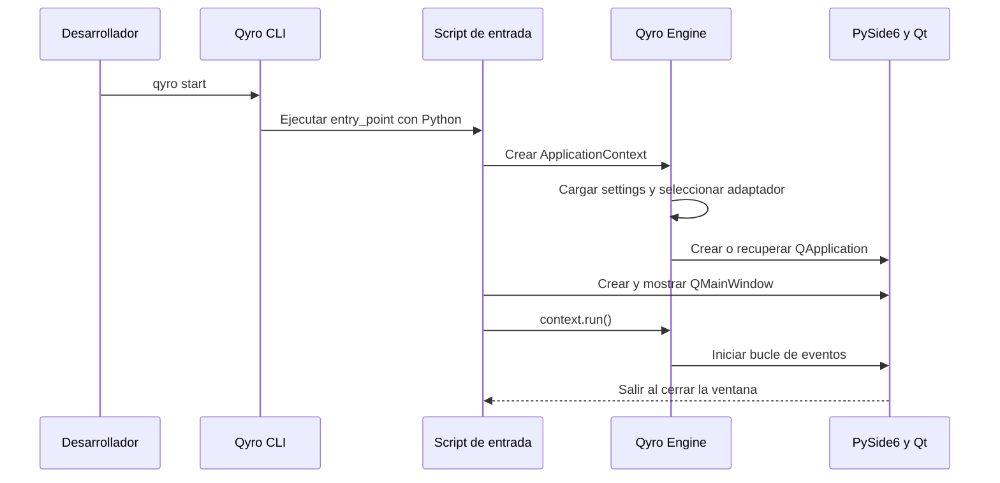

# Tu primera aplicación

En este recorrido crearás una aplicación de escritorio con **Qyro CLI y PySide6**. Necesitas haber completado la [instalación](/es/installation) y mantener activo el entorno Python.

El flujo de trabajo consiste en generar el proyecto con el CLI, desarrollar dentro de su estructura y ejecutarlo con el CLI. La plantilla prepara los archivos iniciales; aquí aprenderás qué hace cada paso y cómo modificar la primera ventana.

## 1. Crear el proyecto

Desde la carpeta donde guardas tus proyectos:

```bash
qyro init --name mi-app --target-platform desktop --binding PySide6 --app-name MiApp --version 1.0.0 --author Ejemplo --yes
```

| Opción | Qué elige |
| --- | --- |
| `--name mi-app` | Carpeta que el CLI creará para el proyecto |
| `--target-platform desktop` | Proyecto inicial para escritorio |
| `--binding PySide6` | Toolkit con el que se construye la interfaz |
| `--app-name MiApp` | Nombre de la aplicación en settings |
| `--version 1.0.0` | Versión de tu aplicación |
| `--author Ejemplo` | Autor registrado en su configuración |
| `--yes` | Aceptación de la confirmación de creación |

El comando suministra los datos del recorrido. También puedes usar `qyro init --name mi-app --binding PySide6` y responder las preguntas del asistente.

El CLI resuelve una plantilla Qt, copia sus archivos, aplica los datos indicados e instala las dependencias del proyecto. La primera descarga necesita acceso a GitHub; una caché previa puede servir de alternativa. Si falla la descarga, corrige conexión/permisos y repite la creación en una carpeta nueva; consulta [Solución de problemas](/es/troubleshooting).

## 2. Entrar y ejecutar

```bash
cd mi-app
qyro start
```

`cd` entra en el proyecto generado. `start` lee su configuración y ejecuta el archivo indicado por `entry_point` con el intérprete Python del CLI. Se abre la aplicación inicial de la plantilla. Ciérrala antes de continuar.

La instalación de dependencias de `init` puede utilizar Poetry, uv o Pipenv si están disponibles. Si el gestor creó otro entorno, ejecuta el CLI dentro de ese entorno e instala allí los mismos paquetes de la [guía de instalación](/es/installation). `start` no cambia de intérprete automáticamente. Con pip, utiliza el entorno que ya activaste.

## 3. Reconocer los archivos

Abre la carpeta generada en tu editor. **`settings/`** contiene la configuración y **`resources/`** los archivos utilizados por la aplicación. Tu código Python está en el archivo de entrada y en los módulos que añada la plantilla.

En `settings/base.json`, comprueba `binding` y `entry_point`: el binding debe corresponder a PySide6 y el entry point identifica el script que abre `qyro start`. Conserva los demás datos generados. La [estructura del proyecto](/es/project-structure) explica la función de cada carpeta.

## 4. Modificar la primera ventana

Abre el script indicado por `entry_point` y reemplaza su contenido por esta aplicación mínima. No cambies la estructura del proyecto: seguimos utilizando el generado por `init`.

```python
from PySide6.QtWidgets import QLabel, QMainWindow
from qyro import ApplicationContext


def main():
    context = ApplicationContext(framework="pyside6", enable_sentry=False)
    window = QMainWindow()
    window.resize(640, 360)
    window.setCentralWidget(QLabel("Mi primera aplicación con Qyro y PySide6", window))
    context.set_window_title(context.get_default_window_title(), window=window)
    window.show()
    return context.run()


if __name__ == "__main__":
    raise SystemExit(main())
```

`ApplicationContext` prepara el motor y la aplicación Qt; por eso se crea antes de `QMainWindow`. El framework crea la ventana y el texto. El contexto utiliza el nombre de settings para el título. `show()` muestra la ventana y `context.run()` inicia el bucle de eventos de Qt, que procesa interacción y cierre.

No necesitas aprender todavía todos los métodos del contexto. La [introducción al Engine](/es/engine) desarrolla su papel después del recorrido por el CLI.

Vuelve a ejecutar desde la carpeta del proyecto:

```bash
qyro start
```

Verás la ventana con el texto que acabas de escribir y el título de tu aplicación. Ciérrala mediante su control nativo de cierre.



El CLI lanza el proceso; el Engine prepara los servicios dentro de ese proceso; Qt administra la interfaz y sus eventos.

## Elegir otro binding

Qyro CLI admite **PySide6, PyQt6, PyQt5, PySide2, Tkinter y Kivy**. El valor de `--binding` selecciona la plantilla y dependencias. La API gráfica del código también debe corresponder a esa elección: un proyecto PyQt no utiliza imports PySide6.

Este recorrido conserva PySide6. Más adelante encontrarás ejemplos para los otros toolkits en [Frameworks](/es/frameworks). Comprueba sus requisitos de Python antes de elegirlos.

## Siguiente paso

Ya utilizaste el flujo principal de desarrollo: `init` para generar y `start` para probar cambios. Continúa con [Estructura del proyecto](/es/project-structure) y [Build, bundle y distribución](/es/tooling). Después estudia [Qyro Engine](/es/engine) para incorporar configuración, recursos y componentes a tu aplicación.
