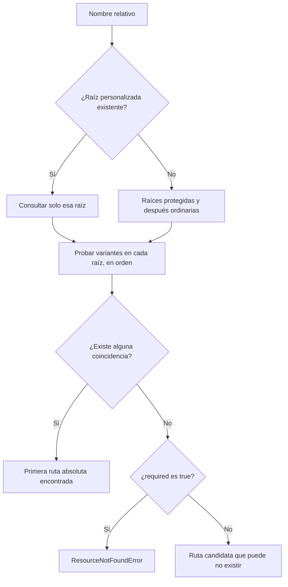

# Recursos

Un **recurso** es un archivo de entrada de la aplicación: texto, imagen, fuente, stylesheet o plantilla. Resolverlo significa localizarlo; abrirlo o interpretarlo corresponde a tu código/toolkit. No es almacenamiento de datos del usuario. Se consulta por segmentos y se devuelve una ruta absoluta.

Los snippets con `context` presuponen un contexto creado; el helper se importa con `from qyro import get_resource`.

```python
logo = context.get_resource("images", "logo.png")
font = get_resource("fonts/Inter.ttf")
```

`ResourceQuery.from_segments()` descompone cada argumento con `Path.parts`: puedes expresar el mismo recurso con `get_resource("images", "logo.png")` o `get_resource("images/logo.png")`. Las dos consultas del bloque anterior buscan archivos diferentes.

## Prioridad de raíces

Si se configuró `custom_resources_dir` y existe, es la única raíz usada. De lo contrario:

1. recursos extraídos del bundle protegido;
2. recursos del bundle frozen o del proyecto source.

Dentro de cada origen, el orden es específico de la plataforma antes que general:

```text
resources/windows/ o resources/win32/   # Windows
resources/mac/ o resources/darwin/      # macOS
resources/linux/                        # Linux
resources/base/
resources/
```

Las raíces ordinarias exactas, conservando solo las existentes, son estas. `R` es root en source y bundle en frozen:

1. Por cada alias de plataforma: `R/resources/<alias>` y `R/src/main/resources/<alias>`.
2. `R/resources/base`.
3. `R/resources`.
4. `R/src/main/resources/base`.
5. Source: `R/src/main/resources`; frozen: `R` directamente.

Antes van las raíces protegidas: `<extraído>/resources/<alias>`, `resources/base`, `resources`. Un recurso base protegido puede ganar frente a uno específico ordinario. No se usa `R/src/main/resources` como raíz directa en frozen.



La búsqueda se detiene en el primer resultado. `exists` también puede referirse a un directorio: comprueba `is_file` si necesitas un archivo.

Esto permite sobrescribir un logo únicamente en Windows:

```text
resources/
├── base/images/logo.png
└── windows/images/logo.png
```

En Windows, `get_resource("images", "logo.png")` devuelve la variante Windows; en otros sistemas, la base.

## Source y frozen

En source las raíces parten de `get_root_dir()`. En frozen parten de `get_bundle_dir()`:

- PyInstaller: `sys._MEIPASS`.
- frozen genérico en macOS: `../Resources` respecto al ejecutable si existe.
- otros casos: directorio raíz/ejecutable.

El `ResourceResult` interno indica `absolute_path`, `exists`, `is_bundled` y, cuando hay éxito, `target_os`.

## Carpetas aplanadas

Los bundles pueden aplanar `base/` o la carpeta de plataforma. Para conservar compatibilidad, una consulta como:

```python
get_resource("base", "images", "avatar.png")
get_resource("windows", "icons", "app.ico")
```

prueba tanto el path completo como la variante sin el primer segmento cuando este es `base`, `windows`, `win32`, `mac`, `darwin` o `linux`.

## Recurso requerido u opcional

```python
required = context.get_resource("schemas", "main.json")
optional = context.get_resource("themes", "seasonal.qss", required=False)
```

- `required=True`: `ResolveResourceUseCase` lanza `ResourceNotFoundError` si no existe.
- `required=False`: devuelve una ruta absoluta candidata con `exists=False` internamente; la fachada la convierte a `str`.

```python
from pathlib import Path

candidate = Path(optional)
if candidate.exists():
    print(candidate.read_text(encoding="utf-8"))
```

El error incluye el nombre normalizado y el padre de la ruta fallback. No contiene toda la lista real de raíces probadas.

## Listar recursos

La API de bajo nivel permite listar hijos inmediatos:

```python
paths = context.container.resource_adapter.list_resources("images")
for path in paths:
    print(path)
```

La lista:

- agrega entradas de todas las raíces existentes;
- no es recursiva;
- puede contener archivos y directorios;
- se deduplica mediante `set`, por lo que el orden final no está garantizado.

## Raíz personalizada

`ApplicationContext(custom_root=...)` cambia la raíz general. Para separar solo recursos, crea el contenedor directamente:

```python
from pathlib import Path
from qyro import EngineContainer

container = EngineContainer(
    framework_name="headless",
    custom_root=Path("/srv/app"),
    custom_resources_dir=Path("/srv/shared-assets"),
)

path = container.resolve_resource_use_case.execute("logo.svg")
```

## Buenas prácticas

- Usa segmentos (`"images", "logo.png"`) para expresar intención y evitar separadores dependientes del SO.
- No construyas paths manualmente desde `cwd`; frozen puede usar una raíz diferente.
- Coloca defaults en `resources/base` y overrides solo donde cambien.
- Trata `required=False` como una consulta de candidato, no como garantía de existencia.
- No guardes secretos como recursos ordinarios.

- El resolver no confina paths absolutos o `..` a una raíz. Valida nombres de usuarios antes de utilizarlos: no es un sandbox.
- Prefiere segmentos o `/`. `Path.parts` interpreta separadores según el SO; backslashes Windows no se separan igual en Linux.
- Cambiar una ruta del Engine no configura automáticamente su inclusión por los hooks del CLI.

Las bases se explican en [Source/frozen](/es/source-frozen) y el empaquetado en [Tooling](/es/tooling).
