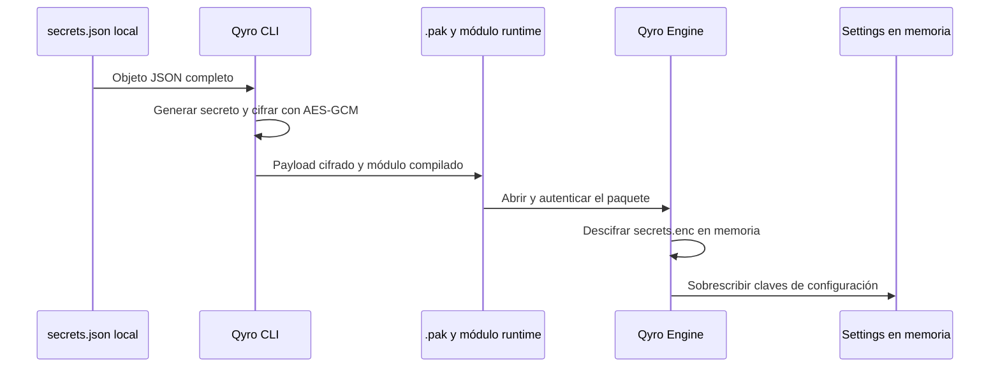

`settings/secrets.json` almacena únicamente datos protegidos que la aplicación necesita durante su ejecución: claves de API, tokens, credenciales de servicios, licencias u otros valores de runtime. Qyro lo aplica como override de configuración.

En source, el Engine lee el archivo local. Durante `qyro build`, el CLI excluye esa copia plana del bundle, cifra el objeto completo y empaqueta su versión protegida para que el Engine la recupere en frozen. Las contraseñas, certificados, identidades y credenciales de notarización pertenecen a `settings/sign.json`, que solo carga `qyro sign` y nunca se empaqueta.

Un endpoint público o un nombre de aplicación no necesita el mismo tratamiento y puede permanecer en `base.json`. Qyro protege los secretos embebidos en reposo, aunque no sustituye un almacén seguro del sistema operativo ni un backend de autenticación cuando el modelo de riesgo exige que el cliente nunca posea una credencial de alto valor.

## Source: objeto JSON local

El Engine aplica `secrets.json` junto a la carpeta de settings elegida; si falta, intenta `<root>/settings/secrets.json` (en frozen, con la base del bundle). Solo lo aplica si encontró una carpeta de settings. El archivo debe ser un objeto:

```json
{
  "api_url": "https://api.example.com",
  "api_key": "clave-de-la-aplicacion",
  "service_token": "token-protegido",
  "license_key": "licencia-local"
}
```
<Warning>
No versiones este archivo. Los errores de JSON/lectura del archivo plano se silencian; valida su sintaxis durante desarrollo. Sus claves sustituyen valores de base/plataforma superficialmente. El último override son los secretos cifrados, si se encuentran. Consulta [Settings](/es/settings).
</Warning>

Después de cargar settings, la aplicación consume esos valores mediante la misma API que cualquier otra configuración:

```python
api_key = self.app_settings.get("api_key")
service_token = self.app_settings.get("service_token")
```

En source proceden del JSON local. En frozen proceden del payload cifrado y ya descifrado en memoria; el código de la aplicación no necesita conocer la ruta ni implementar el descifrado.

## Frozen: qué hace el CLI

El build lee el objeto completo, lo cifra con AES-256-GCM, usa HKDF-SHA256 para derivar una clave del secreto runtime generado y coloca el payload en `.qyro/secrets.enc` dentro del `.pak`. Compila un módulo `runtime` con Cython que contiene el material necesario para descifrar.



Sin protección completa de recursos, el build actual exige `settings/secrets.json`; `{}` es válido para una aplicación sin secretos. Con protección completa, un archivo de secretos es opcional si existen otros archivos empaquetables. Ambos modos compilan el módulo runtime. El Engine no cifra automáticamente el JSON source.

## Separación entre secretos de la aplicación y firma

Los dos archivos tienen ciclos de vida distintos:

- `settings/secrets.json` contiene valores que la aplicación debe recuperar en source y frozen;
- `settings/sign.json` contiene configuración que solo necesita el proceso de firma;
- `qyro build` cifra y empaqueta el objeto completo de `secrets.json`;
- `qyro sign` activa `release.json` y después `sign.json` para firmar artefactos ya construidos;
- el Engine no carga `sign.json`, y el CLI lo excluye del staging normal y del paquete protegido.

Ejemplo local de `settings/sign.json`:

```json
{
  "sign": {
    "windows": {
      "certificate": "src/sign/windows/certificate.pfx",
      "password": "contraseña-del-certificado"
    },
    "mac": {
      "identity": "Developer ID Application: Ejemplo (TEAMID)",
      "notary": {
        "keychain_profile": "QYRO-NOTARY"
      }
    }
  }
}
```

No añadas `sign` ni aliases planos de firma a `secrets.json`: `qyro build` los rechaza para impedir que entren en el payload del cliente. Aunque los secretos de runtime queden cifrados en reposo, el cliente incluye el mecanismo necesario para descifrarlos. Mantén ambos archivos fuera de Git y genera `sign.json` desde el almacén de secretos de CI cuando automatices una entrega.

## Arquitectura recomendada para secretos de alto valor

<Warning>
No distribuyas en una aplicación cliente claves maestras, credenciales administrativas ni API keys con acceso amplio o capacidad de gasto ilimitada. Aunque Qyro cifra `secrets.json` dentro del build, la aplicación necesita descifrar sus valores para utilizarlos y una persona con control del dispositivo puede inspeccionar el proceso. El cifrado dificulta la extracción directa; no hace imposible recuperar una credencial incluida en el cliente.
</Warning>

Para APIs privadas, pagos, inteligencia artificial y operaciones privilegiadas, conserva la clave real en un servidor que controles. La aplicación se autentica contra tu backend mediante HTTPS y recibe únicamente un token temporal, datos limitados o el resultado de la operación.

```text
Aplicación cliente
        │
        │ HTTPS + sesión o token temporal
        ▼
Tu API / backend
        │
        │ API key real almacenada en el servidor
        ▼
Proveedor externo
```

Por ejemplo, si tu aplicación utiliza OpenAI, Stripe u otra API privada:

```text
Cliente  → api.tudominio.com/generate
Backend  → api.proveedor.com
Backend  → devuelve únicamente el resultado permitido
```

La clave real permanece en el backend. El cliente solo recibe el resultado o una capacidad temporal y de alcance reducido. Esto permite aplicar autenticación, límites de uso, validación de entradas, auditoría, revocación y rotación sin publicar una nueva versión de la aplicación.

Usa `secrets.json` cuando el cliente necesariamente deba conocer el valor, por ejemplo una credencial local, una licencia, un identificador protegido o un token de alcance limitado. Incluso entonces:

- concede únicamente los permisos imprescindibles;
- utiliza expiración corta y rotación cuando el proveedor lo permita;
- evita credenciales compartidas entre todos los usuarios;
- aplica límites de gasto, cuota y origen en el proveedor;
- nunca escribas secretos o el diccionario completo de settings en logs;
- revoca inmediatamente una clave si sospechas que fue expuesta.

## Garantías y límites

AES-GCM verifica el payload de secretos, incluido su header. Un tag inválido produce `SecretsCryptoError` (subclase de `ValueError`); texto no UTF-8, JSON inválido u objeto de tipo incorrecto produce `ValueError`. No imprimas el diccionario de settings completo para diagnosticar.

El loader no extrae `.qyro/secrets.enc` al directorio temporal; mantiene el payload cifrado en memoria y después fusiona el JSON descifrado. Esto no evita que un depurador o código dentro del proceso lea el resultado. El módulo runtime y el payload se entregan juntos, por lo que el cliente tiene lo necesario para recuperar los valores.

Además, un fallo del `.pak` exterior se ignora y permite fallback a recursos/settings ordinarios. Solo un payload de secretos que haya llegado a la etapa de descifrado dispara los errores estrictos descritos. No existe una política global de cierre obligatorio ante toda manipulación.

La protección cifra los secretos en reposo, detecta modificaciones del payload y aumenta el costo de extracción. Como ocurre con cualquier secreto que una aplicación cliente debe usar, el valor termina disponible en memoria durante la ejecución. Para datos especialmente críticos, combina Qyro con credenciales de alcance mínimo, rotación, tokens de vida corta y, cuando corresponda, un backend o almacén del sistema operativo.

## Compatibilidad legacy

Si no hay secretos embebidos utilizables, el Engine intenta `.qyro/secrets.json`, que en esa ubicación es un **payload cifrado**, no el JSON source. Necesita un `runtime*.so`, `.pyd` o `.dylib` compatible. Regenera ambos artefactos juntos y no copies módulos compilados entre versiones de Python o plataformas sin validación.

El formato de ambos paquetes y la extracción se explican en [Recursos protegidos](/es/protected-resources).
