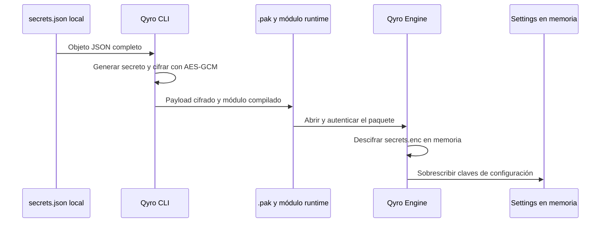

# Secrets y seguridad del cliente

Un secreto es un dato cuyo acceso debe restringirse, como una credencial. Un endpoint público o un nombre de aplicación no necesita el mismo tratamiento. Qyro puede leer un objeto local de secretos y consumir su versión cifrada generada por el CLI, pero no sustituye un almacén seguro del sistema operativo ni un backend de autenticación.

## Source: objeto JSON local

El Engine aplica `secrets.json` junto a la carpeta de settings elegida; si falta, intenta `<root>/settings/secrets.json` (en frozen, con la base del bundle). Solo lo aplica si encontró una carpeta de settings. El archivo debe ser un objeto:

```json
{
  "api_url": "https://api.example.com",
  "development_token": "valor-de-prueba"
}
```

No versiones credenciales. Los errores de JSON/lectura del archivo plano se silencian; valida su sintaxis durante desarrollo. Sus claves sustituyen valores de base/plataforma superficialmente. El último override son los secretos cifrados, si se encuentran. Consulta [Settings](/es/settings).

## Frozen: qué hace el CLI

El build lee el objeto completo, lo cifra con AES-256-GCM, usa HKDF-SHA256 para derivar una clave del secreto runtime generado y coloca el payload en `.qyro/secrets.enc` dentro del `.pak`. Compila un módulo `runtime` con Cython que contiene el material necesario para descifrar.



Sin protección completa de recursos, el build actual exige `settings/secrets.json`; `{}` es válido para una aplicación sin secretos. Con protección completa, un archivo de secretos es opcional si existen otros archivos empaquetables. Ambos modos compilan el módulo runtime. El Engine no cifra automáticamente el JSON source.

## Credenciales de firma: riesgo de mezcla

`SettingsRepository` del CLI usa el mismo archivo local para opciones sensibles de firma. El freezer cifra todo ese JSON, **sin filtrar las claves de firma**. Guardar allí contraseñas PFX, contraseñas de notarización u otras credenciales del tooling durante build puede introducirlas en la aplicación del cliente.

Antes del build incluye únicamente datos permitidos en el cliente. Añade las opciones sensibles de firma después del build si necesitas ese mecanismo y retíralas antes de reconstruir. Revisa artefactos y logs. La separación automática de ambos tipos de secretos es una decisión pendiente del proyecto, no una característica existente.

## Garantías y límites

AES-GCM verifica el payload de secretos, incluido su header. Un tag inválido produce `SecretsCryptoError` (subclase de `ValueError`); texto no UTF-8, JSON inválido u objeto de tipo incorrecto produce `ValueError`. No imprimas el diccionario de settings completo para diagnosticar.

El loader no extrae `.qyro/secrets.enc` al directorio temporal; mantiene el payload cifrado en memoria y después fusiona el JSON descifrado. Esto no evita que un depurador o código dentro del proceso lea el resultado. El módulo runtime y el payload se entregan juntos, por lo que el cliente tiene lo necesario para recuperar los valores.

Además, un fallo del `.pak` exterior se ignora y permite fallback a recursos/settings ordinarios. Solo un payload de secretos que haya llegado a la etapa de descifrado dispara los errores estrictos descritos. No existe una política global de cierre obligatorio ante toda manipulación.

La protección sirve contra inspección casual y puede aumentar el costo de ingeniería inversa. No conserva secretos de alto valor frente a quien controla el cliente. Para credenciales reales de servicio, evita distribuirlas; diseña autenticación, tokens limitados y un backend o almacén apropiado para tu aplicación. Qyro no implementa esas piezas.

## Compatibilidad legacy

Si no hay secretos embebidos utilizables, el Engine intenta `.qyro/secrets.json`, que en esa ubicación es un **payload cifrado**, no el JSON source. Necesita un `runtime*.so`, `.pyd` o `.dylib` compatible. Regenera ambos artefactos juntos y no copies módulos compilados entre versiones de Python o plataformas sin validación.

El formato de ambos paquetes y la extracción se explican en [Recursos protegidos](/es/protected-resources).
