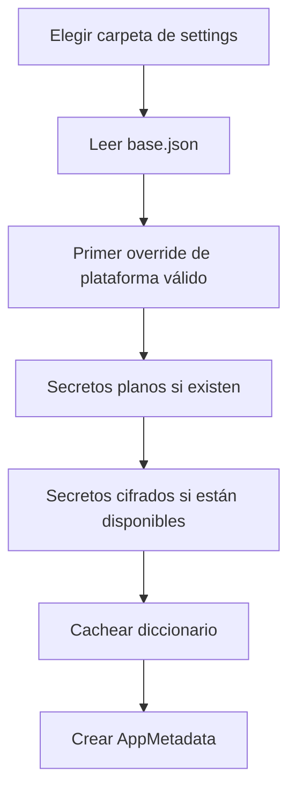
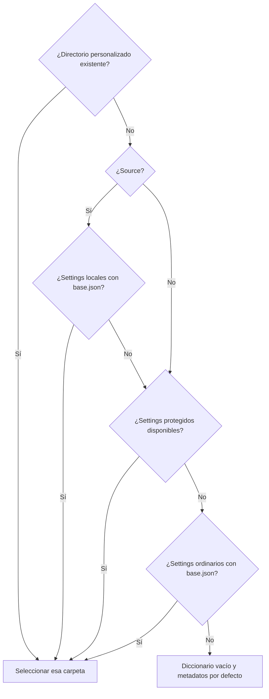

# Configuración

Los **settings** son valores de arranque: metadatos, toolkit y opciones propias. Qyro los lee, pero no transforma automáticamente cada clave en una propiedad visual. `JsonSettingsAdapter` combina JSON y produce el diccionario final y `AppMetadata`. No es persistencia de preferencias.

El repositorio de settings del [CLI](/es/tooling) hace merge profundo y activa perfiles explícitos; sus reglas son diferentes de las descritas aquí.

## Archivos

`base.json` es el archivo que identifica una carpeta de settings. Puede complementarse con:

| Plataforma | Primer nombre | Alias |
| --- | --- | --- |
| Windows | `windows.json` | `win32.json` |
| macOS | `mac.json` | `darwin.json` |
| Linux | `linux.json` | — |

Solo se usa el primer archivo de plataforma existente y válido según ese orden.

## Precedencia de valores

La combinación es superficial y usa `dict.update()`:

```text
base.json
   ↓ sobrescribe
archivo de plataforma
   ↓ sobrescribe
secrets.json plano
   ↓ sobrescribe
secretos cifrados embebidos o legacy
```

Ejemplo:

```json
{
  "app_name": "Example",
  "window": {"width": 800, "height": 600},
  "debug": false
}
```

```json
{
  "window": {"width": 1024},
  "debug": true
}
```

El primer bloque se guarda en `base.json` y el segundo en `windows.json`, sin comentarios. El resultado de `window` será `{"width": 1024}`: no conserva `height`, porque no hay merge profundo. Repite el objeto completo para conservar todos sus campos.



Cada override sustituye claves completas. Utiliza objetos JSON: los archivos ordinarios no tienen validación de schema, y `dict.update` puede aceptar estructuras inesperadas o aplicar datos parcialmente antes de una excepción.

## Búsqueda de la carpeta

En source, la primera carpeta con `base.json` gana:

1. `<root>/settings`
2. `<root>/build/settings`
3. `<root>/src/main/settings`
4. `<root>/src/build/settings`
5. `<root>`

Si ninguna existe, se intenta el bundle protegido. En frozen, el bundle protegido se consulta antes que las rutas ordinarias del bundle.

`custom_settings_dir` en `EngineContainer` sustituye la búsqueda si existe, incluso si no contiene `base.json`. `ApplicationContext` no expone ese parámetro.



Las rutas usan root en source y bundle en frozen, con el orden listado. Solo se selecciona una carpeta; no se combinan los archivos base de diferentes raíces.

## Claves de metadatos

`load_metadata()` reconoce de forma especial:

| Clave | Default |
| --- | --- |
| `app_name` | `QyroApp` |
| `version` | `1.0.0` |
| `author` | `Developer` |
| `identifier` | `com.qyro.app` |
| `description` | cadena vacía |

Todas las claves, conocidas o no, permanecen en `metadata.raw_settings` y están disponibles mediante `metadata.get(key, default)` o `context.app_settings`.

Otras claves consumidas por el runtime son:

- `binding` o `framework`: selección del toolkit; `binding` tiene prioridad.
- `sentry_dsn`: activa el adaptador Sentry si `enable_sentry=True`.
- `icon` o `app_icon`: recurso del icono; `icon` tiene prioridad.

```json
{
  "app_name": "Inventario",
  "version": "2.3.0",
  "author": "Acme",
  "identifier": "com.acme.inventario",
  "description": "Cliente de escritorio",
  "binding": "pyside6",
  "icon": "icons/app.png",
  "theme": "dark"
}
```

## Caché y recarga

`JsonSettingsAdapter.get_raw_settings()` cachea el diccionario después de la primera lectura. `LoadSettingsUseCase` mantiene además su propia caché de `AppMetadata`.

```python
metadata = container.load_settings_use_case.execute()
metadata = container.load_settings_use_case.execute(force_reload=True)
```

`force_reload=True` reconstruye `AppMetadata`, pero el adaptador sigue devolviendo su diccionario cacheado. No existe una API pública que invalide `_cached_settings`; los archivos están pensados para configuración de arranque, no hot reload.

## Secretos planos

En desarrollo puede existir `secrets.json` junto a `base.json`. Si no está allí, se intenta `<root>/settings/secrets.json`. Debe contener un objeto JSON:

```json
{
  "api_url": "https://api.example.com",
  "api_token": "solo-desarrollo"
}
```

No lo versiones. Los errores de lectura, JSON o tipo en el archivo plano se silencian.

## Secretos cifrados

El runtime prefiere `.qyro/secrets.enc` embebido dentro de `protected_resources.pak`. Como compatibilidad, también acepta el archivo cifrado externo `.qyro/secrets.json`. En ambos casos necesita un módulo compilado `runtime*.so`, `.pyd` o `.dylib` con `RUNTIME_SECRET_HEX`.

El payload descifrado debe ser UTF-8, JSON y un objeto. A diferencia de los JSON ordinarios, un secreto cifrado inválido genera `ValueError`/`SecretsCryptoError`, porque continuar silenciosamente podría arrancar con credenciales incorrectas.

Consulta [Recursos protegidos](/es/protected-resources) para el formato criptográfico y su modelo de seguridad.

## Comportamiento ante errores

- Ausencia total de settings: se devuelve `{}` y `AppMetadata` usa defaults; `SettingsNotFoundError` existe pero el adaptador actual no lo lanza.
- JSON base/plataforma/plano inválido: se ignora silenciosamente.
- Payload cifrado corrupto, clave incorrecta o JSON descifrado inválido: se lanza error.
- `sentry_dsn` sin `sentry-sdk`: el arranque continúa con un warning.

## Configuración en memoria y tooling

`context.app_settings` y `get_raw_settings()` entregan el diccionario cacheado por referencia. Modificarlo no escribe archivos ni reconstruye automáticamente los campos de metadata. Los snippets con `container` presuponen un `EngineContainer` creado.

`load_metadata` usa los defaults de la tabla. `AppMetadata(app_name="Ejemplo")` usa los defaults del dataclass (`version="0.1.0"`, author/identifier vacíos); `AppMetadata.default()` usa `author="Author"`. No son formas idénticas.

`entry_point`, `release.json`, `optimization`, `bundle`, `sign` y `resource_protection` son entradas del tooling cuando este las interpreta. El Engine no activa perfiles release/debug ni lee `build.json`; una clave `window` o `debug` no configura sola la UI. Tu aplicación lee y aplica sus opciones.

Antes de utilizar credenciales, consulta [Secrets](/es/secrets), especialmente la mezcla de secretos de firma y cliente durante build.
