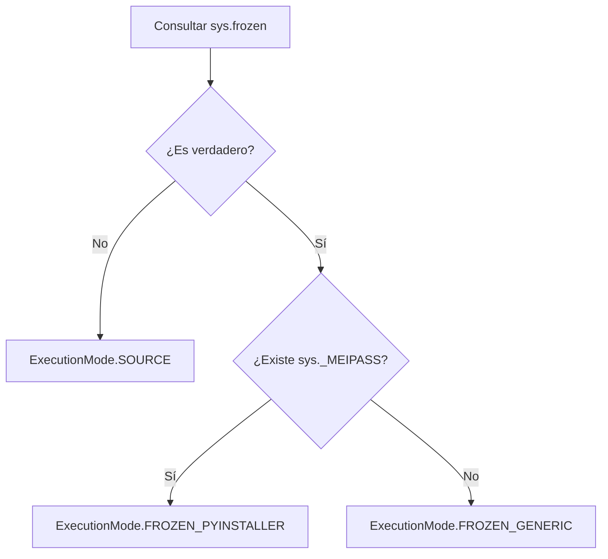

# Source, frozen y rutas

**Source** significa ejecutar los archivos Python con un intérprete, por ejemplo cuando se ejecuta `qyro start` o `python main.py`. **Frozen** significa ejecutar un artefacto que incluye la aplicación y su entorno Python, normalmente generado por PyInstaller mediante Qyro CLI. Congelar no convierte toda la lógica Python en código nativo ni crea por sí solo un instalador.

Qyro Engine adapta la lectura de configuración y recursos a ambos entornos. Cuando `ApplicationContext` forma parte de la clase principal, tu código puede seguir usando `self.get_resource("texts/welcome.txt")` aunque el archivo ya no esté en el árbol original del proyecto.

## Detección

`SystemEnvironmentAdapter.is_frozen()` devuelve `getattr(sys, "frozen", False)`. Normalmente es booleano, pero el adaptador no convierte expresamente el valor a `bool`. La presencia de `_MEIPASS` sin `sys.frozen` no basta.



`ExecutionMode.EMBEDDED` está declarado, pero el detector actual no lo devuelve. Los nombres genéricos de otros congeladores en comentarios no constituyen una integración comprobada con cada herramienta.

## Raíz y directorio del bundle

La **raíz** sirve para localizar un proyecto source o el directorio del ejecutable. El **directorio del bundle** contiene los datos que el congelador pone a disposición de la aplicación. No siempre son el mismo lugar.

| Método | Source | Frozen con `_MEIPASS` | Frozen genérico |
| --- | --- | --- | --- |
| `get_root_dir()` | Primer ancestro del directorio de trabajo que contiene `pyproject.toml` o `src`; si ninguno, directorio de trabajo | Padre de `sys.executable` | Padre de `sys.executable` |
| `get_bundle_dir()` | Raíz | `Path(sys._MEIPASS).resolve()` | En macOS, `../Resources` desde el padre del ejecutable si existe; de lo contrario, raíz |

`custom_root=Path(...)` sustituye la raíz sin normalizarla. Utiliza un `Path` absoluto. En frozen con `_MEIPASS`, **no sustituye el directorio del bundle**.

```python
from PySide6.QtWidgets import QMainWindow
from qyro import ApplicationContext
from qyro.ui.component import Component


class MiApp(QMainWindow, Component, ApplicationContext):
    def component_will_mount(self):
        print(self.execution_mode.value)
        print(self.container.env_adapter.get_root_dir())
        print(self.container.env_adapter.get_bundle_dir())
```

En el uso habitual no necesitas consultar estas rutas: utiliza `self.get_resource(...)` y deja que el Engine elija la ubicación correcta. `custom_root=Path(...)` queda para integraciones avanzadas que necesitan sustituir explícitamente la raíz.

En source la búsqueda parte del directorio de trabajo, no de `__file__`. Ejecutar `python /ruta/app/main.py` desde otra carpeta puede seleccionar otra raíz. Entra primero en el proyecto o pasa una raíz explícita. En frozen evita calcular la raíz a partir de `__file__` del script: su ubicación puede pertenecer al bundle.

Los formatos `onedir` y `onefile` pertenecen a Qyro CLI, no al Engine. Aquí solo importa que ambos se detectan como `FROZEN_PYINSTALLER`; consulta [Build, bundle y distribución](/es/tooling#primer-build) para elegir y generar el formato.

## Configuración y recursos

Los detalles de precedencia están centralizados en [Settings](/es/settings) y [Resources](/es/resources).

| Área | Source | Frozen |
| --- | --- | --- |
| Settings | Primero configuración local con `base.json`; después paquete protegido | Primero configuración del paquete protegido; después rutas ordinarias del bundle |
| Resources | Recursos protegidos antes de recursos del proyecto, si existe un paquete válido | Recursos protegidos antes de recursos ordinarios del bundle |
| Secretos cifrados | Se buscan bajo `.qyro` de la raíz | Se buscan bajo `.qyro` del bundle |
| Configuración personalizada | Directorios explícitos existentes sustituyen la búsqueda normal | Igual; no se empaquetan automáticamente por indicar una ruta al Engine |

No existe una garantía de equivalencia entre un build y source si ambos cargan archivos diferentes. `release.json` es un perfil del CLI: el Engine no lo activa automáticamente. Los recursos ordinarios pueden quedar aplanados durante el build; el resolver acepta algunas variantes sin el primer segmento `base` o de plataforma.

## Dos directorios temporales diferentes

PyInstaller administra su ubicación de ejecución. Separadamente, Qyro extrae recursos protegidos a `<temp>/qyro_protected_<digest>/`. El segundo directorio tiene caché y un marcador `.ok`; el loader no implementa limpieza automática al cerrar la aplicación ni verifica de nuevo el contenido ya extraído cuando existe el marcador.

Los secretos embebidos no se escriben allí como JSON descifrado por el loader, pero los recursos y settings ordinarios sí quedan legibles. Consulta [Protección y límites](/es/protected-resources).

## Datos del usuario

Los recursos son entradas de la aplicación, no almacenamiento de preferencias o documentos. Qyro no ofrece una API de directorio de datos del usuario ni persistencia de settings. Elige una carpeta escribible apropiada para tu aplicación y administra allí los datos; no escribas en `_MEIPASS`, el `.pak`, la extracción temporal o la carpeta de instalación.

Para pasar de source a frozen sigue [Build y distribución](/es/tooling). El [ejemplo completo](/es/examples) muestra el mismo acceso a un archivo en los dos modos.
