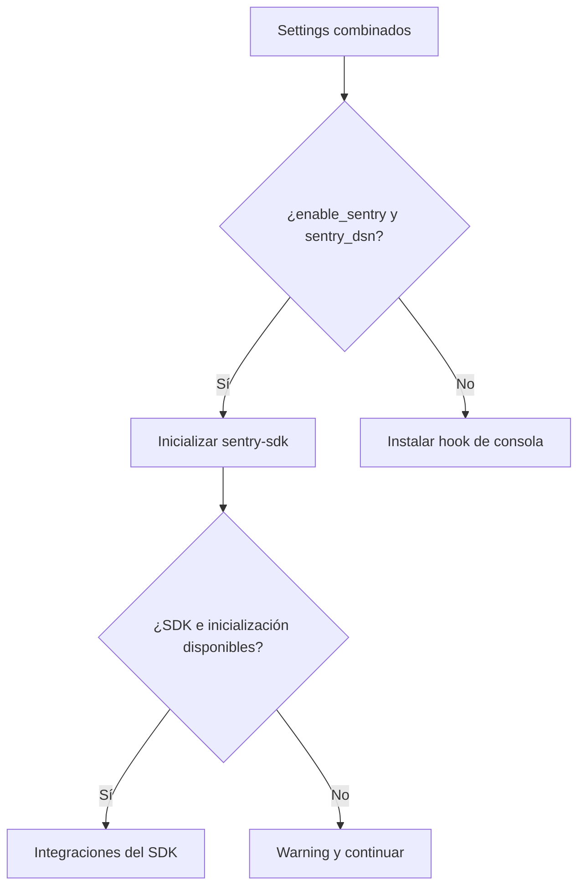

# Telemetría y errores no controlados

Qyro instala un hook de excepciones durante `InitializeEngineUseCase.execute()`. El adaptador se elige al construir `EngineContainer`.

## Selección

```text
enable_sentry=True y sentry_dsn no vacío → SentryExceptionHookAdapter
cualquier otro caso                         → ConsoleExceptionHookAdapter
```

La selección usa el valor ya combinado de settings.

## Consola

`ConsoleExceptionHookAdapter.install()` reemplaza `sys.excepthook`. Una excepción no controlada imprime:

- un banner Qyro en `stderr`;
- tipo, mensaje y traceback completo;
- un separador final.

`KeyboardInterrupt` se reenvía al hook original para conservar la terminación normal con Ctrl+C.

```python
from qyro.adapters.telemetry.console_hook import ConsoleExceptionHookAdapter

hook = ConsoleExceptionHookAdapter(show_banner=True)
hook.install()
```

El parámetro `show_banner` se almacena, pero la implementación actual siempre imprime el banner.

## Sentry

Configura el DSN en settings:

```json
{
  "sentry_dsn": "https://public@example.ingest.sentry.io/123",
  "version": "2.1.0"
}
```

Y habilita el extra `sentry`. El adaptador llama:

Este bloque describe la llamada interna; `dsn` y `version` son valores de configuración, no variables definidas por el fragmento.

```python
sentry_sdk.init(
    dsn=dsn,
    environment="production",
    release=version,
    traces_sample_rate=0.2,
)
```

Si el constructor recibe un DSN vacío, también consulta la variable de entorno `SENTRY_DSN`. Sin embargo, `EngineContainer` solo crea este adaptador cuando `raw_settings["sentry_dsn"]` ya es truthy; por esa ruta, una variable de entorno aislada no cambia la selección.

Si falta `sentry-sdk` o la inicialización falla, se imprime un warning y el proceso continúa. `handle_exception()` captura el error solo después de una inicialización exitosa.

## Desactivar Sentry

```python
from qyro import ApplicationContext

ctx = ApplicationContext(enable_sentry=False)
```

Esto selecciona el hook de consola aunque exista `sentry_dsn`. Recuerda que el primer `ApplicationContext` fija el contenedor global.

## Alcance real

- El hook global cubre excepciones que llegan a `sys.excepthook`.
- Algunos toolkits interceptan errores dentro de callbacks; su propio mecanismo puede ser necesario.
- El adaptador Sentry no reemplaza explícitamente `sys.excepthook`; confía en las integraciones de `sentry-sdk` y su método `handle_exception` no se registra directamente en `install()`.
- No se envían logs, breadcrumbs personalizados ni información de usuario desde Qyro.

No incluyas secretos en mensajes de excepción. Las funciones criptográficas no registran plaintext ni runtime secrets, pero tu aplicación puede hacerlo accidentalmente.



Un fallo de Sentry no instala automáticamente el hook Qyro de consola. La selección ocurre al construir el contenedor; `install` ocurre durante el arranque. No se promete cubrir todos los errores de callbacks o threads.
