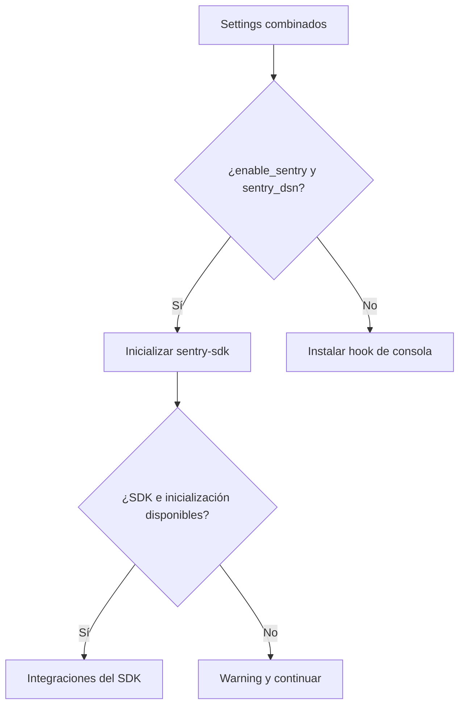

Qyro instala un hook de excepciones durante `InitializeEngineUseCase.execute()`. El adaptador se elige al construir `EngineContainer`.

## Selección

```text
enable_sentry=True y sentry_dsn no vacío → SentryExceptionHookAdapter
cualquier otro caso                         → ConsoleExceptionHookAdapter
```

La selección usa el valor ya combinado de settings.

## Configuración en settings

Para activar Sentry, instala `sentry-sdk` y añade `sentry_dsn` a `settings/base.json`:

```bash
pip install sentry-sdk
```

Con Poetry utiliza:

```bash
poetry add sentry-sdk
```

```json
{
  "app_name": "MiApp",
  "version": "2.1.0",
  "binding": "PySide6",
  "sentry_dsn": "https://public@example.ingest.sentry.io/123"
}
```

El Engine utiliza dos valores:

| Setting | Uso |
| --- | --- |
| `sentry_dsn` | Si contiene una cadena no vacía, selecciona `SentryExceptionHookAdapter`. |
| `version` | Se envía a Sentry como nombre de release. El fallback interno es `0.1.0`. |

El DSN puede estar en `base.json`, en el archivo de plataforma o en `secrets.json`. El Engine aplica su merge superficial habitual y utiliza el valor final. Un perfil posterior puede desactivar Sentry sobrescribiéndolo con una cadena vacía:

```json
{
  "sentry_dsn": ""
}
```

No existen settings para cambiar `environment` o `traces_sample_rate`: el adaptador actual utiliza `"production"` y `0.2`. Tampoco existe un setting JSON llamado `enable_sentry`; ese valor es una opción de construcción de `ApplicationContext` y `EngineContainer`.

## Uso con el mixin ApplicationContext

En una aplicación generada por Qyro no necesitas inicializar Sentry manualmente. La clase principal mezcla `ApplicationContext`, que carga los settings y configura la telemetría antes de terminar de construir la ventana:

```python
import sys
from PySide6.QtWidgets import QLabel, QMainWindow
from qyro import ApplicationContext
from qyro.ui.component import Component


class MiApp(QMainWindow, Component, ApplicationContext):
    def render(self):
        label = QLabel(
            f"App: {self.window_title}\n"
            f"Release: {self.app_settings.get('version', 'sin versión')}",
            parent=self,
        )
        label.move(40, 40)
        label.resize(label.sizeHint())


if __name__ == "__main__":
    window = MiApp()
    window.show()
    sys.exit(window.run())
```

El flujo ocurre automáticamente:

1. `ApplicationContext` crea el Engine compartido.
2. El Engine combina `base.json`, el perfil de plataforma y los secretos.
3. Si el resultado contiene un `sentry_dsn` no vacío, selecciona Sentry.
4. Durante el arranque instala el adaptador antes de crear o recuperar la aplicación nativa.
5. La ventana continúa con `component_will_mount()` y `render()`.

No llames a `sentry_sdk.init()` desde `render()` ni desde cada componente. Eso repetiría una inicialización que pertenece al arranque global. Los componentes hijos reutilizan el mismo Engine y no necesitan heredar de `ApplicationContext`.

## Consola

`ConsoleExceptionHookAdapter.install()` reemplaza `sys.excepthook`. Una excepción no controlada imprime:

- un banner Qyro en `stderr`;
- tipo, mensaje y traceback completo;
- un separador final.

`KeyboardInterrupt` se reenvía al hook original para conservar la terminación normal con Ctrl+C.

```python
from qyro.adapters.telemetry.console_hook import ConsoleExceptionHookAdapter

hook = ConsoleExceptionHookAdapter(show_banner=True)
hook.install()
```

El parámetro `show_banner` se almacena, pero la implementación actual siempre imprime el banner.

## Sentry

Una vez seleccionado, el adaptador realiza internamente esta llamada:

Este bloque describe la llamada interna; `dsn` y `version` son valores de configuración, no variables definidas por el fragmento.

```python
sentry_sdk.init(
    dsn=dsn,
    environment="production",
    release=version,
    traces_sample_rate=0.2,
)
```

Si el constructor recibe un DSN vacío, también consulta la variable de entorno `SENTRY_DSN`. Sin embargo, `EngineContainer` solo crea este adaptador cuando `raw_settings["sentry_dsn"]` ya es truthy; por esa ruta, una variable de entorno aislada no cambia la selección.

Si falta `sentry-sdk` o la inicialización falla, se imprime un warning y el proceso continúa. `handle_exception()` captura el error solo después de una inicialización exitosa.

## Desactivar Sentry

Con el patrón mixin, la opción más sencilla es omitir `sentry_dsn` o dejar vacío su valor final. Así Qyro selecciona automáticamente el hook de consola.

En una integración avanzada que construya el contexto explícitamente, también puedes desactivarlo mediante código:

```python
from qyro import ApplicationContext

ctx = ApplicationContext(enable_sentry=False)
```

Esto selecciona el hook de consola aunque exista `sentry_dsn`. Hazlo antes de crear una ventana que mezcle `ApplicationContext`, porque el primer contexto fija el contenedor global. No pases `enable_sentry` como prop de un componente hijo.

## Alcance real

- El hook global cubre excepciones que llegan a `sys.excepthook`.
- Algunos toolkits interceptan errores dentro de callbacks; su propio mecanismo puede ser necesario.
- El adaptador Sentry no reemplaza explícitamente `sys.excepthook`; confía en las integraciones de `sentry-sdk` y su método `handle_exception` no se registra directamente en `install()`.
- No se envían logs, breadcrumbs personalizados ni información de usuario desde Qyro.

No incluyas secretos en mensajes de excepción. Las funciones criptográficas no registran plaintext ni runtime secrets, pero tu aplicación puede hacerlo accidentalmente.



Un fallo de Sentry no instala automáticamente el hook Qyro de consola. La selección ocurre al construir el contenedor; `install` ocurre durante el arranque. No se promete cubrir todos los errores de callbacks o threads.
