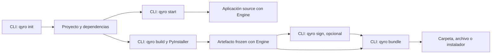
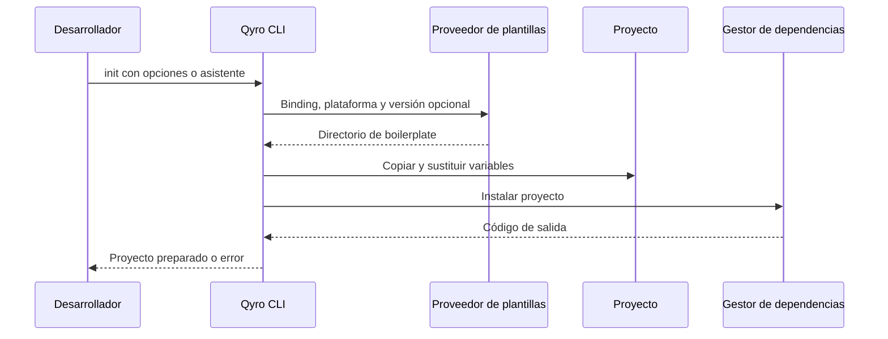
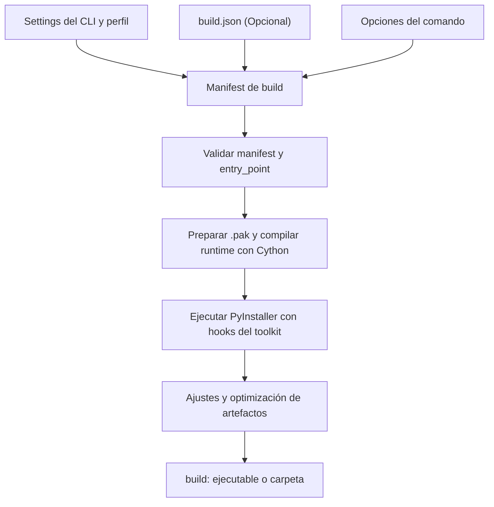

# Build, bundle y distribución

Esta guía completa el recorrido de [Qyro CLI](/es/cli). Después de crear el proyecto y probarlo con `qyro start`, necesitas preparar una aplicación ejecutable y organizar sus archivos para entregarla. Aquí aprenderás las etapas de build, firma y bundle, y la configuración que utilizan.



La firma trabaja sobre los artefactos de build. Si vas a firmar, hazlo antes de copiarlos a un bundle final. `bundle` no congela código ni firma automáticamente el instalador que genera. No hay un comando público de publicación o subida de releases en el registro actual.

## Instalar el tooling

Con el entorno de tu aplicación activo:

```bash
pip install --pre "qyro-cli[desktop]"
qyro_cli --help
```

`[desktop]` añade PyInstaller, Pillow y Cython. El CLI importa Pillow desde su contenedor; instalar solo el paquete base puede fallar antes de ejecutar incluso comandos ajenos al build. La distribución del CLI declara además una dependencia del Engine. Consulta [Instalación](/es/installation).

El ejecutable `qyro` y `qyro_cli` invocan la misma aplicación de comandos. La segunda forma facilita asegurar qué intérprete se utiliza.

## Crear con `qyro init`

```bash
qyro init --name mi-app --target-platform desktop --binding PySide6 --app-name MiApp --version 1.0.0 --author Ejemplo --yes
```

`--name` es la carpeta; `--app-name` es el nombre de la aplicación. `--binding` elige el toolkit. `--target-platform desktop` se normaliza a la opción de scaffolding x86_64, no inicia una compilación. `--yes` acepta la confirmación; no rellena todas las preguntas si faltan otros valores. El comando anterior suministra los datos necesarios y omite addons.

El inicializador comprueba si existe `main.py` en el destino, reúne opciones, resuelve una plantilla, copia su árbol, sustituye variables con `string.Template` e instala dependencias. No borra previamente el directorio destino: usa una carpeta nueva para evitar mezclar proyectos.



El proveedor consulta repositorios de `Neuri-AI`: `qyro-boilerplate-qt` para Qt y `qyro-boilerplate-tkinter` / `qyro-boilerplate-kivy` para esos toolkits. Intenta tags compatibles con la versión mínima `1.0.0`, rama por defecto cuando corresponde, caché en `~/.qyro/templates` y finalmente plantillas empaquetadas.

`--template-version` requiere una versión concreta parseable, por ejemplo `1.0.0`; `1.0.x` no es una versión válida. El rango implementado conserva tags con el mismo major y no inferiores al mínimo. La caché Qt es compartida por la familia de bindings. El contenido remoto puede cambiar: inspecciona el proyecto generado en lugar de asumir una estructura idéntica para todas las plantillas.

<Note>En el checkout auditado no existe `qyro_cli/templates`. El proveedor de fallback está implementado, pero no hay plantillas locales que permitan garantizar `init` sin red o sin una caché previa. Si la descarga falla y no tienes caché, necesitas resolver la conexión para completar `init`.</Note>

El instalador selecciona el primer gestor disponible en este orden: Poetry (`lock`, `install`), uv (`lock`, `sync`), Pipenv (`lock`, `install`) o el Python del CLI (`pip install .`). El proceso posterior de `start` **no cambia automáticamente** al entorno creado por ese gestor. Activa el entorno del proyecto o ejecuta `poetry run qyro start` / `uv run qyro start` si el CLI está instalado allí.

Opciones adicionales implementadas: `--addon` repetible (`hotrl`, `pydux`, `sentry-sdk`, `requests`), `--bundle-id`, y plataformas `x86_64`, `apple-silicon`, `iphone`, `android`. El addon registra dependencias/configuración; no garantiza que tu UI ya tenga conexiones de estado o hot reload. El [soporte móvil](/es/compatibility) está incompleto.

## Ejecutar con `qyro start`

Ejecuta desde la raíz del proyecto:

```bash
qyro start
```

El CLI exige `pyproject.toml`, lee `settings/base.json` y secretos locales, comprueba `binding`, comprueba `entry_point` y lanza `[sys.executable, entry_point]` en un subproceso con la raíz añadida a `PYTHONPATH`. El Engine arranca dentro de ese proceso. `start` no acepta argumentos propios ni implementa un watcher de recarga en su caso de uso actual.

El repositorio de settings del CLI no activa el perfil de plataforma en `start`; el Engine sí aplica su override al arrancar. Mantén coherentes los bindings de los archivos de configuración.

## Primer build

Necesitas un toolkit instalado, `[desktop]`, un compilador C compatible con tu Python y los datos del proyecto. Cython se usa incluso cuando `resource_protection.enabled` es `false`.

Antes del primer build, comprueba que el proyecto generado contiene `settings/secrets.json`. Si tu aplicación no utiliza secretos, su contenido debe ser un objeto vacío:

```json
{}
```

Un archivo vacío no equivale a `{}`. En la ruta sin protección de recursos el CLI exige ese archivo; en la ruta con protección completa basta con encontrar settings/recursos, y los secretos son opcionales. Coloca allí únicamente claves de API, tokens y demás valores protegidos que la aplicación necesite. El CLI cifra **todo** el objeto durante build y el Engine lo recupera en frozen. Las credenciales de firma pertenecen a `settings/sign.json`. Lee [Secrets](/es/secrets) para conocer la separación y sus límites.

```bash
qyro build --mode onedir --debug
```

`--mode onedir` genera una carpeta; `--debug` habilita consola. Por defecto el perfil es `release`, la salida se coloca en `build/` y se ejecuta el PyInstaller del intérprete actual. Para Windows, un `app_name` de `MiApp` produce normalmente `build/MiApp/MiApp.exe`. En macOS windowed se espera `build/MiApp.app`; en Linux, `build/MiApp/MiApp`.



La lectura del CLI es diferente a la del runtime: su repositorio combina objetos anidados recursivamente, activa primero el perfil del host y después el solicitado, y reaplica secretos tras cada perfil. `_load_manifest` selecciona campos de `build.json` con fallbacks a settings y opciones CLI; no es un merge uniforme de todos los campos. Muchas elecciones usan `or`, por lo que valores falsos o vacíos en `build.json` pueden caer al valor de settings. `hidden_imports`, `paths`, `collect_all` y argumentos adicionales se agregan.

`build.json` es opcional. La configuración recomendada vive en `settings/base.json` y en `settings/windows.json`, `settings/linux.json` o `settings/mac.json`; coloca allí `optimization`, porque queda junto al resto de opciones específicas de la plataforma.

Si necesitas aislar temporalmente un problema del freezer, puedes crear este `build.json` de diagnóstico y eliminarlo después:

```json
{
  "bundle": "onedir",
  "optimization": {
    "upx_enabled": false,
    "strip_binaries": false,
    "bytecode_opt": 0,
    "clean_build": false,
    "remove_translations": false,
    "exclude_modules": []
  },
  "resource_protection": {"enabled": false}
}
```

Esta configuración facilita diagnosticar el primer artefacto. Las optimizaciones por defecto pueden retirar traducciones, metadata, plugins o bibliotecas. Comprueba todas las funciones de tu aplicación antes de reducir el tamaño. `build.json` lo interpreta únicamente el CLI; el Engine no lo lee y no es necesario para un build normal. Consulta [Archivos de configuración](/es/configuration-files) para saber qué valores del archivo pueden sustituir o concatenar los settings.

Opciones reales de build: `-m/--mode`, `--onefile`, `--debug`, `--console`, `--uac`, `-p/--profile`, `-c/--clean`, `-i/--interactive`, `--target`, `--init-spec`. `freeze` es un alias de `build`. No hay opción de manifest personalizado ni `--extra-args` en el parser actual; `build.json` admite `extra_args`.

`--target windows/mac/linux` selecciona perfil y parámetros; no proporciona un compilador cruzado. Construye y prueba en el sistema de destino. Las opciones móviles detectan un caso de uso que el contenedor actual no configura y devuelven error.

## Probar el artefacto antes de distribuir

Abre el ejecutable directamente, desde una carpeta de trabajo distinta, y comprueba recursos, configuración y tareas importantes. Si falla, consulta `build/pyinstaller_command.txt`, `build/pyinstaller_output.log` y, cuando el build termina, `build/build_log.txt`.

La [guía source/frozen](/es/source-frozen) explica por qué cambian las rutas. Para datos/imports no detectados revisa `hidden_imports`, `collect_all` y los hooks del CLI. No soluciona dependencias ausentes instalar el Engine en el ordenador del usuario: el build debe incluirlas.

## Firma opcional

```bash
qyro sign --check
qyro sign
```

La primera orden valida requisitos sin firmar archivos; la segunda firma artefactos ya construidos. Configura ambas plataformas en el archivo local `settings/sign.json`. Windows requiere `signtool`, certificado y contraseña en `sign.windows`; firma recursivamente las extensiones que reconoce el signer. macOS requiere `codesign`, una identidad en `sign.mac` y una `.app` válida; firma binarios anidados y el bundle, y puede ejecutar notarización, stapling y evaluación Gatekeeper.

Opciones: `--platform auto/windows/mac`, `--check`, `--notarize`, `--staple`, `--no-assess`, `--keychain-profile`. `--staple` implica notarización. Linux no tiene un signer configurado. El build macOS también intenta firma ad hoc: no equivale a una firma de distribución con identidad y notarización.

`qyro sign` carga primero `release.json` y después `sign.json`. El Engine nunca lee `sign.json`, y el build lo excluye de PyInstaller y del paquete protegido. Añádelo a `.gitignore`; en CI, créalo desde el almacén de secretos inmediatamente antes de firmar. `secrets.json` queda reservado para valores que utiliza la aplicación en runtime.

## Bundle y entrega

Una primera entrega sin dependencias de instalador:

```bash
qyro bundle --format dir --no-resources
```

Copia el artefacto de build a `release/<app_name>/`. En `onedir` evita anidar dos carpetas del mismo nombre. `--no-resources` impide copiar además los `resources/` originales: los datos necesarios ya deben formar parte del build. Es especialmente importante en builds protegidos, porque el bundle copia recursos ordinarios por defecto y podría incluir una segunda copia legible.

```bash
qyro bundle --format zip --no-resources
qyro bundle --check
```

`--format zip` crea un archivo de distribución con nombre y versión. `--zip` es otra opción: añade un ZIP además del formato principal. `installer` es alias de `bundle`.

| Formato | Requisitos principales |
| --- | --- |
| `dir`, `zip`, `tar.gz` | Operaciones de filesystem y archivo del CLI |
| `auto` | macOS: `dmg`; Windows: `nsis`; Linux: `tar.gz` |
| `dmg` | macOS y herramientas de creación de DMG; personalizaciones requieren `create-dmg` |
| `nsis` | Windows, `makensis`, plantilla NSIS y opciones válidas |
| `deb`, `rpm`, `arch` | Linux y `fpm` |

Otras opciones: `--release-dir`, `--platform`, `--no-resources`, `--zip`, `--format`, `--check`. `settings/release.json` puede contener `bundle.extra_files`, `bundle.dmg` y `bundle.nsis`; la [referencia de archivos del CLI](/es/configuration-files) documenta sus tipos, defaults y validaciones. Los comandos no suben la entrega a un servicio externo.

## Limpiar y consultar versiones

```bash
qyro version
qyro clean
qyro clean --release
```

`version` muestra versiones del CLI y Engine utilizando metadata de distribución y fallbacks. `clean` elimina `freeze_dir` (por defecto `build`); `--release` añade la carpeta literal `release`. No elimina `.qyro`, cachés de plantillas, extracción temporal ni una carpeta de release personalizada. Revisa rutas personalizadas antes de limpiar: el código no impone que `freeze_dir` quede dentro del proyecto.

Para diagnosticar comandos y diferencias con documentación antigua, continúa con [Solución de problemas](/es/troubleshooting) y [Compatibilidad](/es/compatibility).
